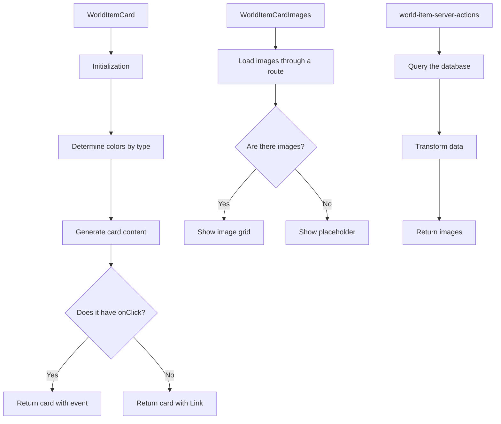

# WorldItemCard

This card component shows World Item information with a collectible-card (TCG) design.

## Description

The `WorldItemCard` component presents World Item information in TCG (Trading Card Game) format.

The structured design shows properties, attributes, statistics, and related images.

## Operation flow



## File structure

The directory includes the following files:

- **index.tsx**: Entry point and component exports
- **world-item-card.tsx**: Main component that renders the card
- **world-item-card-images.tsx**: Component that shows the item images
- **world-item-server-actions.ts**: Routes that fetch data
- **world-item-card.test.tsx**: Component tests

## Usage examples

### Basic use with automatic navigation

```tsx
import { WorldItemCard } from '@/components/cards/world-item-card';

function WorldItemsList({ worldItems }) {
	return (
		<div className="grid grid-cols-3 gap-4">
			{worldItems.map((item) => (
				<WorldItemCard key={item.id} worldItem={item} />
			))}
		</div>
	);
}
```

### Use with a custom event handler

```tsx
import { WorldItemCard } from '@/components/cards/world-item-card';

function WorldItemsSelector({ worldItems, onSelect }) {
	return (
		<div className="grid grid-cols-3 gap-4">
			{worldItems.map((item) => (
				<WorldItemCard key={item.id} worldItem={item} onClick={onSelect} />
			))}
		</div>
	);
}
```

## Integration

This component is used mainly in the following places:

- `WorldItemsView`: Main World Item view
- Item selectors in forms
- Selection dialogs and modals

## Visual customization

Colors and the icon of the component are determined automatically from the item type.

The types use the following styles:

- **ARTIFACT**: Purple and violet colors with a gem icon
- **BOOK**: Blue and turquoise colors with a book icon
- **CONSUMABLE**: Green and orange colors with a shop icon
- **Other types**: Dark blue colors with a generic box icon

## Features

The card provides the following features:

- **TCG design**: Visual effects that simulate cards from Magic, Yu-Gi-Oh, or Pokemon
- **Rarity display**: Visual rarity of the item with appropriate effects
- **Associated images**: Thumbnails of images linked to the item
- **Detailed statistics**: Properties, attributes, effects, and requirements
- **Animations**: Hover and selection effects that improve the user experience
- **Customizable**: Multiple customization options (TCG, compact, interactive)
- **Accessible**: Full support for keyboard navigation

## Use

```tsx
import { WorldItemCard } from '@/components/cards/world-item-card';

// Inside your component
<WorldItemCard
	worldItem={worldItemWithRelations}
	onClick={() => handleWorldItemClick(worldItem.id)}
	tcgMode={true}
	compact={false}
/>;
```

## Props

| Prop          | Type                     | Description                                                     |
| ------------- | ------------------------ | --------------------------------------------------------------- |
| `worldItem`   | `WorldItemWithRelations` | Object with relations and counters                              |
| `onClick`     | `() => void`             | Function that runs on a click on the card                       |
| `className`   | `string`                 | Extra CSS classes                                               |
| `style`       | `React.CSSProperties`    | Extra inline styles                                             |
| `tcgMode`     | `boolean`                | Enable or disable TCG design (default: `true`)                  |
| `isSelected`  | `boolean`                | Indicates whether the card is selected                          |
| `compact`     | `boolean`                | More compact version of the card                                |
| `disabled`    | `boolean`                | Disables interaction                                            |
| `interactive` | `boolean`                | Enables or disables interactive effects (default: `true`)       |

## Data type

The component expects a `WorldItemWithRelations` object that includes the following fields:

```typescript
interface WorldItemWithRelations {
	id: string;
	name: string;
	emoji: string;
	color: string;
	description: string | null;
	shortcut: string | null;
	category: string;
	type: string;
	rarity: string;
	size: string;
	origin: string;
	attributes: string[] | string;
	effects: WorldItemEffect[] | string;
	requirements: Record<string, WorldItemRequirement> | string;
	stats: WorldItemStats | string;
	properties: WorldItemProperty[] | string;
	featuredImage: string | object | null;
	isFavorite: boolean;
	createdAt: Date;
	updatedAt: Date;
	_count?: {
		images: number;
		videos: number;
		albums: number;
		collections: number;
		tags: number;
		characters: number;
		places: number;
		concepts: number;
		prompts: number;
		notes: number;
		wildcards: number;
		properties: number;
		groups: number;
	};
}
```

## Alignment with the Prisma schema

This implementation aligns with the WorldItem model in the Prisma schema.

The alignment includes the following parts:

- Basic properties (id, name, emoji, color)
- Specific attributes (type, rarity, size, origin)
- Structured JSON data (attributes, effects, requirements, stats, properties)
- Visual configuration (featuredImage, isFavorite)
- Relations with other entities (albums, collections, characters)
- Relation counts (_count)

## Auxiliary components

The WorldItemCard component uses several auxiliary components.

The auxiliary components are the following:

- `CardHeader`: Shows the title, icon, and item type
- `WorldItemCardImages`: Shows thumbnails of related images
- `WorldItemCardContent`: Shows description, properties, effects, and statistics
- `WorldItemCardFooter`: Shows metadata and counters

## TCG style

TCG mode display includes the following effects:

1. Gradients and styled borders by item type
2. Visual rarity indicators (common, uncommon, rare, epic, legendary)
3. Glow effects based on rarity
4. Animations on hover
5. Specific icons by item type
6. Thematic colors based on the item type and rarity
