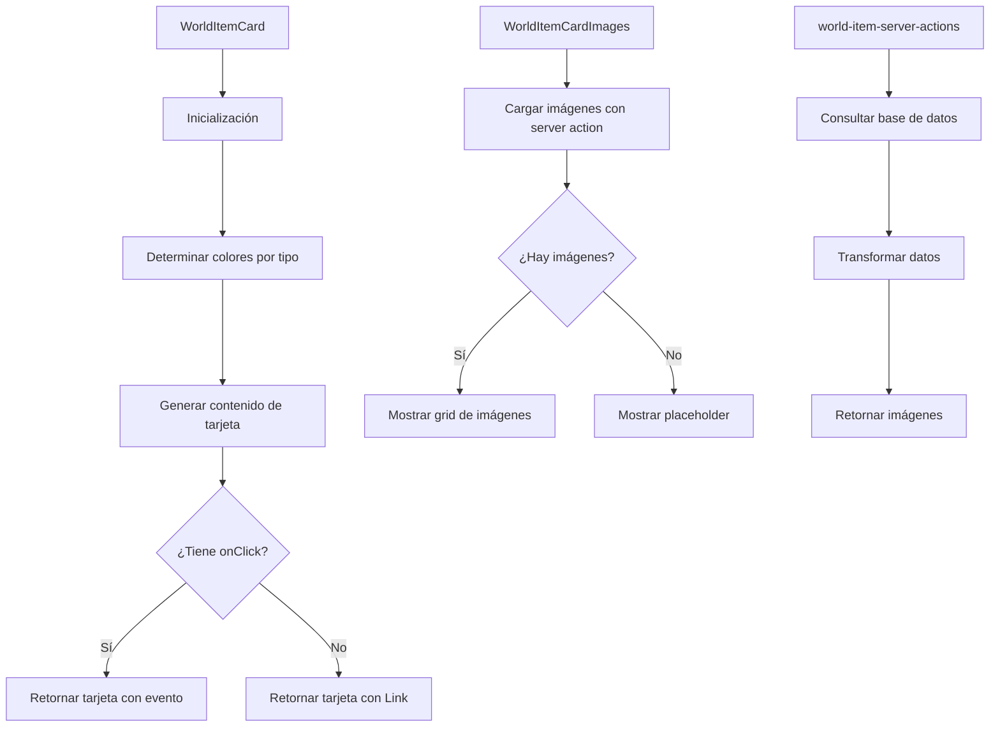

# 🎴 WorldItemCard

Componente que muestra una tarjeta estilo Magic para representar objetos del mundo (world items).

## 📋 Descripción

Este componente forma parte del sistema de tarjetas de entidades, siguiendo el mismo diseño que `CharacterCard` y `PlaceCard`. Cada tarjeta tiene un diseño inspirado en cartas de Magic:

- Cabecera con título e icono
- Sección de imágenes en un grid
- Sección de descripción
- Colores adaptados al tipo de objeto

## 🔄 Flujo de funcionamiento



## 🗂️ Estructura de archivos

- **index.tsx**: Punto de entrada y exportaciones del componente
- **world-item-card.tsx**: Componente principal que renderiza la tarjeta
- **world-item-card-images.tsx**: Componente para mostrar las imágenes del objeto
- **world-item-server-actions.ts**: Acciones del servidor para obtener datos
- **world-item-card.test.tsx**: Tests del componente

## 🖥️ Ejemplos de uso

### Uso básico con navegación automática

```tsx
import { WorldItemCard } from '@/components/cards/world-item-card';

function WorldItemsList({ worldItems }) {
  return (
    <div className="grid grid-cols-3 gap-4">
      {worldItems.map(item => (
        <WorldItemCard key={item.id} worldItem={item} />
      ))}
    </div>
  );
}
```

### Uso con manejador de eventos personalizado

```tsx
import { WorldItemCard } from '@/components/cards/world-item-card';

function WorldItemsSelector({ worldItems, onSelect }) {
  return (
    <div className="grid grid-cols-3 gap-4">
      {worldItems.map(item => (
        <WorldItemCard
          key={item.id}
          worldItem={item}
          onClick={onSelect}
        />
      ))}
    </div>
  );
}
```

## 🔌 Integración

Este componente se utiliza principalmente en:
- `WorldItemsView`: Vista principal de objetos del mundo
- Selectores de objetos en formularios
- Diálogos y modales de selección

## 🎨 Personalización visual

Los colores y el icono del componente se determinan automáticamente según el tipo de objeto:
- **ARTIFACT**: Colores púrpura/violeta con icono de gema
- **BOOK**: Colores azul/turquesa con icono de libro
- **CONSUMABLE**: Colores verde/naranja con icono de tienda
- **Otros tipos**: Colores azul oscuro con icono de caja genérico