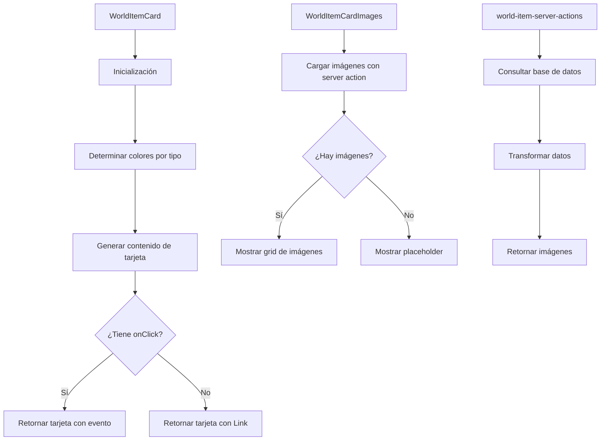

# 🎴 WorldItemCard

Un componente de tarjeta para mostrar información de objetos del mundo con un diseño inspirado en cartas de juegos de colección (TCG).

## 📋 Descripción

El componente `WorldItemCard` presenta información de objetos del mundo en formato de carta TCG (Trading Card Game), con efectos visuales y diseño estructurado que muestra propiedades, atributos, estadísticas e imágenes relacionadas.

## 🔄 Flujo de funcionamiento



## 🗂️ Estructura de archivos

- **index.tsx**: Punto de entrada y exportaciones del componente
- **world-item-card.tsx**: Componente principal que renderiza la tarjeta
- **world-item-card-images.tsx**: Componente para mostrar las imágenes del objeto
- **world-item-server-actions.ts**: Acciones del servidor para obtener datos
- **world-item-card.test.tsx**: Tests del componente

## 🖥️ Ejemplos de uso

### Uso básico con navegación automática

```tsx
import { WorldItemCard } from '@/components/cards/world-item-card';

function WorldItemsList({ worldItems }) {
  return (
    <div className="grid grid-cols-3 gap-4">
      {worldItems.map(item => (
        <WorldItemCard key={item.id} worldItem={item} />
      ))}
    </div>
  );
}
```

### Uso con manejador de eventos personalizado

```tsx
import { WorldItemCard } from '@/components/cards/world-item-card';

function WorldItemsSelector({ worldItems, onSelect }) {
  return (
    <div className="grid grid-cols-3 gap-4">
      {worldItems.map(item => (
        <WorldItemCard
          key={item.id}
          worldItem={item}
          onClick={onSelect}
        />
      ))}
    </div>
  );
}
```

## 🔌 Integración

Este componente se utiliza principalmente en:

- `WorldItemsView`: Vista principal de objetos del mundo
- Selectores de objetos en formularios
- Diálogos y modales de selección

## 🎨 Personalización visual

Los colores y el icono del componente se determinan automáticamente según el tipo de objeto:

- **ARTIFACT**: Colores púrpura/violeta con icono de gema
- **BOOK**: Colores azul/turquesa con icono de libro
- **CONSUMABLE**: Colores verde/naranja con icono de tienda
- **Otros tipos**: Colores azul oscuro con icono de caja genérico

## Características

- **Diseño TCG**: Efectos visuales que simulan cartas de juegos como Magic, Yu-Gi-Oh o Pokémon
- **Visualización de rareza**: Muestra visualmente la rareza del objeto con efectos apropiados
- **Imágenes asociadas**: Muestra miniaturas de las imágenes vinculadas al objeto
- **Estadísticas detalladas**: Muestra propiedades, atributos, efectos y requisitos
- **Animaciones**: Efectos de hover y selección para mejorar la experiencia de usuario
- **Personalizable**: Admite múltiples opciones de personalización (TCG, compacto, interactivo)
- **Accesible**: Soporte completo para navegación con teclado

## Uso

```tsx
import { WorldItemCard } from '@/components/cards/world-item-card';

// Dentro de tu componente
<WorldItemCard
  worldItem={worldItemWithRelations}
  onClick={() => handleWorldItemClick(worldItem.id)}
  tcgMode={true}
  compact={false}
/>
```

## Props

| Prop | Tipo | Descripción |
|------|------|-------------|
| `worldItem` | `WorldItemWithRelations` | Objeto con relaciones y contadores |
| `onClick` | `() => void` | Función a ejecutar al hacer clic en la tarjeta |
| `className` | `string` | Clases CSS adicionales |
| `style` | `React.CSSProperties` | Estilos inline adicionales |
| `tcgMode` | `boolean` | Activar/desactivar diseño TCG (por defecto: `true`) |
| `isSelected` | `boolean` | Indica si la tarjeta está seleccionada |
| `compact` | `boolean` | Versión más compacta de la tarjeta |
| `disabled` | `boolean` | Deshabilita la interacción |
| `interactive` | `boolean` | Habilita/deshabilita efectos interactivos (por defecto: `true`) |

## Tipo de Datos

El componente espera un objeto `WorldItemWithRelations` que incluye:

```typescript
interface WorldItemWithRelations {
  id: string;
  name: string;
  emoji: string;
  color: string;
  description: string | null;
  shortcut: string | null;
  category: string;
  type: string;
  rarity: string;
  size: string;
  origin: string;
  attributes: string[] | string;
  effects: WorldItemEffect[] | string;
  requirements: Record<string, WorldItemRequirement> | string;
  stats: WorldItemStats | string;
  properties: WorldItemProperty[] | string;
  featuredImage: string | object | null;
  isFavorite: boolean;
  createdAt: Date;
  updatedAt: Date;
  _count?: {
    images: number;
    videos: number;
    albums: number;
    collections: number;
    tags: number;
    characters: number;
    places: number;
    concepts: number;
    prompts: number;
    notes: number;
    wildcards: number;
    properties: number;
    groups: number;
  }
}
```

## Alineación con el esquema Prisma

Esta implementación se alinea con el modelo WorldItem en el esquema Prisma, incluyendo:

- Propiedades básicas (id, name, emoji, color)
- Atributos específicos (type, rarity, size, origin)
- Datos estructurados JSON (attributes, effects, requirements, stats, properties)
- Configuración visual (featuredImage, isFavorite)
- Relaciones con otras entidades (albums, collections, characters, etc.)
- Conteos de relaciones (_count)

## Componentes auxiliares

El componente WorldItemCard utiliza varios componentes auxiliares:

- `CardHeader`: Muestra el título, icono y tipo de objeto
- `WorldItemCardImages`: Muestra miniaturas de imágenes relacionadas
- `WorldItemCardContent`: Muestra descripción, propiedades, efectos y estadísticas
- `WorldItemCardFooter`: Muestra metadatos y contadores

## Estilo TCG

La visualización en modo TCG incluye efectos como:

1. Gradientes y bordes estilizados según el tipo de objeto
2. Indicadores visuales de rareza (común, poco común, raro, épico, legendario)
3. Efectos de brillo basados en la rareza
4. Animaciones al pasar el cursor
5. Iconos específicos según el tipo de objeto
6. Colores temáticos basados en el tipo y rareza del objeto
