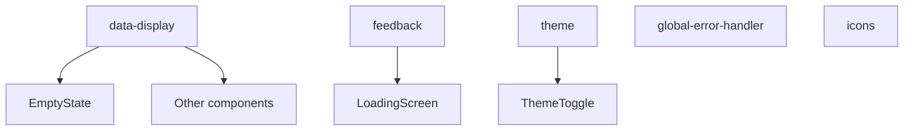

# Core components

This module groups basic components and shared utilities for the application.

## Structure



The module includes the following parts:

- **data-display/**: Presentation elements such as `EmptyState`.
- **feedback/**: Feedback components, including the loading screen and messages.
- **theme/**: Light and dark theme handling through `ThemeToggle`.
- **error-boundary.tsx** and **global-error-handler.tsx**: Capture of React errors.
- **icons.tsx**: Shared icons used across modules.

## Basic use

```tsx
import { EmptyState } from '@/components/core/data-display/empty-state';
import { ThemeToggle } from '@/components/core/theme/theme-toggle';
```

You can use these components anywhere in the application for status messages and theme control.
