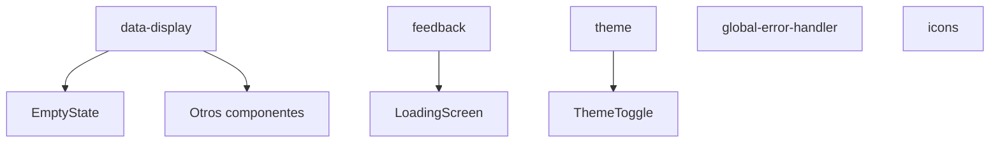

# Componentes Core

Este módulo agrupa componentes básicos y utilidades compartidas en toda la aplicación.

## Estructura



- **data-display/**: Elementos de presentación como `EmptyState`.
- **feedback/**: Componentes de retroalimentación (pantalla de carga, mensajes, etc.).
- **theme/**: Manejo de tema claro/oscuro mediante `ThemeToggle`.
- **error-boundary.tsx** y **global-error-handler.tsx**: Captura de errores de React.
- **icons.tsx**: Iconos compartidos usados en distintos módulos.

## Uso básico

```tsx
import { EmptyState } from '@/components/core/data-display/empty-state';
import { ThemeToggle } from '@/components/core/theme/theme-toggle';
```

Estos componentes pueden usarse en cualquier parte de la aplicación para brindar mensajes de estado y gestión de tema.
