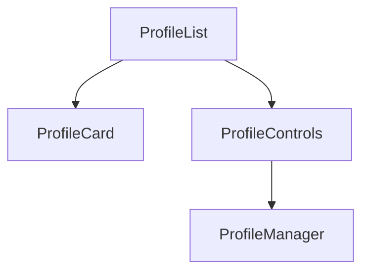

# Módulo de Entidades

Este directorio contiene componentes relacionados con entidades particulares del sistema. Actualmente solo incluye los componentes de **Perfil**.

## Carpetas

- **profile/**: Gestión de perfiles de usuario o contexto de trabajo.

## Descripción rápida

- **ProfileCard**: Muestra información básica de un perfil.
- **ProfileControls**: Botones para crear o seleccionar perfiles.
- **ProfileList**: Lista de perfiles disponibles.
- **ProfileManager**: Componente central que integra los demás.

Estos componentes se usan en las vistas de configuración o cuando es necesario cambiar de perfil activo.
