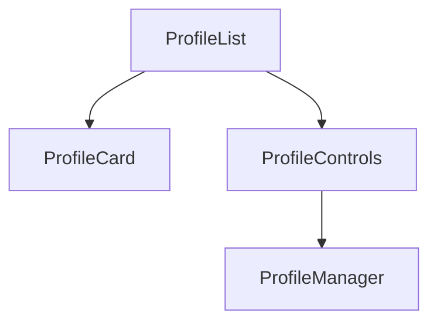

# Entity module

This directory holds components for particular system entities.

The directory currently includes **Profile** components only.

## Folders

The directory contains the following folder:

- **profile/**: User profile management or work context.

## Quick description

The profile components have the following roles:

- **ProfileCard**: Shows basic profile information.
- **ProfileControls**: Buttons that create or select profiles.
- **ProfileList**: List of available profiles.
- **ProfileManager**: Central component that integrates the others.

Settings views use these components when the active profile must change.
