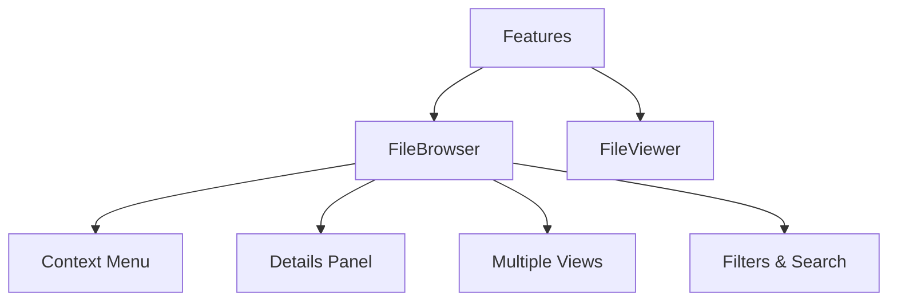

# Features module

This module groups main application features.

The module contains the following submodules:

- **file-browser/**: File navigation and display with multiple views, multi-select, a context menu, and an integrated details panel.
- **file-viewer/**: Component for individual file display of images and videos.

## Architecture

### FileBrowser

The main component includes the following parts:

- **Views**: Grid, List, Cards, and Masonry with virtualization
- **Context Menu**: Modular system with dynamic submenus
- **Details Panel**: Consolidated panel with EntityWithStats
- **Filters**: Filter and search system
- **Hooks**: Specialized utilities for data load and virtualization

### FileViewer

This focused component displays one file at a time.

Detailed technical documentation lives in `/docs/`.
