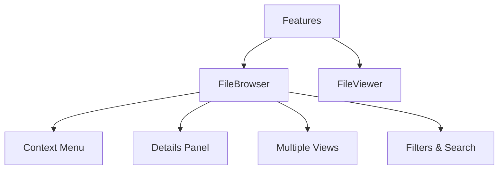

# Módulo de Features

Agrupa funcionalidades principales de la aplicación. Contiene los siguientes submódulos:

- **file-browser/**: Navegación y visualización de archivos con múltiples vistas, selección múltiple, menú contextual y panel de detalles integrado.
- **file-viewer/**: Componente de visualización individual de archivos (imágenes, videos, etc.).

## Arquitectura

### FileBrowser

Componente principal que incluye:

- **Views**: Grid, List, Cards, Masonry con virtualización
- **Context Menu**: Sistema modular con submenús dinámicos
- **Details Panel**: Panel consolidado con EntityWithStats
- **Filters**: Sistema de filtrado y búsqueda
- **Hooks**: Utilidades especializadas para carga de datos y virtualización

### FileViewer

Componente simple y enfocado para visualización individual de archivos.

La documentación técnica detallada se encuentra en `/docs/`.
