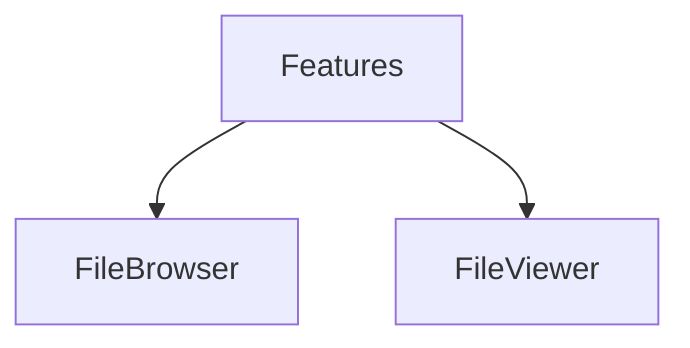

# Módulo de Features

Agrupa funcionalidades principales de la aplicación. Contiene los siguientes submódulos:

- **file-browser/**: Navegación y visualización de archivos.
- **file-viewer/**: Componente de visualización individual de archivos (imágenes, videos, etc.).

Cada submódulo dispone de su propia documentación interna. Consulta `file-browser/docs/` para detalles de precarga y optimizaciones.
