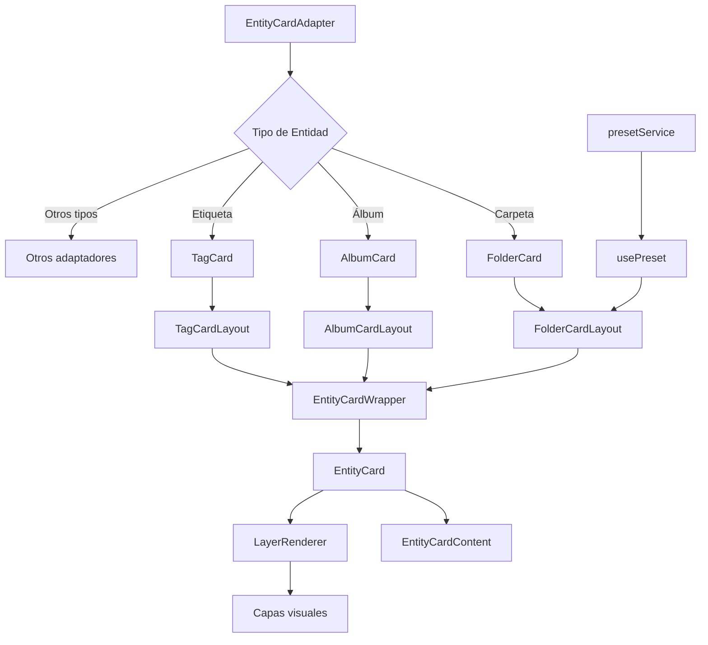

# Sistema de Tarjetas de Entidades

Este sistema proporciona una forma flexible y extensible de mostrar diferentes tipos de entidades (carpetas, imágenes, álbumes, etc.) como tarjetas visuales interactivas.

## Arquitectura

El sistema está diseñado con una arquitectura modular que permite:

- Personalización visual por tipo de entidad
- Efectos visuales avanzados (holográfico, brillo, etc.)
- Sistema de capas para efectos visuales
- Soporte para presets visuales guardados
- Adaptadores específicos por tipo de entidad

## Diagrama de Flujo



## Componentes Principales

### EntityCardAdapter

Punto de entrada principal que selecciona el adaptador adecuado según el tipo de entidad.

### Adaptadores Específicos (FolderCard, AlbumCard, etc.)

Componentes que adaptan los datos específicos de cada entidad al formato común de tarjeta.

### Layouts Específicos (FolderCardLayout, AlbumCardLayout, etc.)

Definen la estructura visual y la disposición de los elementos para cada tipo de entidad.

### EntityCardWrapper

Envuelve el componente EntityCard y proporciona opciones por defecto según el tipo de entidad.

### EntityCard

Componente principal que maneja la interactividad, efectos 3D y sistemas de capas.

### Sistema de Presets

Permite guardar y cargar configuraciones visuales predefinidas para diferentes tipos de entidades.

## Personalización

El sistema permite personalizar:

- Colores y estilos
- Efectos visuales
- Disposición de elementos
- Animaciones
- Interactividad

## Uso

```tsx
// Ejemplo básico
<EntityCardAdapter
  entityType="folder"
  entity={folderData}
  onClick={handleFolderClick}
/>

// Con opciones personalizadas
<EntityCardAdapter
  entityType="folder"
  entity={folderData}
  options={{
    enableHolographicEffect: true,
    designSystem: {
      preset: 'folder',
      cornerRadius: 16
    }
  }}
  onClick={handleFolderClick}
/>
```

## Estilos

Los estilos se aplican mediante una combinación de:

- Clases CSS específicas por componente
- Clases CSS específicas por tipo de entidad
- Estilos inline generados dinámicamente
- Variables CSS para temas

## Extensión

Para añadir soporte para un nuevo tipo de entidad:

1. Crear un componente de tarjeta (ej: `NewEntityCard.tsx`)
2. Crear un componente de layout (ej: `NewEntityCardLayout.tsx`)
3. Registrar el adaptador en `entity-card-adapter.tsx`
4. Añadir estilos específicos si es necesario
