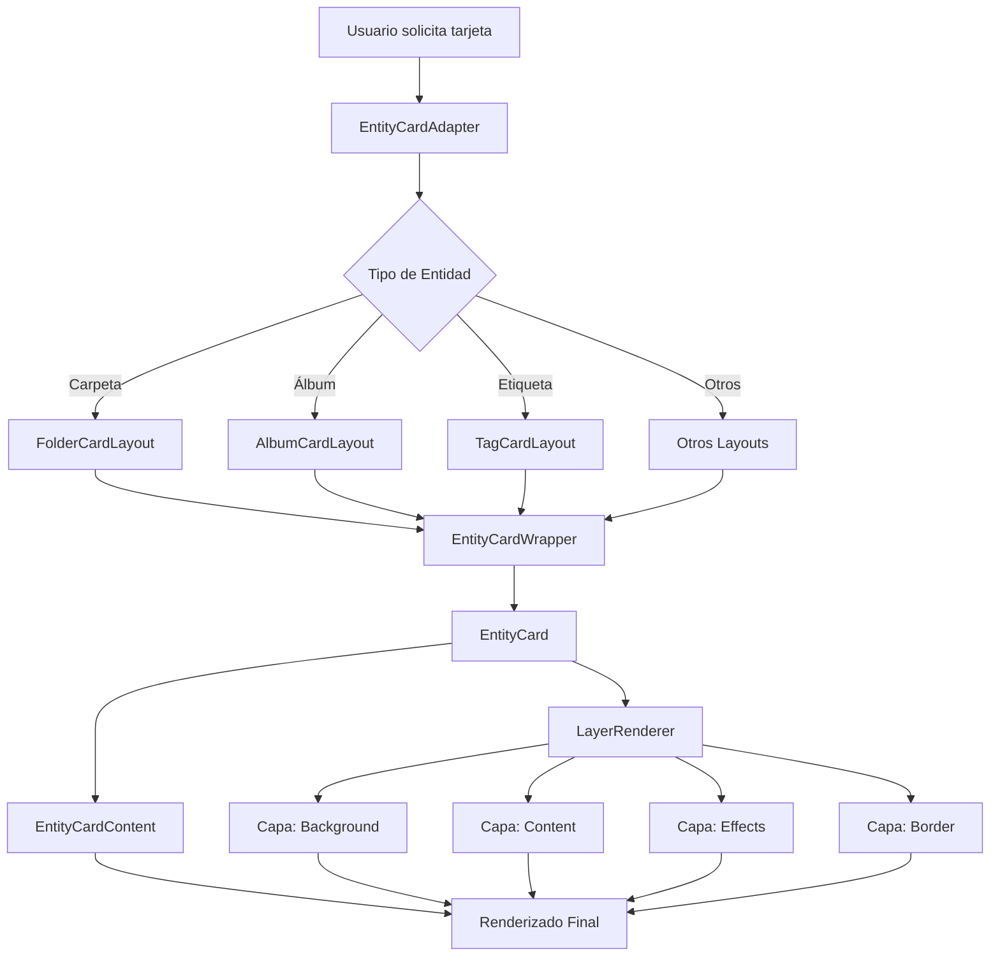
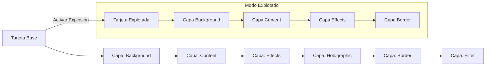

# Arquitectura del Sistema Entity Cards

## Visión General

El sistema Entity Cards es un framework modular para renderizar tarjetas de entidades con efectos visuales avanzados. Está diseñado para ser extensible, configurable y reutilizable en toda la aplicación.

## Componentes Principales

### 1. Adaptadores

Los adaptadores conectan los tipos de entidades específicos con sus layouts correspondientes:

- `entity-card-adapter.ts`: Adaptador principal que selecciona el layout adecuado según el tipo de entidad
- `card-adapter-factory.tsx`: Fábrica para crear adaptadores genéricos para diferentes tipos de entidades

### 2. Sistema de Capas

El sistema de capas permite aplicar efectos visuales a las tarjetas:

- `layer-plugin-system.tsx`: Sistema de plugins para registrar y gestionar capas
- `RegisterLayers`: Componente que registra todas las capas disponibles
- Capas individuales (glow, border, scanlines, etc.)

### 3. Módulos

Los módulos proporcionan funcionalidades específicas:

- `animation`: Sistema de animaciones para tarjetas
- `backside`: Gestión de la cara posterior de las tarjetas
- `colors`: Sistema de colores y paletas
- `core`: Funcionalidad central y configuración
- `design`: Sistema de diseño visual
- `effects`: Efectos visuales avanzados
- `performance`: Optimizaciones de rendimiento

### 4. Layouts

Los layouts definen la estructura visual para cada tipo de entidad:

- `folder-card.tsx`, `album-card.tsx`, etc.: Layouts específicos para cada tipo de entidad
- `image-grid.tsx`: Componente para mostrar grids de imágenes

### 5. Presets Visuales

El sistema de presets permite guardar y aplicar configuraciones visuales:

- `use-preset.ts`: Hook para gestionar presets
- `visual-presets.actions.ts`: Acciones del servidor para gestionar presets

## Flujo de Datos

1. El usuario solicita una tarjeta para una entidad específica
2. `EntityCardAdapter` selecciona el layout adecuado según el tipo de entidad
3. Se cargan las configuraciones de capas y presets visuales
4. Se renderiza la tarjeta con todas sus capas y efectos
5. Las interacciones del usuario (hover, click) activan efectos y animaciones

## Extensibilidad

### Añadir un Nuevo Tipo de Entidad

1. Crear un nuevo tipo en `types/entities/`
2. Crear un layout en `layouts/`
3. Registrar el adaptador en `entity-card-adapter.ts`

### Añadir una Nueva Capa

1. Duplicar la carpeta `layers/templates/`
2. Implementar la lógica específica de la capa
3. Registrar la capa en `register-layers.tsx`

## Optimizaciones

- Lazy loading de componentes pesados
- Memoización de configuraciones y cálculos costosos
- Sistema de rendimiento configurable
- Renderizado condicional de efectos

## Consideraciones Técnicas

- El sistema está diseñado para funcionar con Next.js 15 y React 19
- Utiliza Server Components y Server Actions para operaciones del servidor
- Integra con Prisma para persistencia de configuraciones
- Utiliza TailwindCSS para estilos y shadcn/ui para componentes de interfaz

## Diagramas de Arquitectura

### Flujo de Datos



### Estructura de Componentes

```mermaid
classDiagram
    class EntityCardAdapter {
        +entityType: string
        +entity: Entity
        +options: CardOptions
        +render()
    }

    class EntityCardWrapper {
        +entityType: string
        +entityId: string
        +title: string
        +description: string
        +options: CardOptions
        +render()
    }

    class EntityCard {
        +id: string
        +title: string
        +description: string
        +image: string
        +options: CardOptions
        +enableLayers: boolean
        +enableDesign: boolean
        +enableAnimation: boolean
        +render()
    }

    class EntityCardContent {
        +title: string
        +description: string
        +image: string
        +images: ImageGridImage[]
        +imageLayout: string
        +imageStyle: string
        +render()
    }

    class LayerRenderer {
        +isExploded: boolean
        +isHovered: boolean
        +mousePosition: {x,y}
        +activeLayer: string
        +entityType: string
        +entityId: string
        +configs: object
        +render()
    }

    class FolderCardLayout {
        +folder: Folder
        +onClick: function
        +showVisualConfig: boolean
        +enableExplode: boolean
        +render()
    }

    EntityCardAdapter --> EntityCardWrapper
    EntityCardWrapper --> EntityCard
    EntityCard --> EntityCardContent
    EntityCard --> LayerRenderer
    FolderCardLayout --> EntityCardWrapper
```

### Sistema de Capas


