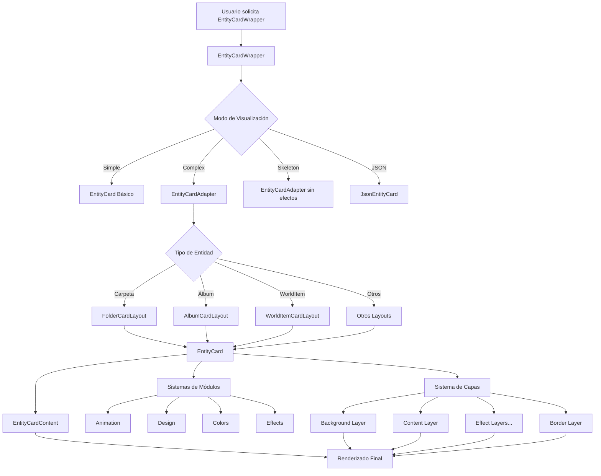
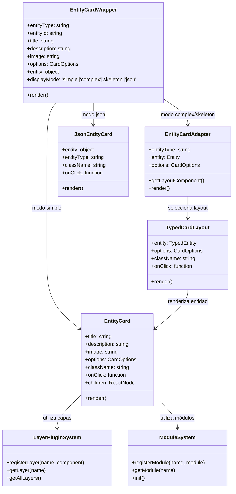
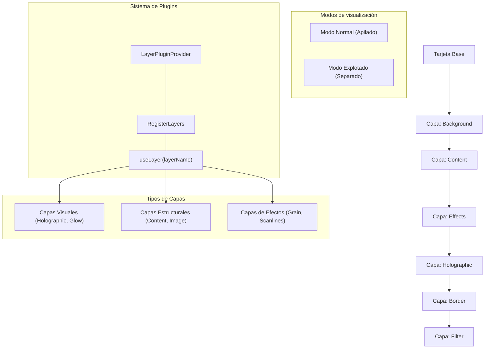
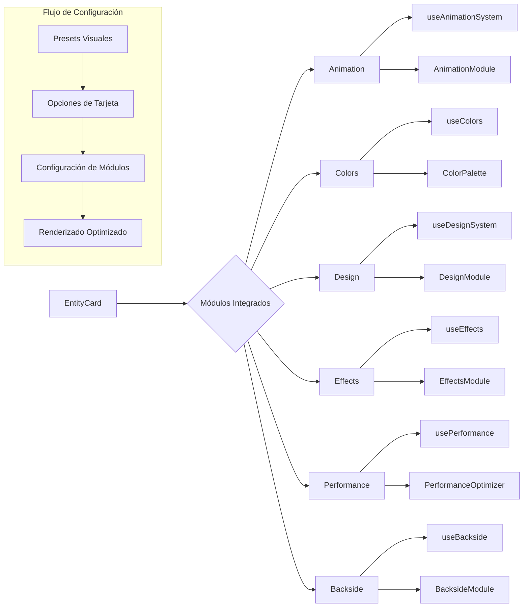

# Arquitectura del Sistema Entity Cards (v2.0)

## Visión General

El sistema Entity Cards es un framework modular para renderizar tarjetas de entidades con efectos visuales avanzados. Está diseñado para ser extensible, configurable y reutilizable en toda la aplicación, permitiendo la visualización consistente de diferentes tipos de entidades (carpetas, álbumes, etiquetas, personajes, etc.).

## Componentes Principales

### 1. EntityCard
El componente raíz que coordina la presentación de tarjetas. Tiene tres modos principales:
- **Simple**: Versión básica para máximo rendimiento
- **Complex**: Versión completa con efectos visuales avanzados
- **Skeleton**: Versión estructural para pruebas sin efectos visuales
- **JSON**: Modo de desarrollo para visualizar datos brutos

### 2. EntityCardWrapper
Envoltorio que maneja los modos de visualización y proporciona soporte para depuración. Sirve como punto de entrada principal para usar tarjetas en la aplicación.

### 3. Adaptadores de Entidades
Conectan los tipos de entidades específicos con sus layouts correspondientes:

- `entity-card-adapter.tsx`: Adaptador principal que selecciona el layout adecuado según el tipo de entidad
- `card-adapter-factory.tsx`: Fábrica para crear adaptadores genéricos para diferentes tipos de entidades
- Adaptadores específicos por tipo (`folder-adapter.tsx`, `world-item-adapter.tsx`, etc.)

### 4. Sistema de Capas

El sistema de capas permite aplicar efectos visuales a las tarjetas de manera modular:

- `layer-plugin-system.tsx`: Sistema de plugins para registrar y gestionar capas
- `RegisterLayers`: Componente que registra todas las capas disponibles
- Capas individuales (glow, border, scanlines, holographic, etc.) organizadas en subdirectorios

### 5. Módulos Funcionales

Los módulos proporcionan funcionalidades específicas:

- `animation`: Sistema de animaciones para tarjetas
- `backside`: Gestión de la cara posterior de las tarjetas
- `colors`: Sistema de colores y paletas
- `core`: Funcionalidad central y configuración
- `design`: Sistema de diseño visual
- `effects`: Efectos visuales avanzados
- `performance`: Optimizaciones de rendimiento
- `preview`: Sistema de vista previa de tarjetas
- `rarities`: Sistema de rareza para entidades

### 6. Layouts Específicos

Los layouts definen la estructura visual para cada tipo de entidad:

- `folder-card-layout.tsx`, `album-card-layout.tsx`, etc.: Layouts específicos para cada tipo de entidad
- `base-card-layout.tsx`: Layout base del que heredan los demás

### 7. Sistema de Tipos

Sistema extenso de tipos TypeScript para asegurar la consistencia:

- `unified-card-types.ts`: Tipos principales del sistema
- Tipos específicos para cada entidad y subsistema

### 8. Presets Visuales

El sistema de presets permite guardar y aplicar configuraciones visuales:

- `use-preset.ts`: Hook para gestionar presets
- `visual-presets.actions.ts`: Acciones del servidor para gestionar presets
- Configuraciones predefinidas para diferentes tipos de entidades

## Flujo de Datos

## Estructura de Componentes

## Sistema de Capas

## Integración con Módulos

## Extensibilidad

### Añadir un Nuevo Tipo de Entidad

1. Crear un nuevo tipo en `types/`
2. Crear un layout en `layouts/`
3. Crear un adaptador en `adapters/`
4. Registrar el adaptador en `entity-card-adapter.tsx`
5. Crear estilos CSS específicos (opcional)
6. Definir presets visuales para el nuevo tipo

### Añadir una Nueva Capa

1. Crear una carpeta en `layers/` siguiendo la estructura estándar
2. Implementar los componentes principales:
   - `[nombre]-layer.tsx`: Componente principal
   - `[nombre]-settings.tsx`: Panel de configuración
   - `actions/[nombre]-config.action.ts`: Acciones del servidor
3. Registrar la capa en `register-layers.tsx`

## Optimizaciones de Rendimiento

El sistema incluye varias optimizaciones para mantener un buen rendimiento:

- **Modos de visualización**: 'simple' para casos de uso de alto rendimiento
- **Lazy loading**: Carga diferida de componentes pesados
- **Memorización**: Uso de `useMemo` y `useCallback` para evitar re-renders
- **Renderizado condicional**: Solo se renderizan los efectos habilitados
- **Módulo de rendimiento**: Ajuste automático según las capacidades del dispositivo

## Integración con Backend

- Uso de Server Actions para operaciones de persistencia
- Integración con Prisma para almacenamiento de presets y configuraciones
- Carga y guardado asíncrono de configuraciones

## Consideraciones Técnicas

- Compatible con Next.js 15 y React 19
- Utiliza Server Components y Server Actions para operaciones del servidor
- Integrado con Prisma para persistencia de configuraciones
- Utiliza TailwindCSS 4 para estilos y shadcn/ui para componentes de interfaz
- Sistema modular que permite habilitar/desactivar características específicas

## Monitoreo y Depuración

- Sistema de logs detallados en modo desarrollo
- Herramientas de depuración visual (`debug/card-debug-toolbar.tsx`)
- Panel de control interactivo para ajustar parámetros en tiempo real

## Patrones de Diseño Utilizados

- **Adapter**: Para conectar diferentes tipos de entidades con sus visualizaciones
- **Factory**: Para crear instancias de adaptadores y capas
- **Plugin**: Sistema de registro y uso de capas visuales
- **Provider**: Contextos para compartir estado y configuración
- **Hook**: Encapsulación de lógica reutilizable
- **Decorator**: Adición de funcionalidades a las tarjetas base
