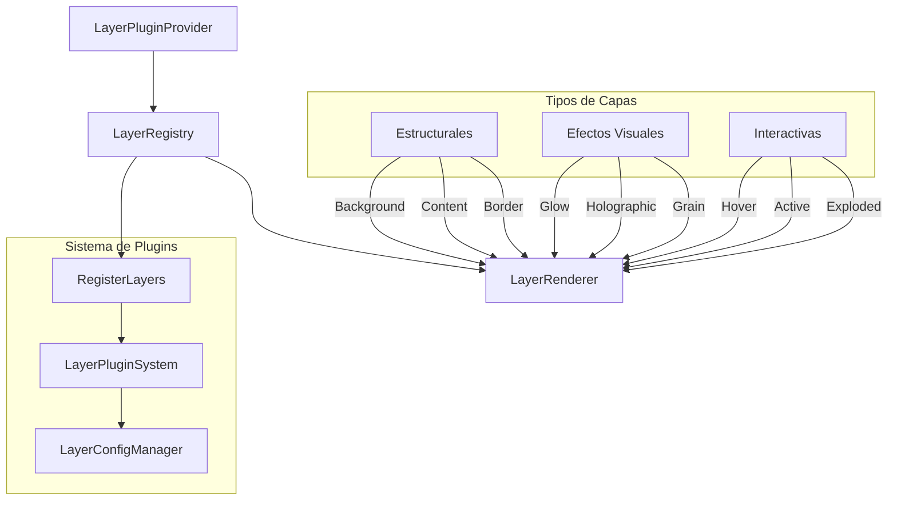
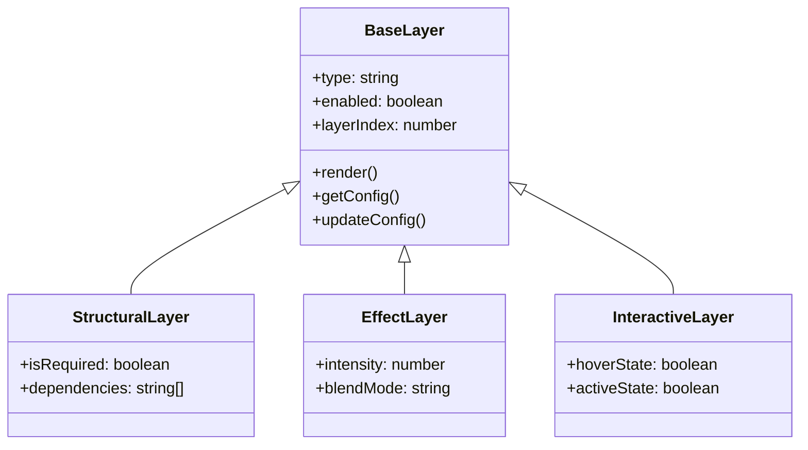
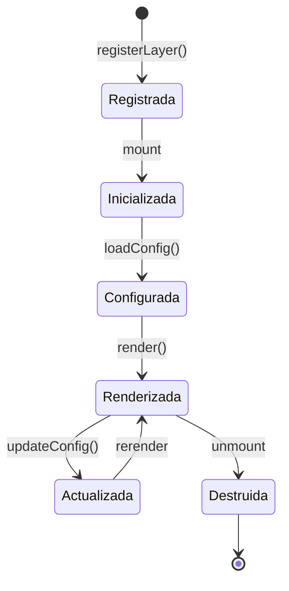

# Sistema de Capas Entity Cards v2.0

## Visión General

El sistema de capas es un framework modular y extensible que permite la composición de efectos visuales en las tarjetas de entidad. Cada capa representa un efecto visual específico que puede ser configurado, activado/desactivado y ordenado según las necesidades.

## Arquitectura del Sistema



## Jerarquía de Capas



## Sistema de Plugins

### Registro de Capas

```typescript
interface LayerPlugin<T extends BaseLayerConfig> {
  type: string;
  Component: React.ComponentType<LayerComponentProps<T>>;
  SettingsComponent?: React.ComponentType<LayerSettingsProps<T>>;
  defaultConfig: T;
  getServerActions: () => LayerServerActions<T>;
}

// Ejemplo de registro
registerLayer({
  type: 'holographic',
  Component: HolographicLayer,
  SettingsComponent: HolographicSettings,
  defaultConfig: {
    enabled: true,
    layerIndex: 5,
    intensity: 0.5
  },
  getServerActions: () => ({
    getConfig: getHolographicConfig,
    updateConfig: updateHolographicConfig,
    deleteConfig: deleteHolographicConfig
  })
});
```

## Ciclo de Vida de una Capa



## Integración con el Sistema de Presets

```typescript
interface LayerPreset {
  id: string;
  name: string;
  layers: {
    [key: string]: BaseLayerConfig;
  };
}

// Ejemplo de preset
const holographicPreset: LayerPreset = {
  id: 'holo-rare',
  name: 'Holographic Rare',
  layers: {
    holographic: {
      enabled: true,
      layerIndex: 5,
      intensity: 0.8
    },
    glow: {
      enabled: true,
      layerIndex: 6,
      color: '#ff00ff',
      spread: 20
    }
  }
};
```

## Optimización de Rendimiento

### Estrategias Implementadas

1. **Lazy Loading de Capas**
   - Carga bajo demanda de efectos pesados
   - Priorización de capas estructurales

2. **Cacheo de Renderizado**
   - Memorización de capas estáticas
   - Reuso de configuraciones comunes

3. **Gestión de Recursos**
   - Limpieza de efectos no utilizados
   - Pooling de recursos compartidos

```typescript
// Ejemplo de optimización
const OptimizedLayer = React.memo(({ config, ...props }) => {
  const cachedConfig = useMemo(() => ({
    ...config,
    computed: expensiveComputation(config)
  }), [config]);

  return <LayerRenderer config={cachedConfig} {...props} />;
});
```

## Ejemplos de Implementación

### 1. Capa Básica

```typescript
// basic-layer.tsx
export function BasicLayer({ config, isHovered }: LayerComponentProps<BasicConfig>) {
  return (
    <div
      className={cn(
        'absolute inset-0',
        isHovered && 'layer-hovered'
      )}
      style={{
        opacity: config.intensity
      }}
    />
  );
}
```

### 2. Capa con Efectos Avanzados

```typescript
// advanced-layer.tsx
export function AdvancedLayer({
  config,
  isExploded,
  getExplodeLayerTransform
}: LayerComponentProps<AdvancedConfig>) {
  const { intensity, effect } = config;

  return (
    <motion.div
      className="absolute inset-0"
      style={{
        filter: `${effect}(${intensity}px)`,
        ...(isExploded ? getExplodeLayerTransform(config.layerIndex) : {})
      }}
      animate={isExploded ? 'exploded' : 'normal'}
      variants={explodeVariants}
    />
  );
}
```

## Guías de Implementación

### 1. Creación de Nueva Capa

1. Define los tipos y configuración
2. Implementa el componente de la capa
3. Crea el componente de configuración
4. Implementa las acciones del servidor
5. Registra la capa en el sistema

### 2. Mejores Prácticas

- Utiliza transformaciones CSS para mejor rendimiento
- Implementa lazy loading para efectos pesados
- Mantén las capas modulares y reutilizables
- Documenta la configuración y dependencias
- Implementa tests para cada capa

## Depuración y Desarrollo

### Herramientas Disponibles

1. **Vista Explodida**
   - Separación visual de capas
   - Inspección de orden y composición

2. **Panel de Desarrollo**
   - Configuración en tiempo real
   - Visualización de estado

3. **Logging y Monitoreo**
   - Rendimiento de capas
   - Uso de recursos

## Próximas Mejoras

1. Sistema de dependencias entre capas
2. Optimización de rendimiento
3. Nuevos efectos visuales
4. Mejoras en la API de configuración
5. Herramientas de desarrollo mejoradas