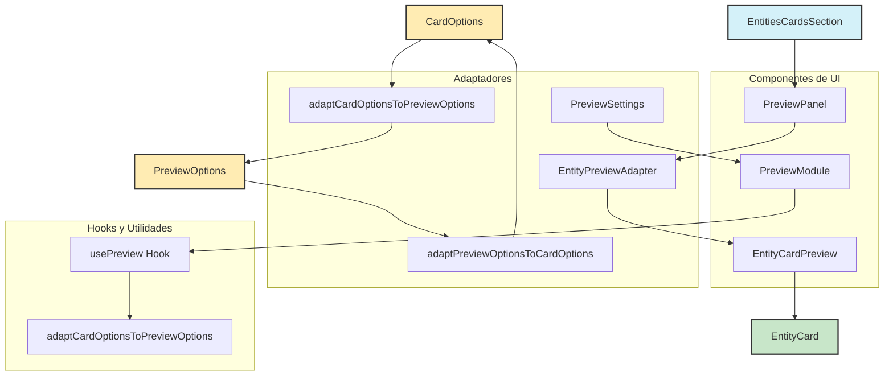

# Resumen del Sistema de Tarjetas de Entidad

## Propósito

El sistema de tarjetas de entidad proporciona una forma unificada y visualmente atractiva de representar diferentes tipos de entidades (carpetas, álbumes, etiquetas, etc.) en la interfaz de usuario. Permite una experiencia coherente mientras mantiene la flexibilidad para mostrar información específica de cada tipo de entidad.

## Componentes Principales

- **EntityCardAdapter**: Punto de entrada principal que determina qué tipo de tarjeta renderizar basado en el tipo de entidad.
- **EntityCardWrapper**: Contenedor que proporciona funcionalidades comunes como efectos visuales, interactividad y modo de explosión de capas.
- **Layouts específicos**: Implementaciones para cada tipo de entidad (FolderCardLayout, AlbumCardLayout, etc.).
- **Sistema de capas**: Permite separar visualmente los componentes de la tarjeta para una mejor comprensión de su estructura.

## Características Clave

- **Adaptabilidad**: Se ajusta a diferentes tipos de entidades manteniendo una apariencia coherente.
- **Personalización visual**: Soporta diferentes presets de diseño, efectos y configuraciones visuales.
- **Interactividad**: Incluye estados hover, click y animaciones para mejorar la experiencia del usuario.
- **Modo de explosión**: Permite ver las diferentes capas de la tarjeta separadas para entender su estructura.
- **Rendimiento optimizado**: Utiliza técnicas para minimizar el impacto en el rendimiento de los efectos visuales.

## Recientes Mejoras y Correcciones

- **Adaptación Responsiva**: Se han añadido clases para que las tarjetas se adapten al tamaño completo de su contenedor.
- **Documentación Visual**: Se han agregado diagramas Mermaid para visualizar la arquitectura y flujo de datos.
- **Rediseño de Tarjetas de Carpeta**: Se ha implementado un nuevo diseño inspirado en cartas de Magic/Pokémon TCG con bordes estilizados, efectos visuales mejorados y una estética más atractiva.
- **Mejoras Visuales**: Se han añadido efectos de resplandor, texturas sutiles y decoraciones de esquinas para dar más profundidad y atractivo visual.
- **Sistema de Rareza Mejorado**: Se ha refinado el sistema de rareza con gradientes, animaciones y efectos visuales específicos para cada nivel.
- **Corrección de Dependencias Circulares**: Se ha implementado un sistema de carga dinámica de adaptadores para evitar problemas de inicialización y dependencias circulares.
- **Refactorización de Utilidades**: Se han extraído funciones comunes a módulos de utilidades para mejorar la mantenibilidad y evitar duplicación de código.
- **Corrección de Errores de Contexto**: Se ha corregido el error de LayerPluginProvider en EntityCard para asegurar que los hooks se usen dentro del contexto adecuado.
- **Corrección de Errores en Módulo de Diseño**: Se han añadido verificaciones de nulidad para customCssClasses y customCssVariables en DesignPanel para evitar errores cuando estos valores son undefined.
- **Mejora en la Gestión de Estado**: Se ha mejorado el hook useDesignSystem para garantizar que las propiedades críticas siempre estén definidas, evitando errores de valores nulos o indefinidos.
- **Corrección de Errores en Presets**: Se ha corregido el error en PresetCard al intentar parsear valores por defecto como JSON, implementando verificaciones para evitar intentar parsear strings que no son JSON válidos.
- **Manejo Robusto de Entidades Indefinidas**: Se ha implementado verificación de nulidad y valores por defecto en todos los componentes de tarjeta para evitar errores cuando se reciben entidades indefinidas o nulas.
- **Mejora del Módulo de Animación**: Se ha implementado un sistema mejorado de generación de CSS para animaciones, con funciones específicas para generar clases, variables y estilos en línea.
- **Refactorización del Hook useAnimationSystem**: Se ha mejorado el hook principal de animaciones para una mejor reutilización y mantenibilidad.
- **Integración con EntityCard**: Se ha actualizado el componente principal para utilizar las nuevas funciones de generación de CSS.
- **Soporte para Funciones de Temporización Personalizadas**: Se ha añadido soporte para funciones cubic-bezier personalizadas con manejo automático tanto en clases CSS como en estilos en línea.
- **Método applyCustomTimingFunction**: Se ha implementado un método en el hook useAnimationSystem para facilitar la aplicación de funciones de temporización personalizadas mediante parámetros numéricos.
- **Mejora en la Integración de Capas**: Se ha refactorizado el componente EntityCard para una mejor integración con el sistema de capas, implementando correctamente el LayerPluginProvider y RegisterLayers, y optimizando el renderizado de capas.

## Próximos Pasos

- Implementar más presets de diseño para diferentes contextos de uso.
- Mejorar la accesibilidad de las tarjetas.
- Optimizar aún más el rendimiento para grandes cantidades de tarjetas.
- Añadir más opciones de personalización para el usuario final.

# Resumen de Implementación: Módulo de Vista Previa

## Cambios Realizados

Hemos implementado un sistema completo de vista previa para las tarjetas de entidad, que incluye:

1. **Componentes de Vista Previa**:

   - `EntityCardPreview`: Componente base que renderiza una tarjeta con datos de ejemplo
   - `EntityPreviewAdapter`: Adaptador para garantizar compatibilidad entre diferentes formatos de opciones
   - `PreviewPanel`: Panel visual con controles para interactuar con la vista previa
   - `PreviewModule`: Módulo de configuración completo para ajustar las opciones de vista previa

2. **Utilidades y Adaptadores**:

   - `adaptCardOptionsToPreviewOptions`: Convierte opciones de tarjeta a opciones de vista previa
   - `adaptPreviewOptionsToCardOptions`: Convierte opciones de vista previa a opciones de tarjeta
   - `applyPreviewOptionToCardOptions`: Aplica una opción específica de vista previa a las opciones de tarjeta
   - `getPreviewDimensions`: Obtiene las dimensiones en píxeles según el tamaño seleccionado

3. **Hooks y Estado**:

   - `usePreview`: Hook para gestionar el estado de la vista previa
   - `PreviewOptions`: Tipo para las opciones de vista previa
   - `PreviewPanelProps`: Tipo para las props del panel de vista previa

4. **Integración con EntitiesCardsSection**:
   - Actualización del componente principal para utilizar los nuevos componentes de vista previa
   - Implementación de controles para ajustar el zoom y la visualización

## Corrección de Errores

1. **Resolución de Dependencias Circulares**:

   - Implementación de un sistema de carga dinámica para los adaptadores de tarjeta
   - Uso de importaciones dinámicas para romper ciclos de dependencia
   - Creación de un módulo de utilidades para funciones compartidas (rarity-utils)

2. **Mejoras de Arquitectura**:

   - Refactorización de la estructura de componentes para evitar problemas de inicialización
   - Separación clara de responsabilidades entre componentes y utilidades
   - Implementación de estados de carga para manejar la inicialización asíncrona

3. **Corrección de Errores de Contexto y Validación**:
   - Corrección del error de LayerPluginProvider en EntityCard
   - Añadida verificación de nulidad para customCssClasses en DesignPanel
   - Añadida verificación de nulidad para customCssVariables en DesignPanel
   - Mejora en el hook useDesignSystem para garantizar valores por defecto seguros
   - Implementación de validaciones para evitar errores de undefined o null
   - Corrección del error en PresetCard al intentar parsear valores por defecto como JSON
   - Implementación de verificación de nulidad y valores por defecto en todos los componentes de tarjeta para evitar errores con entidades indefinidas

## Estructura del Módulo

```
preview/
├─ entity-card-preview.tsx     # Componente base para renderizar tarjetas
├─ entity-preview-adapter.tsx  # Adaptador para diferentes formatos de opciones
├─ preview-adapter.ts          # Utilidades para convertir entre formatos
├─ preview-module.tsx          # Módulo de configuración completo
├─ preview-panel.tsx           # Panel de vista previa con controles
├─ preview-settings-adapter.tsx # Adaptador para el panel de configuración
├─ types.ts                    # Definiciones de tipos
├─ use-preview.ts              # Hook para gestionar opciones
└─ README.md                   # Documentación
```

## Próximos Pasos

Para continuar mejorando el sistema de tarjetas de entidad, se recomienda:

1. **Implementar Módulos Pendientes**:

   - `SystemSettings`: Configuración de sistemas (rareza, textura, categoría)
   - `VisualEffectsSettings`: Configuración de efectos visuales
   - `DistortionEffectsSettings`: Configuración de efectos de distorsión
   - `AdvancedSettingsPanel`: Panel de configuración avanzada
   - `LayersSettingsPanel`: Configuración de capas

2. **Mejorar la Integración**:

   - Asegurar que todos los componentes utilicen los mismos tipos y convenciones
   - Implementar pruebas unitarias para garantizar la compatibilidad
   - Documentar cada módulo con ejemplos de uso

3. **Optimizaciones de Rendimiento**:

   - Implementar memorización para evitar renderizados innecesarios
   - Optimizar la carga de imágenes en la vista previa
   - Implementar lazy loading para componentes pesados

4. **Mejoras de UX**:
   - Añadir animaciones para transiciones entre estados
   - Implementar un sistema de notificaciones para cambios
   - Mejorar la accesibilidad de los controles

## Diagrama de Arquitectura



## Conclusión

La implementación del módulo de vista previa y la corrección de errores de dependencia circular, contexto y validación son pasos importantes para mejorar la experiencia de usuario y la estabilidad del sistema de tarjetas de entidad. Estas mejoras proporcionan una base sólida para continuar desarrollando los módulos pendientes y optimizando el rendimiento general del sistema.
