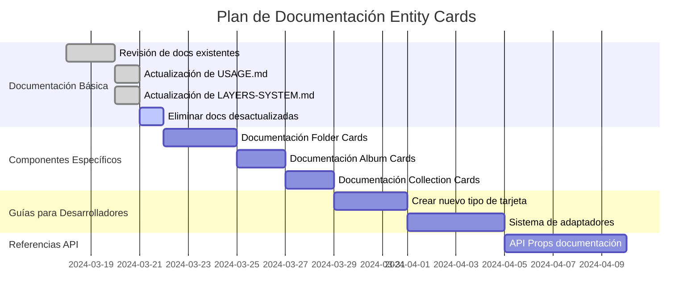

# 📋 Tareas de Documentación: Entity Cards

Este documento registra el estado actual de la documentación del sistema de Entity Cards, las áreas donde se ha trabajado y las áreas que aún requieren documentación.

## ✅ Documentación Completada

1. **Documentación Básica del Sistema**
   - `USAGE.md` - Guía de uso general del sistema
   - `ARCHITECTURE.md` - Arquitectura y diseño del sistema
   - `LAYERS-SYSTEM.md` - Documentación detallada del sistema de capas

2. **Documentación de Proceso**
   - `progress.md` - Seguimiento del progreso de desarrollo
   - `refactorization-summary.md` - Resumen de refactorizaciones
   - `migration-guide.md` - Guía para migrar del sistema antiguo

3. **Documentación de Planes**
   - `layouts-improvement-plan.md` - Plan para mejorar layouts
   - `entity-cards-integration-plan.md` - Plan de integración con otras partes del sistema

4. **Documentación de Componentes Específicos**
   - `world-item-card.md` - Detalle de implementación de tarjetas de objetos del mundo

5. **Vista Específica de Documentación**
   - Vista de Entity Cards con ejemplos interactivos en `src/components/views/entity-cards/entity-cards-view.tsx`
   - Documentación en forma de código en los ejemplos

## 🗑️ Documentación Desactualizada a Eliminar

La siguiente documentación ha sido reemplazada por versiones mejoradas y más completas:

1. **`layer-system-flow.md`**
   - Reemplazado por: `LAYERS-SYSTEM.md`
   - Razón: La nueva documentación incluye diagramas actualizados, ejemplos de código y es más completa.

2. **`SUMMARY.md`**
   - Reemplazado por: `ARCHITECTURE.md`
   - Razón: El documento de arquitectura contiene información más completa y detallada sobre el sistema completo.

3. **Documentación duplicada o fragmentada**
   - Fragmentos de documentación en archivos separados que ya están consolidados en los archivos principales.
   - Se recomienda mantener la documentación centralizada en archivos principales bien organizados.

## 🚧 Áreas Pendientes

1. **Documentación de Componentes Específicos**
   - Tarjetas de Carpetas (Folder Cards)
   - Tarjetas de Álbumes (Album Cards)
   - Tarjetas de Colecciones (Collection Cards)
   - Tarjetas de Personajes (Character Cards)
   - Tarjetas de Lugares (Place Cards)
   - Tarjetas de Conceptos (Concept Cards)
   - Tarjetas de Prompts (Prompt Cards)
   - Tarjetas de Notas (Note Cards)
   - Tarjetas de Etiquetas (Tag Cards)

2. **Documentación Técnica Profunda**
   - Sistema de Adaptadores - Diagrama de flujo y funcionamiento
   - Sistema de Presets Visuales - Cómo usar y extender
   - Guía de optimización de rendimiento
   - Implementación responsive de tarjetas

3. **Guías para Desarrolladores**
   - Cómo crear un nuevo tipo de tarjeta
   - Cómo extender el sistema con nuevos efectos visuales
   - Guía de testing para componentes de tarjetas
   - Cómo integrar tarjetas con el resto del sistema de archivos

4. **Referencias API**
   - Documentación de Props para cada componente
   - Tipos TypeScript completos y ejemplos
   - Hooks personalizados del sistema y su uso

5. **Documentación para Diseño**
   - Guía de diseño visual y mejores prácticas
   - Sistema de tokens y variables de diseño
   - Transiciones y animaciones

## 📊 Prioridades para la Próxima Iteración

1. **ALTA** - Documentación de los tipos de tarjetas principales (Folder, Album, Collection)
2. **ALTA** - Guía para desarrolladores sobre cómo crear un nuevo tipo de tarjeta
3. **MEDIA** - Referencias API con documentación de Props
4. **MEDIA** - Sistema de adaptadores - diagrama de flujo y funcionamiento
5. **BAJA** - Guía de diseño visual y mejores prácticas

## 🔄 Plan de Trabajo

## 📝 Notas y Observaciones

- La documentación debe mantener un equilibrio entre detalles técnicos profundos y guías prácticas para facilitar el uso.
- Se recomienda crear ejemplos interactivos para cada tipo de tarjeta.
- Las actualizaciones de la API deben documentarse inmediatamente para evitar documentación obsoleta.
- Se sugiere mantener un registro de cambios en la documentación para seguir su evolución.
- **Mantener Documentación Centralizada**: Es preferible tener menos archivos más completos que muchos archivos fragmentados.

## 🔗 Relación con Otras Partes del Sistema

- Sistema de presets visuales (vinculado con prisma/seeds/visual-preset.seed.ts)
- Sistema de navegación y vistas (vinculado con src/components/views)
- Sistema de UI components (vinculado con src/components/ui)
- Sistema de imágenes y archivos (vinculado con el módulo de gestión de archivos)