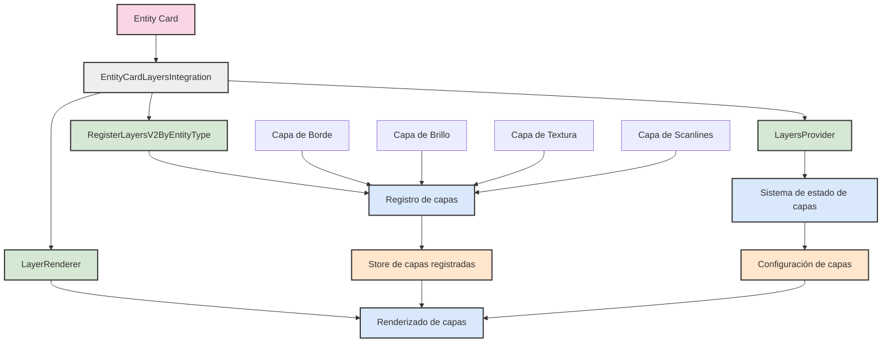
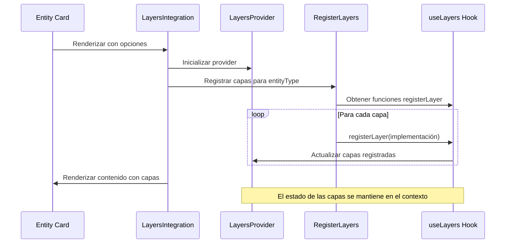
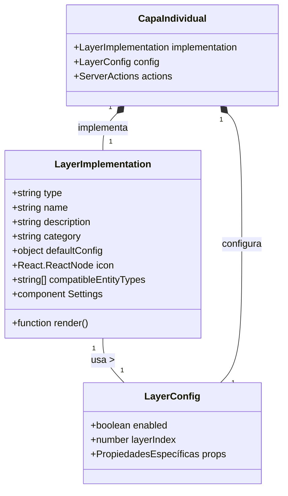
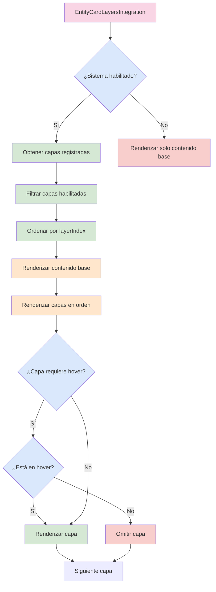
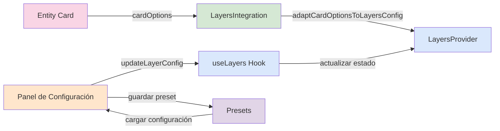
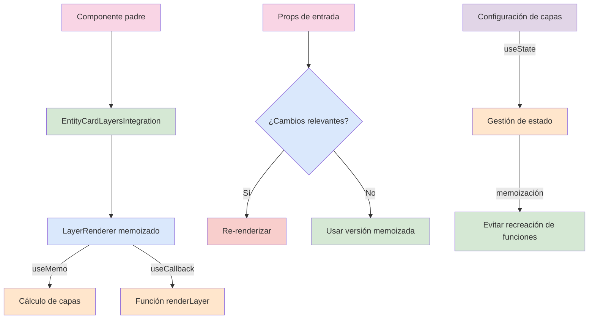

# Flujo del Sistema de Capas para Entity Cards

Este documento visualiza mediante diagramas la arquitectura, flujo de datos y componentes del sistema de capas integrado en las tarjetas de entidad.

## Arquitectura general

## Flujo de registro de capas

## Arquitectura de una capa individual

## Flujo de renderizado de capas

## Integración con sistema de configuración

## Ciclo de optimización de rendimiento

Este conjunto de diagramas proporciona una visión completa del sistema de capas, su arquitectura, flujo de datos y técnicas de optimización de rendimiento.