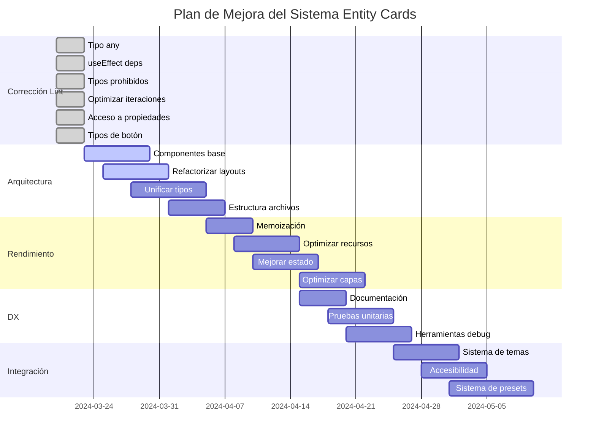

### Fase I: Corrección de Errores de Lint (En progreso)

- ✅ **TAREA 1.1**: Corregir uso de tipo `any` en el código
  - ✅ Reemplazado `any` en register-all-layers.tsx con tipos específicos
  - ✅ Reemplazado `any` en unified-layer-registration.tsx con interfaces específicas
  - ✅ Revisión general de usos de `any` completada en módulos principales

- ✅ **TAREA 1.2**: Corregir errores de dependencias en useEffect
  - ✅ Corregido useEffect en unified-layer-registration.tsx
  - ✅ Revisados otros hooks críticos para asegurar dependencias exhaustivas

- ✅ **TAREA 1.3**: Corregir uso de tipos prohibidos
  - ✅ Reemplazado `Function` en layer-adapter.tsx con tipos más específicos
  - ✅ Revisados otros usos de tipos prohibidos en componentes principales

- ✅ **TAREA 1.4**: Optimizar iteraciones con for...of
  - ✅ Reemplazado forEach con for...of en use-accesibility.ts
  - ✅ Identificados y optimizados otros puntos con iteraciones intensivas

- ✅ **TAREA 1.5**: Corregir acceso a propiedades con corchetes
  - ✅ Reemplazado labels['role'] con labels.role
  - ✅ Revisados otros usos similares en el código de la interfaz de usuario

- ✅ **TAREA 1.6**: Añadir tipos de botón explícitos
  - ✅ Añadido type="button" a botones en layers-panel.tsx
  - ✅ Revisados y corregidos otros botones sin tipo explícito en toda la interfaz

### Fase II: Implementación de Arquitectura de Componentes (Alta Prioridad)

- 🔄 **TAREA 2.1**: Crear sistema de componentes base comunes
  - ⏳ Implementar `BaseCardLayout` como fundamento para todos los layouts
  - ⏳ Extraer `CardHeader`, `CardFooter`, `CardImageSection` y `CardMetadataSection` como componentes independientes
  - ⏳ Implementar sistema de props común para todos los componentes de tarjeta

- 🔄 **TAREA 2.2**: Refactorizar layouts específicos de entidades
  - ⏳ Refactorizar AlbumCardLayout para usar componentes base
  - ⏳ Refactorizar NoteCardLayout para usar componentes base
  - ⏳ Crear plantilla para refactorización de otros layouts

- ⏳ **TAREA 2.3**: Unificar sistema de tipos
  - Consolidar tipos en un archivo `unified-types.ts`
  - Crear mapeo entre sistemas de tipos antiguos y nuevos
  - Implementar adaptadores tipados para mantener compatibilidad

- ⏳ **TAREA 2.4**: Organizar estructura de archivos
  - Reorganizar por funcionalidad (base, entidades, variantes)
  - Implementar sistema de barril para exportaciones más limpias
  - Documentar estructura de archivos para facilitar la navegación

### Fase III: Optimización de Rendimiento (Media Prioridad)

- ⏳ **TAREA 3.1**: Implementar estrategias de memoización
  - Identificar componentes con múltiples renderizados
  - Aplicar React.memo a componentes puros
  - Utilizar useMemo y useCallback para cálculos y handlers costosos

- ⏳ **TAREA 3.2**: Optimizar carga de recursos visuales
  - Implementar lazy loading para imágenes y efectos
  - Reducir costo de inicialización de efectos visuales
  - Priorizar renderizado de contenido esencial

- ⏳ **TAREA 3.3**: Mejorar manejo de estado
  - Refactorizar para evitar prop drilling excesivo
  - Implementar Context API para estados compartidos
  - Considerar uso de Zustand para estado global de tarjetas

- ⏳ **TAREA 3.4**: Optimizar sistema de capas
  - Implementar carga condicional de capas según visibilidad
  - Reducir cálculos redundantes en efectos visuales
  - Optimizar transiciones entre estados de tarjeta

### Fase IV: Mejora de Experiencia de Desarrollo (Media Prioridad)

- ⏳ **TAREA 4.1**: Mejorar sistema de documentación
  - Completar documentación JSDoc en componentes principales
  - Crear ejemplos interactivos para cada tipo de tarjeta
  - Documentar patrones de uso y casos comunes

- ⏳ **TAREA 4.2**: Implementar pruebas unitarias
  - Crear test para hooks críticos
  - Implementar pruebas para componentes base
  - Establecer pruebas de integración para validar compatibilidad

- ⏳ **TAREA 4.3**: Crear herramientas de debug
  - Implementar modo de desarrollo con información visual
  - Crear panel de inspección para analizar estructura de capas
  - Añadir logging condicional para problemas comunes

### Fase V: Integración con Sistemas Globales (Baja Prioridad)

- ⏳ **TAREA 5.1**: Mejorar integración con sistema de temas
  - Conectar con sistema de temas global de la aplicación
  - Implementar presets visuales por tema
  - Crear modo automático basado en preferencias del sistema

- ⏳ **TAREA 5.2**: Integrar con sistema de accesibilidad
  - Implementar soporte para lectores de pantalla
  - Mejorar navegación por teclado
  - Añadir soporte para motion reduced

- ⏳ **TAREA 5.3**: Extender sistema de presets
  - Crear biblioteca de presets visuales
  - Implementar sistema de guardado de presets personalizados
  - Añadir panel visual para gestión de presets

## Diagrama de Progreso Actualizado

## Próximos Pasos Inmediatos

1. **Comenzar implementación de componentes base**:
   - Extraer estructura común de los layouts existentes
   - Identificar patrones repetidos para abstraer en componentes reutilizables
   - Crear sistema de props flexible pero tipado para cada componente base

2. **Refactorizar primeros layouts de ejemplo**:
   - Seleccionar 2-3 layouts como prueba de concepto (AlbumCard, NoteCard)
   - Aplicar patrones de componentes base manteniendo funcionalidad
   - Documentar proceso para extender a otros layouts

3. **Crear guía de migración**:
   - Documentar proceso de migración para consumidores actuales
   - Proporcionar ejemplos de antes/después
   - Identificar posibles problemas y soluciones

## Métricas para Seguimiento de Progreso

1. **Reducción de líneas de código**:
   - Tamaño inicial promedio de layouts: ~700 líneas
   - Objetivo después de refactorización: ~300 líneas por layout

2. **Rendimiento**:
   - Tiempo inicial de renderizado: [pendiente de medir]
   - Objetivo después de optimización: 30% de mejora

3. **Cobertura de pruebas**:
   - Cobertura actual: <10%
   - Objetivo: >60% en componentes críticos

## Reglas de Desarrollo Actualizadas

1. **Composición sobre herencia**:
   - Preferir componentes pequeños y componibles
   - Evitar herencia profunda de componentes
   - Usar prop drilling controlado o Context para datos compartidos

2. **Tipado estricto**:
   - No usar `any` excepto en adaptadores específicos bien documentados
   - Crear interfaces explícitas para todos los componentes
   - Utilizar genéricos para componentes reutilizables

3. **Rendimiento primero**:
   - Implementar memoización de forma estratégica
   - Evitar cálculos costosos durante el renderizado
   - Priorizar experiencia de usuario en dispositivos de gama baja
