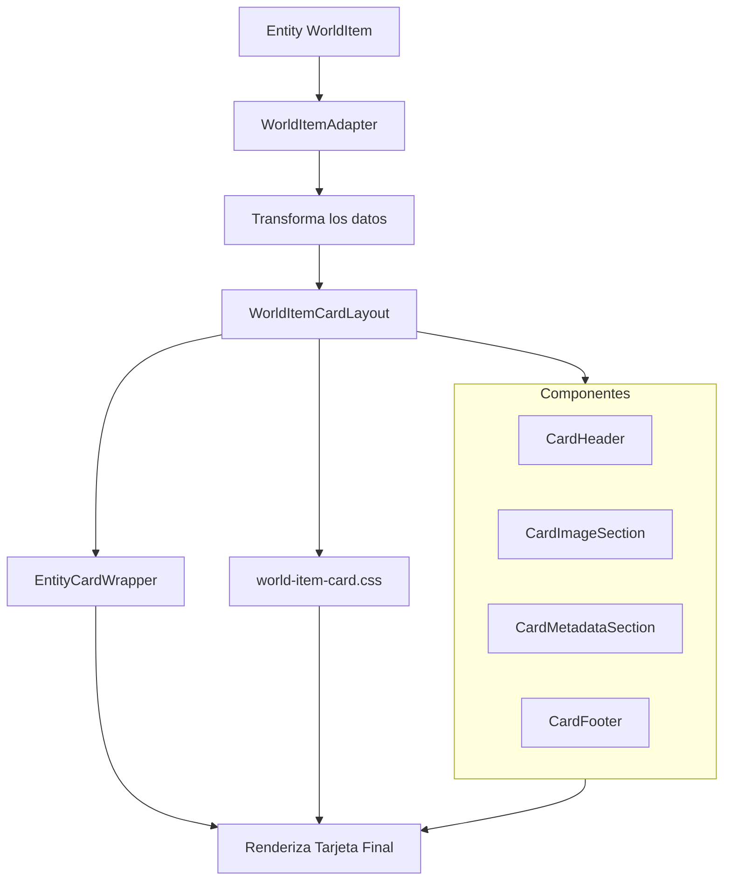

# WorldItemCard

Este componente permite mostrar objetos del mundo (world items) en una tarjeta visualmente atractiva con estilo de juego RPG.

## Características

- Visualización estilizada de objetos del mundo con diseño RPG/TCG
- Sistema de rareza visual (common, uncommon, rare, epic, legendary, artifact)
- Efectos visuales dependientes de la rareza (bordes animados, brillos, holográficos)
- Visualización de propiedades y estadísticas del objeto
- Diseño adaptable y responsivo
- Integración con el sistema de tarjetas de entidad
- Soporte para efectos al pasar el ratón y animaciones

## Estructura de directorios

```
src/components/features/entity-cards/
├── adapters/
│   ├── world-item-adapter.tsx    # Adaptador para transformar WorldItem
│   └── entity-card-adapter.tsx   # Adaptador genérico que usa WorldItemAdapter
├── layouts/
│   └── world-item-card-layout.tsx # Implementación principal del componente
├── styles/
│   └── world-item-card.css       # Estilos específicos para el componente
```

## Diagrama de flujo



## Tipos de Datos

`WorldItemExtended` extiende la interfaz básica `WorldItem` para añadir propiedades adicionales:

```typescript
interface WorldItemExtended extends Omit<WorldItem, 'properties' | 'stats' | 'requirements'> {
  level?: number;
  weight?: number;
  value?: number;
  image?: string;
  isArtifact?: boolean;
  isUnique?: boolean;
  properties?: PropertyItem[];
  imageCount?: number;
  presetId?: string;
}
```

## Sistema de Rareza

La rareza determina el aspecto visual de la tarjeta:

| Rareza     | Color    | Efectos Visuales                     |
|------------|----------|-------------------------------------|
| Common     | Gris     | Básico                              |
| Uncommon   | Verde    | Borde ligeramente mejorado          |
| Rare       | Azul     | Pulso en el borde                   |
| Epic       | Púrpura  | Pulso más intenso en el borde       |
| Legendary  | Dorado   | Bordes con flujo, efectos holográficos |
| Artifact   | Fucsia   | Arcoíris, efectos holográficos      |

## Ejemplo de Uso

### Uso Básico con EntityCardAdapter

```tsx
import { EntityCardAdapter } from '@/components/features/entity-cards/adapters';

export function ItemGallery({ items }) {
  return (
    <div className="grid grid-cols-3 gap-4">
      {items.map(item => (
        <EntityCardAdapter
          key={item.id}
          entityType="worldItem"
          entity={item}
          onClick={() => handleItemClick(item)}
        />
      ))}
    </div>
  );
}
```

### Uso Directo con WorldItemAdapter

```tsx
import { WorldItemAdapter } from '@/components/features/entity-cards/adapters';

export function ItemDetails({ item }) {
  return (
    <WorldItemAdapter
      worldItem={item}
      options={{ enableGlowEffect: true }}
      enableExplode={true}
      showVisualConfig={true}
      onEdit={handleEdit}
      onDelete={handleDelete}
    />
  );
}
```

### Uso Avanzado con Presets Visuales

```tsx
import { WorldItemCard } from '@/components/features/entity-cards/layouts';
import { usePreset } from '@/components/features/entity-cards/hooks/use-preset';

export function CustomItemCard({ item, presetId }) {
  const { cardOptions } = usePreset({
    entityType: 'worldItem',
    entityId: item.id,
    presetId: presetId,
  });

  return (
    <WorldItemCard
      item={item}
      options={cardOptions}
      enableExplode={true}
    />
  );
}
```

## CSS personalizado

El componente utiliza estilos CSS personalizados definidos en `world-item-card.css`:

- Variables CSS para mantener consistencia en colores por rareza
- Animaciones para efectos de borde (pulse, flow, rainbow)
- Efectos holográficos para rarezas altas
- Patrones de fondo personalizados
- Efectos de interacción al pasar el ratón

## Configuraciones avanzadas

Las opciones avanzadas se pueden pasar a través del prop `options`:

```tsx
<WorldItemAdapter
  worldItem={item}
  options={{
    enableHolographicEffect: true,
    enableGlowEffect: true,
    glowOptions: {
      intensity: 0.8,
      color: '#ff0000',
    },
    interactivity: {
      hover: {
        scale: 1.05,
      }
    }
  }}
/>
```