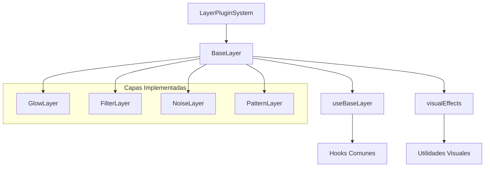
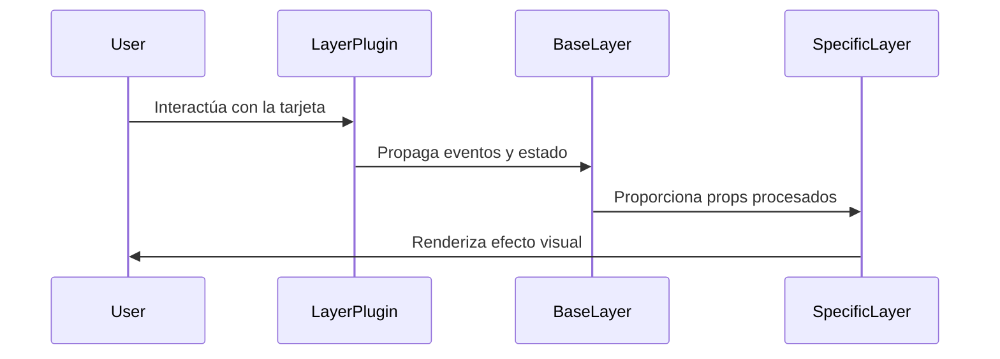

# 🎨 Sistema de Capas para Entity Cards

## Descripción
El sistema de capas proporciona una arquitectura modular y extensible para agregar efectos visuales y funcionalidades a las tarjetas de entidades. Cada capa puede ser activada, configurada y animada de forma independiente.

## Estructura del Sistema



## Componentes Principales

### 🔌 LayerPluginSystem
- Gestiona el registro y renderizado de capas
- Proporciona contexto global para las capas
- Maneja la activación y desactivación de capas

### 🎭 BaseLayer
- Componente base para todas las capas
- Maneja estados comunes (hover, explosión)
- Proporciona animaciones base con Framer Motion
- Gestiona transformaciones 3D

### 🎨 Hooks y Utilidades

#### useBaseLayer
- Procesa configuraciones de capa
- Maneja visibilidad y estados
- Calcula transformaciones
- Gestiona posición del mouse

#### visualEffects
- Generación de filtros CSS
- Manejo de blend modes
- Efectos de brillo
- Transformaciones 3D
- Gradientes dinámicos
- Animaciones

## Uso

### Crear una Nueva Capa

   ```typescript
import { withBaseLayer } from './components/base-layer';
import type { BaseLayerConfig } from './types';

interface MyLayerConfig extends BaseLayerConfig {
    // Configuración específica de la capa
    customProperty: string;
}

const MyLayer = withBaseLayer<MyLayerConfig>((props) => {
    const { processedConfig, isVisible, style } = props;

     return (
        <div style={style}>
            {/* Implementación de la capa */}
        </div>
     );
});
   ```

### Registrar una Capa

   ```typescript
import { useLayerPlugin } from './layer-plugin-system';

function MyComponent() {
    const { registerLayer } = useLayerPlugin();

    React.useEffect(() => {
        registerLayer({
            type: 'my-layer',
            name: 'Mi Capa',
            component: MyLayer,
   	defaultConfig: {
   		enabled: true,
                layerIndex: 0,
                customProperty: 'valor'
            }
        });
    }, []);

   	return null;
   }
   ```

## Optimizaciones de Rendimiento

- Uso extensivo de `React.memo` para prevenir re-renders innecesarios
- Memoización de cálculos costosos con `useMemo`
- Callbacks memoizados con `useCallback`
- Transformaciones hardware-accelerated
- Lazy loading de capas

## Mejores Prácticas

1. **Composición de Capas**
   - Usar el HOC `withBaseLayer` para nueva funcionalidad
   - Extender `BaseLayerConfig` para configuraciones específicas
   - Mantener la lógica de renderizado separada de la lógica de estado

2. **Optimización**
   - Memoizar valores calculados
   - Usar transformaciones CSS eficientes
   - Minimizar cambios de estado

3. **Mantenibilidad**
   - Documentar configuraciones de capa
   - Usar tipos TypeScript
   - Seguir el patrón de diseño establecido

## Ejemplos de Uso

### Capa de Brillo
```typescript
const GlowLayer = withBaseLayer<GlowConfig>((props) => {
    const { processedConfig, safeMousePosition } = props;
    const glowStyle = useGlowEffect(processedConfig, safeMousePosition);
    return <div style={glowStyle} />;
});
```

### Capa de Filtros
```typescript
const FilterLayer = withBaseLayer<FilterConfig>((props) => {
    const { processedConfig } = props;
    const filterStyle = generateFilterStyles(processedConfig);
    return <div style={filterStyle} />;
});
```

## Flujo de Datos


