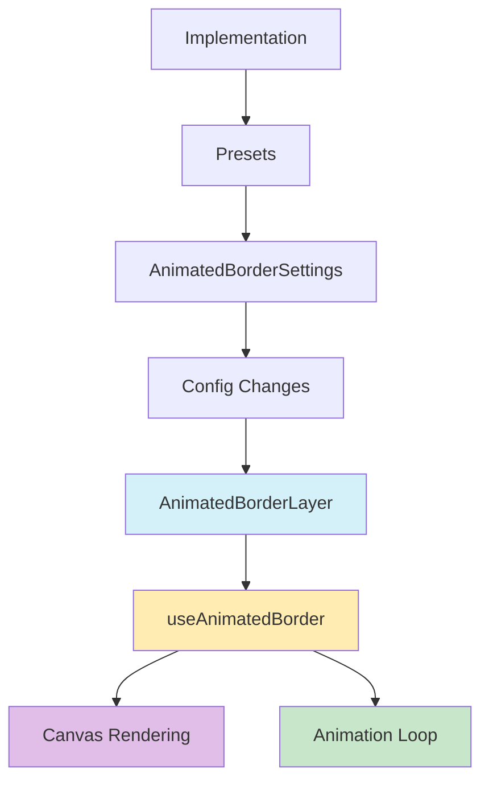

# 🔄 Animated Border Layer

Esta capa añade un borde animado a las tarjetas de entidad, creando efectos visuales dinámicos y atractivos.

## 📁 Estructura del Directorio

```typescript
src/components/features/entity-cards/layers/animated-border/
├── actions/
│   └── animated-border-config.action.ts  // Acciones y tipos de configuración
├── components/
│   ├── animated-border-layer.tsx        // Componente principal
│   └── animated-border-settings.tsx     // Panel de configuración
├── hooks/
│   └── use-animated-border.ts          // Lógica de renderizado
├── animated-border-implementation.tsx   // Implementación y presets
├── index.ts                           // Exportaciones
└── README.md                          // Documentación
```

## 🔄 Flujo de Datos



## ⚙️ Configuración

La interfaz `AnimatedBorderConfig` incluye las siguientes propiedades:

```typescript
interface AnimatedBorderConfig {
  enabled: boolean;           // Activar/desactivar el borde
  visibleOnHover: boolean;   // Mostrar solo en hover
  layerIndex: number;        // Orden de la capa
  opacity: number;           // Opacidad del borde
  color: string;            // Color del borde
  width: number;           // Ancho del borde
  speed: number;          // Velocidad de animación
  segments: number;      // Número de segmentos
  blendMode: string;    // Modo de mezcla
}
```

## 🎨 Características Principales

1. **Animación Fluida**: Utiliza `requestAnimationFrame` para animaciones suaves
2. **Personalización**: Control total sobre color, velocidad, segmentos y más
3. **Modos de Mezcla**: Integración con diferentes modos de mezcla para efectos visuales
4. **Presets**: Configuraciones predefinidas para efectos comunes
5. **Responsive**: Se adapta automáticamente al tamaño de la tarjeta

## 📝 Ejemplos de Uso

```tsx
// Uso básico
<AnimatedBorderLayer
  config={{
    enabled: true,
    color: '#ffffff',
    speed: 0.001,
    segments: 4
  }}
  isHovered={false}
  isExploded={false}
/>

// Con preset
<AnimatedBorderLayer
  config={animatedBorderImplementation.presets[0].config}
  isHovered={true}
  isExploded={false}
/>
```

## 🔧 Optimizaciones

1. **Memoización**: Uso de `useMemo` para cálculos costosos
2. **Canvas Optimization**: Limpieza y redibujado eficiente
3. **Event Handling**: Gestión optimizada de eventos de resize

## 🤝 Integración con Otros Sistemas

- Compatible con el sistema de capas de la tarjeta
- Interactúa con el sistema de explosión de capas
- Se integra con el sistema de configuración global

## 📈 Planes Futuros

1. Añadir más patrones de animación
2. Implementar efectos de partículas
3. Mejorar el rendimiento en dispositivos móviles
4. Añadir más presets personalizados
5. Implementar efectos de sonido opcionales