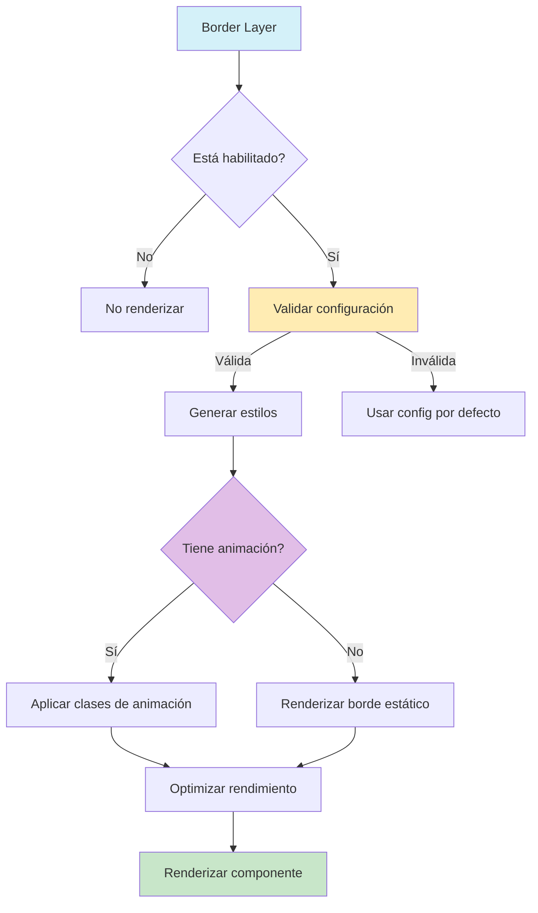

# Border Layer (Capa de Borde)

## 📝 Descripción
La capa de borde proporciona bordes personalizables para Entity Cards, permitiendo definir estilos, colores, animaciones y efectos visuales para los contornos de las tarjetas. Esta implementación ha sido optimizada para rendimiento y reactividad.

## 🔧 Configuración

```typescript
interface BorderConfig {
    enabled: boolean;            // Habilitar/deshabilitar la capa
    layerIndex: number;          // Posición en el stack de capas
    width: number;               // Ancho del borde en píxeles (0-20)
    style: 'solid' | 'dashed' | 'dotted' | 'double';  // Estilo del borde
    color: string;               // Color del borde (hex, rgba, etc.)
    radius?: number;             // Radio de las esquinas en píxeles (0-50)
    animated?: boolean;          // Si el borde tiene animación
    animationType?: 'none' | 'pulse' | 'flow' | 'rainbow';  // Tipo de animación
    animationSpeed?: number;     // Velocidad de la animación (0.1-5)
    glowAmount?: number;         // Intensidad del brillo del borde (0-50)
    opacity?: number;            // Opacidad del borde (0-1)
    gradient?: string[];         // Colores para gradiente (mínimo 2)
    dashPattern?: number[];      // Patrón para bordes discontinuos
    cornerStyle?: 'round' | 'bevel' | 'miter';  // Estilo de las esquinas
    borderImage?: string;        // URL de imagen para borde
}
```

## 🎨 Características Principales

1. **Estilos de Borde**
   - Sólido: Borde continuo
   - Discontinuo: Líneas discontinuas
   - Punteado: Puntos equiespaciados
   - Doble: Borde con doble línea

2. **Efectos Visuales**
   - Glow: Efecto de brillo alrededor del borde
   - Gradient: Degradado de colores
   - Opacity: Control de transparencia
   - Esquinas configurables

3. **Animaciones**
   - Pulse: Efecto de pulsación
   - Flow: Flujo de color
   - Rainbow: Ciclo de colores del arcoíris

## ⚡ Optimizaciones de Rendimiento

1. **Memoización**
   - Componentes envueltos en React.memo
   - Estilos calculados memoizados
   - Configuración y props memoizadas

2. **Gestión de Recursos**
   - Limpieza de efectos y listeners
   - Optimización de rerenderings
   - Validación eficiente de configuración

3. **Animaciones**
   - Uso de GPU acceleration
   - Throttling de animaciones
   - Optimización de transiciones

## 🚀 Uso

```typescript
import { borderLayerImplementation } from './border';

// Configuración básica
const basicConfig = {
    enabled: true,
    layerIndex: 2,
    width: 2,
    style: 'solid',
    color: '#3B82F6',
    radius: 8
};

// Configuración con animación
const animatedConfig = {
    enabled: true,
    layerIndex: 2,
    width: 3,
    style: 'solid',
    color: '#3B82F6',
    radius: 12,
    animated: true,
    animationType: 'pulse',
    animationSpeed: 1.5,
    glowAmount: 5
};

// Uso en EntityCard
<EntityCard
    layerConfigs={{
        border: basicConfig
    }}
/>
```

## 🔄 Integración con otras capas

La capa de borde trabaja en conjunto con:
- Container Layer
- Content Layer
- Image Layer
- Glow Layer
- Holographic Layer

## ⚠️ Validaciones y Restricciones

1. **Validaciones de Configuración**
   ```typescript
   // Ejemplo de validaciones implementadas
   if (width < 0 || width > 20) {
       throw new Error('El ancho del borde debe estar entre 0 y 20px');
   }
   if (radius < 0 || radius > 50) {
       throw new Error('El radio de las esquinas debe estar entre 0 y 50px');
   }
   if (opacity < 0 || opacity > 1) {
       throw new Error('La opacidad debe estar entre 0 y 1');
   }
   ```

2. **Restricciones de Rendimiento**
   - Límites en el número de gradientes
   - Control de animaciones simultáneas
   - Optimización de efectos visuales

## 📊 Diagrama de Flujo



## 🔍 Notas de Implementación

1. **Gestión de Estado**
   - Uso de React.memo para optimización
   - Memoización de cálculos costosos
   - Validación eficiente de props

2. **Optimizaciones**
   - Cálculo eficiente de estilos
   - Reutilización de valores memoizados
   - Minimización de rerenderings

3. **Mantenimiento**
   - Tests unitarios completos
   - Documentación actualizada
   - Código modular y limpio

## 🎯 Ejemplos Avanzados

### Borde con Gradiente Animado
```typescript
const gradientConfig = {
    enabled: true,
    width: 3,
    style: 'solid',
    radius: 12,
    gradient: ['#3B82F6', '#8B5CF6', '#EC4899'],
    animated: true,
    animationType: 'flow',
    animationSpeed: 1.2
};
```

### Borde con Efecto Glow
```typescript
const glowConfig = {
    enabled: true,
    width: 4,
    style: 'solid',
    color: '#3B82F6',
    radius: 10,
    glowAmount: 8,
    opacity: 0.9
};
```

## 📝 Mejoras Futuras

1. **Rendimiento**
   - Implementar Web Workers para cálculos complejos
   - Optimizar más las animaciones
   - Mejorar la gestión de memoria

2. **Funcionalidades**
   - Soporte para patrones SVG
   - Más tipos de animaciones
   - Efectos 3D avanzados

3. **Accesibilidad**
   - Mejorar soporte para temas
   - Opciones de alto contraste
   - Reducción de movimiento