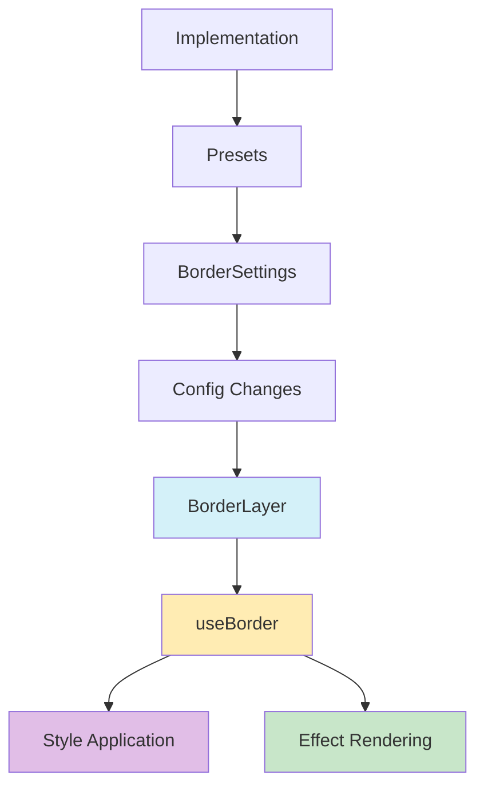

# 🔲 Border Layer

Esta capa añade un borde personalizable a las tarjetas de entidad, con múltiples estilos y efectos visuales.

## 📁 Estructura del Directorio

```typescript
src/components/features/entity-cards/layers/border/
├── actions/
│   └── border-config.action.ts     // Acciones y tipos de configuración
├── components/
│   ├── border-layer.tsx           // Componente principal
│   └── border-settings.tsx        // Panel de configuración
├── hooks/
│   └── use-border.ts             // Lógica de renderizado
├── border-implementation.tsx     // Implementación y presets
├── index.ts                     // Exportaciones
└── README.md                    // Documentación
```

## 🔄 Flujo de Datos



## ⚙️ Configuración

La interfaz `BorderConfig` incluye las siguientes propiedades:

```typescript
interface BorderConfig {
  enabled: boolean;           // Activar/desactivar el borde
  visibleOnHover: boolean;   // Mostrar solo en hover
  layerIndex: number;        // Orden de la capa
  opacity: number;           // Opacidad del borde
  color: string;            // Color del borde
  width: number;           // Ancho del borde
  style: string;          // Estilo del borde (solid, dashed, etc.)
  radius: number;        // Radio de las esquinas
  blendMode: string;    // Modo de mezcla
  glow: boolean;       // Activar efecto de brillo
  glowColor: string;  // Color del brillo
  glowRadius: number; // Radio del brillo
  gradient: boolean;  // Activar gradiente
  gradientAngle: number;    // Ángulo del gradiente
  gradientColors: string[]; // Colores del gradiente
}
```

## 🎨 Características Principales

1. **Estilos Personalizables**: Múltiples estilos de borde (sólido, punteado, etc.)
2. **Efectos Visuales**: Soporte para brillo y gradientes
3. **Modos de Mezcla**: Integración con diferentes modos de mezcla
4. **Presets**: Configuraciones predefinidas para efectos comunes
5. **Responsive**: Se adapta automáticamente al tamaño de la tarjeta

## 📝 Ejemplos de Uso

```tsx
// Uso básico
<BorderLayer
  config={{
    enabled: true,
    color: '#ffffff',
    width: 2,
    style: 'solid'
  }}
  isHovered={false}
  isExploded={false}
/>

// Con preset
<BorderLayer
  config={borderImplementation.presets[0].config}
  isHovered={true}
  isExploded={false}
/>

// Con efectos avanzados
<BorderLayer
  config={{
    enabled: true,
    color: '#00ff00',
    width: 2,
    style: 'solid',
    glow: true,
    glowColor: '#00ff00',
    glowRadius: 15,
    gradient: true,
    gradientColors: ['#ff0000', '#00ff00', '#0000ff']
  }}
  isHovered={true}
  isExploded={false}
/>
```

## 🔧 Optimizaciones

1. **Memoización**: Uso de `useMemo` para cálculos costosos
2. **Style Caching**: Cacheo de estilos para mejor rendimiento
3. **Conditional Rendering**: Renderizado condicional para optimizar recursos

## 🤝 Integración con Otros Sistemas

- Compatible con el sistema de capas de la tarjeta
- Interactúa con el sistema de explosión de capas
- Se integra con el sistema de configuración global

## 📈 Planes Futuros

1. Añadir más estilos de borde personalizados
2. Implementar animaciones de borde
3. Mejorar el rendimiento en dispositivos móviles
4. Añadir más presets personalizados
5. Implementar patrones de borde personalizados