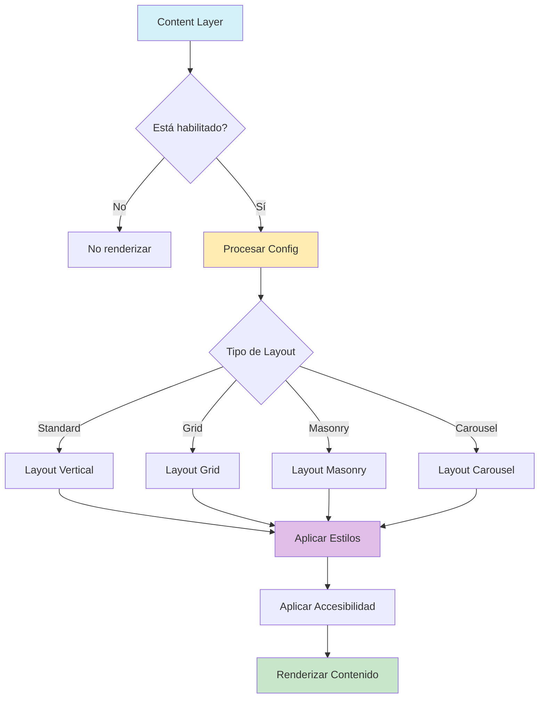

# Content Layer (Capa de Contenido)

## 📝 Descripción
La capa de contenido es una de las capas fundamentales del sistema de Entity Cards. Se encarga de renderizar el contenido principal de una entidad, proporcionando diferentes layouts y opciones de personalización.

## 🔧 Configuración

```typescript
interface ContentLayerConfig extends LayerConfig {
  /** Espaciado interno en píxeles */
  padding: number;
  /** Tipo de layout para el contenido */
  layout: 'standard' | 'grid' | 'masonry' | 'carousel';
  /** Espaciado entre elementos */
  spacing: number;
  /** Alineación del contenido */
  alignment: 'left' | 'center' | 'right';
  /** Número de columnas para grid y masonry */
  columns?: number;
  /** Altura máxima para carousel */
  maxHeight?: number;
  /** Opciones de accesibilidad */
  accessibility?: {
    /** Texto alternativo para lectores de pantalla */
    ariaLabel?: string;
    /** Descripción extendida del contenido */
    ariaDescription?: string;
  };
}
```

## 🎨 Layouts Disponibles

1. **Standard** (`standard`)
   - Layout por defecto
   - Disposición vertical de elementos
   - Ideal para contenido simple
   - Optimizado para rendimiento

2. **Grid** (`grid`)
   - Disposición en cuadrícula
   - Columnas configurables (1-6)
   - Espaciado personalizable
   - Ideal para galerías y colecciones

3. **Masonry** (`masonry`)
   - Layout tipo Pinterest
   - Columnas de altura variable
   - Optimizado para imágenes
   - Perfecto para contenido asimétrico

4. **Carousel** (`carousel`)
   - Scroll horizontal suave
   - Snap points para mejor UX
   - Control de altura máxima
   - Navegación por teclado

## 🚀 Uso

```typescript
import { contentLayerImplementation } from './content';

// Configuración básica
const basicConfig = {
  enabled: true,
  layerIndex: 20,
  padding: 16,
  layout: 'standard',
  spacing: 12,
  alignment: 'center',
  accessibility: {
    ariaLabel: 'Contenido principal',
    ariaDescription: 'Sección que muestra el contenido principal de la tarjeta'
  }
};

// Configuración de grid
const gridConfig = {
  enabled: true,
  layerIndex: 20,
  padding: 12,
  layout: 'grid',
  spacing: 8,
  columns: 3,
  alignment: 'center'
};

// Configuración de carousel
const carouselConfig = {
  enabled: true,
  layerIndex: 20,
  padding: 8,
  layout: 'carousel',
  spacing: 16,
  maxHeight: 400
};

// Uso en EntityCard
<EntityCard
  layerConfigs={{
    content: basicConfig
  }}
/>
```

## 🔄 Integración con otras capas

La capa de contenido trabaja en conjunto con:
- Container Layer (contenedor principal)
- Header Layer (encabezado)
- Footer Layer (pie)
- Image Layer (imágenes)
- Description Layer (descripciones)

## ⚡ Características Principales

1. **Rendimiento Optimizado**
   - Uso de `motion.div` para animaciones suaves
   - Memoización de componentes pesados
   - Lazy loading para carousels
   - Optimización de re-renders

2. **Accesibilidad Mejorada**
   - Roles ARIA apropiados
   - Navegación por teclado
   - Descripciones para lectores de pantalla
   - Estados expandidos/contraídos

3. **Diseño Responsivo**
   - Adaptación a diferentes tamaños
   - Breakpoints configurables
   - Layouts flexibles
   - Soporte para modo oscuro

4. **Personalización**
   - Estilos mediante Tailwind
   - Animaciones configurables
   - Layouts extensibles
   - Temas personalizados

## 🔍 Validación y Errores

```typescript
// Ejemplo de validación de configuración
const validateConfig = (config: ContentLayerConfig): string[] => {
  const errors: string[] = [];

  if (config.columns && (config.columns < 1 || config.columns > 6)) {
    errors.push('El número de columnas debe estar entre 1 y 6');
  }

  if (config.maxHeight && (config.maxHeight < 100 || config.maxHeight > 1000)) {
    errors.push('La altura máxima debe estar entre 100 y 1000 píxeles');
  }

  if (config.padding < 0 || config.padding > 24) {
    errors.push('El padding debe estar entre 0 y 24 píxeles');
  }

  return errors;
};
```

## 📊 Diagrama de Flujo



## 🔄 Ciclo de Vida

1. **Inicialización**
   - Validación de configuración
   - Preparación de estilos
   - Setup de accesibilidad

2. **Renderizado**
   - Aplicación de layout
   - Gestión de estados
   - Animaciones

3. **Actualización**
   - Manejo de cambios
   - Transiciones suaves
   - Optimización de re-renders

4. **Limpieza**
   - Liberación de recursos
   - Reset de estados
   - Cleanup de efectos

## 📚 Referencias

- [Documentación de Layouts](../docs/layouts.md)
- [Guía de Accesibilidad](../docs/accessibility.md)
- [Optimización de Rendimiento](../docs/performance.md)
- [Ejemplos de Uso](../examples/content-layer-examples.md)