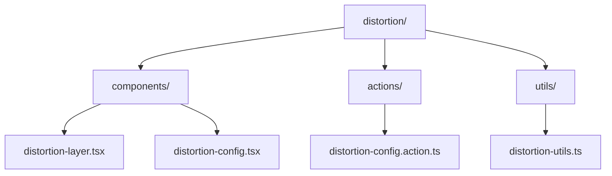
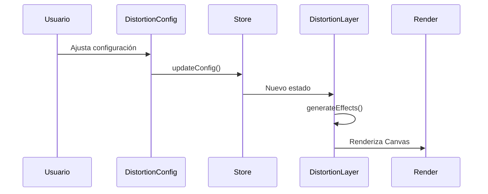

# Módulo de Distorsión

Este módulo proporciona efectos de distorsión visual para las tarjetas de entidad, incluyendo efectos de glitch, aberración cromática y pixelado.

## Estructura del Módulo



## Componentes Principales

### DistortionLayer
Componente principal que renderiza los efectos de distorsión usando Canvas y Framer Motion.

```tsx
import { DistortionLayer } from '@/components/features/entity-cards/layers/distortion';

<DistortionLayer
  width={300}
  height={200}
  isExploded={false}
  isHovered={false}
  activeLayer={0}
/>
```

### DistortionConfig
Panel de configuración que permite ajustar todos los parámetros de los efectos de distorsión.

```tsx
import { DistortionConfig } from '@/components/features/entity-cards/layers/distortion';

<DistortionConfig />
```

## Estado Global

El módulo utiliza Zustand para gestionar el estado de la configuración:

```tsx
import { useDistortionStore } from '@/components/features/entity-cards/layers/distortion';

const { config, updateConfig, resetConfig } = useDistortionStore();
```

## Efectos Disponibles

### 1. Glitch
- Intensidad: Controla la fuerza del efecto glitch
- Frecuencia: Determina qué tan seguido ocurre el efecto
- Duración: Tiempo que dura cada glitch
- Visible al hover: Solo se activa al pasar el cursor

### 2. Aberración Cromática
- Intensidad: Controla la separación de los canales de color
- Desplazamiento: Distancia de separación entre canales
- Visible al hover: Solo se activa al pasar el cursor

### 3. Pixelado
- Intensidad: Controla la fuerza del efecto de pixelado
- Tamaño de bloque: Tamaño de los píxeles
- Visible al hover: Solo se activa al pasar el cursor

## Flujo de Datos



## Ejemplo de Uso Completo

```tsx
import { DistortionLayer, DistortionConfig, useDistortionStore } from '@/components/features/entity-cards/layers/distortion';

export const MyComponent = () => {
  const { config } = useDistortionStore();

  return (
    <div>
      <DistortionLayer
        width={400}
        height={300}
        isExploded={false}
        isHovered={false}
        activeLayer={0}
      />

      <DistortionConfig />
    </div>
  );
};
```

## Mejores Prácticas

1. **Rendimiento**
   - Los efectos se renderizan en Canvas para mejor rendimiento
   - Usar `visibleOnHover` para efectos intensivos
   - Ajustar `layerIndex` para control de orden en modo explotado

2. **Accesibilidad**
   - Los controles de configuración son completamente accesibles
   - Etiquetas descriptivas en todos los controles
   - Soporte para navegación por teclado

3. **Personalización**
   - Todos los efectos son configurables individualmente
   - Valores predeterminados optimizados
   - Fácil extensibilidad para nuevos efectos

## Notas Técnicas

- Utiliza `requestAnimationFrame` para animaciones suaves
- Implementa limpieza de recursos en `useEffect`
- Soporta modo oscuro/claro
- Compatible con SSR
- Optimizado para dispositivos móviles
