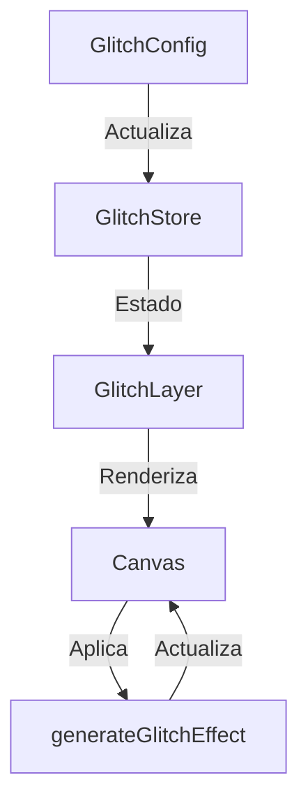

# 🌟 Módulo Glitch

Este módulo proporciona efectos de glitch para las tarjetas de entidad, permitiendo crear distorsiones visuales dinámicas y personalizables.

## 📋 Características

- Efectos de glitch personalizables
- Animaciones dinámicas
- Múltiples modos de mezcla
- Efectos avanzados:
  - Desplazamiento de color
  - Líneas de escaneo
  - Ruido
  - Distorsión
  - Aberración cromática

## 🔧 Configuración

El módulo utiliza un sistema de configuración basado en Zustand con las siguientes opciones:

```typescript
interface GlitchConfig {
  enabled: boolean;          // Habilitar/deshabilitar el efecto
  intensity: number;         // Intensidad general del efecto (0-1)
  frequency: number;         // Frecuencia de actualización (0-1)
  animated: boolean;         // Habilitar animación
  speed: number;            // Velocidad de animación (0-2)
  colorShift: boolean;      // Habilitar desplazamiento de color
  colorShiftAmount: number; // Cantidad de desplazamiento (0-1)
  scanlines: boolean;       // Habilitar líneas de escaneo
  scanlinesCount: number;   // Cantidad de líneas (1-100)
  scanlinesOpacity: number; // Opacidad de las líneas (0-1)
  noise: boolean;           // Habilitar ruido
  noiseIntensity: number;   // Intensidad del ruido (0-1)
  distortion: boolean;      // Habilitar distorsión
  distortionAmount: number; // Cantidad de distorsión (0-1)
  chromatic: boolean;       // Habilitar aberración cromática
  chromaticOffset: number;  // Desplazamiento cromático (0-1)
  blend: string;           // Modo de mezcla
  layerIndex: number;      // Índice de capa para modo explotado
}
```

## 🎨 Componentes

### GlitchLayer

Componente principal que renderiza el efecto de glitch.

```tsx
<GlitchLayer
  width={400}
  height={300}
  isExploded={false}
  isHovered={false}
  activeLayer="glitch"
/>
```

### GlitchConfig

Panel de configuración para ajustar los parámetros del efecto.

```tsx
<GlitchConfig />
```

## 🛠️ Utilidades

### generateGlitchEffect

Función principal para generar el efecto de glitch en un canvas.

```typescript
generateGlitchEffect(ctx: CanvasRenderingContext2D, options: GlitchEffectOptions): void
```

## 🔄 Flujo de Datos



## 🏗️ Estructura de Archivos

```
glitch/
├── actions/
│   └── glitch-config.action.ts   # Store y acciones
├── components/
│   ├── glitch-layer.tsx          # Componente principal
│   ├── glitch-config.tsx         # Panel de configuración
│   └── __tests__/               # Tests
├── utils/
│   └── glitch-utils.ts          # Utilidades y funciones
├── index.ts                     # Exportaciones
└── README.md                    # Documentación
```

## 📝 Ejemplos de Uso

### Configuración Básica

```tsx
import { GlitchLayer, GlitchConfig } from './layers/glitch';

// En tu componente
<div className="relative">
  <GlitchLayer
    width={400}
    height={300}
    isHovered={isHovered}
  />
  <GlitchConfig />
</div>
```

### Configuración Avanzada

```tsx
import { useGlitchStore } from './layers/glitch';

// En tu componente
const { updateConfig } = useGlitchStore();

// Configurar efectos avanzados
updateConfig({
  enabled: true,
  intensity: 0.7,
  animated: true,
  speed: 1.5,
  colorShift: true,
  colorShiftAmount: 0.3,
  scanlines: true,
  scanlinesCount: 50,
  chromatic: true,
  chromaticOffset: 0.2,
  blend: 'screen'
});
```

## 🔍 Consideraciones de Rendimiento

- La animación se detiene automáticamente cuando el componente no está visible
- Los efectos se renderizan en un canvas para mejor rendimiento
- El uso de `requestAnimationFrame` asegura animaciones suaves
- Los recursos se limpian al desmontar el componente

## 🧪 Tests

El módulo incluye tests exhaustivos para:
- Renderizado condicional
- Configuración de efectos
- Interacciones de usuario
- Animaciones
- Limpieza de recursos

## 🔄 Server Actions

El módulo incluye acciones del servidor para:
- Obtener configuración: `getGlitchConfig`
- Actualizar configuración: `updateGlitchConfig`
- Eliminar configuración: `deleteGlitchConfig`