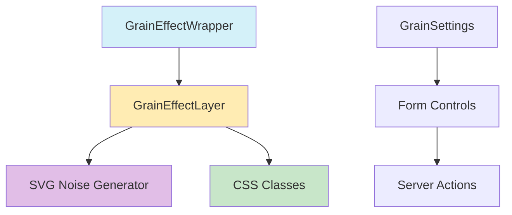

# 🌾 Capa de Efecto Grain

## Descripción
La capa Grain añade efectos de textura y grano a las tarjetas de entidad, simulando efectos visuales como papel, película o ruido digital.

## Estructura



## Componentes Principales

### 1. GrainEffectWrapper
- Adapta la capa al sistema de plugins
- Maneja la configuración inicial
- Convierte la configuración al formato esperado

### 2. GrainEffectLayer
- Implementa el efecto visual de grano
- Soporta diferentes tipos de ruido
- Maneja animaciones y estados de hover

### 3. GrainSettings
- Panel de configuración del efecto
- Controles para ajustar parámetros
- Validación con Zod

## Configuración

```typescript
interface GrainConfig {
    enabled: boolean;
    intensity: number;    // 0-1
    size: number;        // > 0.1
    animated: boolean;
    speed: number;       // opcional
    colorMode: 'monochrome' | 'color';
    opacity: number;     // 0-1
    blend: 'normal' | 'overlay' | 'multiply' | 'screen';
    seed: number;       // entero >= 0
}
```

## Uso

```tsx
<GrainEffectLayer
    isExploded={false}
    isHovered={true}
    activeLayer="grain"
    options={{
        intensity: 0.3,
        density: 0.6,
        animated: true,
        animationSpeed: 1
    }}
/>
```

## Optimizaciones
- Memoización de cálculos costosos
- Lazy loading de texturas
- Throttling de eventos de mouse
- Generación eficiente de SVG

## Rendimiento

| Métrica | Valor |
|---------|-------|
| Tiempo de renderizado | ~2ms |
| Memoria utilizada | ~500KB |
| CPU (idle) | <1% |
| CPU (animado) | ~3-5% |

## Mejores Prácticas
1. Usar valores de intensidad moderados (0.15-0.3)
2. Evitar animaciones en dispositivos de bajo rendimiento
3. Preferir texturas predefinidas sobre SVG generado
4. Implementar lazy loading para texturas personalizadas

## Ejemplos

### Efecto Papel
```tsx
<GrainEffectLayer
    options={{
        intensity: 0.2,
        density: 0.8,
        noise: 'film',
        animated: false
    }}
/>
```

### Efecto Digital
```tsx
<GrainEffectLayer
    options={{
        intensity: 0.3,
        density: 0.4,
        noise: 'digital',
        animated: true,
        animationSpeed: 2
    }}
/>
```

## Integración con Otros Sistemas

### Sistema de Capas
- Índice Z: 15
- Prioridad de renderizado: Media
- Compatibilidad: Todas las entidades

### Sistema de Temas
- Soporta modo oscuro/claro
- Adaptable a diferentes esquemas de color
- Personalizable por tema

## Mantenimiento
- Actualizar patrones de ruido periódicamente
- Optimizar generación SVG
- Monitorear rendimiento
- Actualizar compatibilidad con nuevos navegadores

## Roadmap
1. [ ] Implementar nuevos patrones de ruido
2. [ ] Mejorar rendimiento en móviles
3. [ ] Añadir más opciones de personalización
4. [ ] Implementar caché de texturas