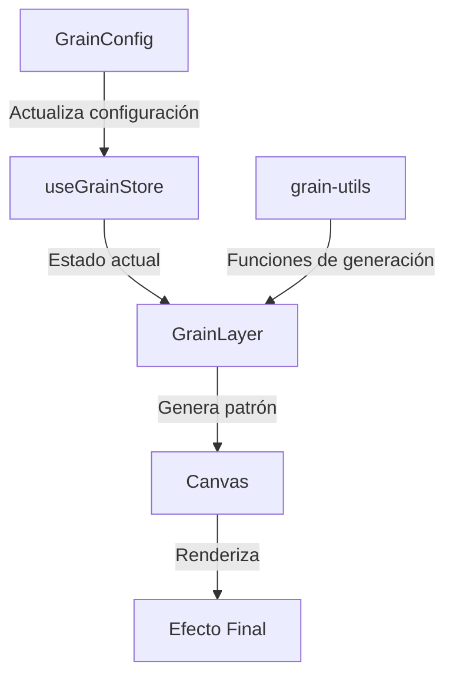

# 🌾 Grain Layer

El Grain Layer es un componente avanzado que permite aplicar efectos de grano a las imágenes de las tarjetas. Este efecto puede utilizarse para crear texturas nostálgicas, efectos de película, o simplemente añadir ruido artístico a las imágenes.

## 📁 Estructura del Directorio

```
grain/
├── actions/
│   └── grain-config.action.ts    # Configuración y store con Zustand
├── components/
│   ├── grain-layer.tsx           # Componente principal del efecto
│   └── grain-config.tsx          # Controles de configuración
├── utils/
│   └── grain-utils.ts            # Utilidades para generar patrones
├── __tests__/
│   ├── grain-layer.test.tsx      # Tests del componente principal
│   └── grain-config.test.tsx     # Tests de la configuración
└── index.ts                      # Exportaciones del módulo
```

## 🔄 Diagrama de Flujo de Datos



## ⚙️ Opciones de Configuración

```typescript
interface GrainConfig {
  enabled: boolean;           // Habilitar/deshabilitar el efecto
  intensity: number;         // Intensidad del grano (0-1)
  size: number;             // Tamaño de los granos (1-10)
  animated: boolean;        // Animación del grano
  speed: number;           // Velocidad de animación (0.1-5)
  colorMode: 'monochrome' | 'rgb' | 'hsl';  // Modo de color
  opacity: number;         // Opacidad del efecto (0-1)
  blend: string;          // Modo de mezcla
  seed: number;           // Semilla para generación de ruido
  pattern: 'perlin' | 'simplex' | 'worley' | 'value' | 'cellular';  // Tipo de patrón
  fractalNoise: boolean;  // Habilitar ruido fractal
  roughness: number;      // Rugosidad del ruido fractal (0-1)
  distribution: 'uniform' | 'gaussian' | 'exponential';  // Distribución del ruido
}
```

## 🎯 Características Principales

- Generación de patrones de grano personalizables
- Animación fluida del efecto
- Múltiples tipos de ruido y distribuciones
- Control preciso sobre la intensidad y tamaño
- Modos de color y mezcla configurables
- Ruido fractal para texturas más complejas

## 📝 Ejemplo de Uso

```tsx
// Uso básico del componente
<GrainLayer
  width={800}
  height={600}
  isHovered={false}
  isExploded={false}
/>

// Configuración del efecto
<GrainConfig className="w-full max-w-sm" />
```

## 🚀 Optimizaciones

- Uso de `requestAnimationFrame` para animaciones suaves
- Generación eficiente de patrones de ruido
- Renderizado condicional basado en el estado `enabled`
- Reutilización de patrones para mejorar el rendimiento
- Limpieza de recursos al desmontar el componente

## 🔌 Integración

El Grain Layer está diseñado para integrarse perfectamente con el sistema de capas de las tarjetas:

- Compatible con el sistema de eventos hover/explode
- Se ajusta automáticamente al tamaño de la tarjeta
- Soporta modos de mezcla para combinar con otras capas
- Mantiene la consistencia visual con otros efectos

## 🎨 Presets Recomendados

### Efecto de Película Clásica
```typescript
{
  intensity: 0.4,
  size: 2,
  colorMode: 'monochrome',
  blend: 'overlay',
  pattern: 'perlin',
  distribution: 'gaussian'
}
```

### Ruido Digital
```typescript
{
  intensity: 0.6,
  size: 1,
  animated: true,
  speed: 2,
  colorMode: 'rgb',
  pattern: 'cellular',
  distribution: 'uniform'
}
```

### Textura Orgánica
```typescript
{
  intensity: 0.3,
  size: 3,
  pattern: 'worley',
  fractalNoise: true,
  roughness: 0.7,
  distribution: 'exponential'
}
```

## 🔜 Planes Futuros

- Implementación de más patrones de ruido
- Optimización para dispositivos móviles
- Soporte para máscaras y áreas selectivas
- Presets guardables y compartibles
- Mejoras en el rendimiento de la animación

## 🛠️ Consideraciones Técnicas

- Requiere soporte de Canvas 2D
- Optimizado para navegadores modernos
- Rendimiento adaptativo según la capacidad del dispositivo
- Manejo eficiente de memoria en animaciones
- Compatibilidad con WebGL para casos específicos