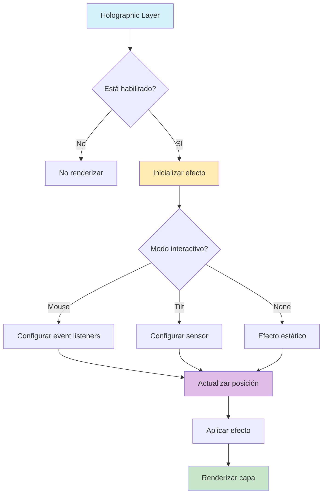

# Holographic Layer (Capa Holográfica)

## 📝 Descripción
La capa holográfica proporciona efectos visuales iridiscentes y holográficos para las Entity Cards, permitiendo crear efectos visuales dinámicos que responden a la interacción del usuario.

## 🔧 Configuración

```typescript
interface HolographicConfig {
    enabled: boolean;            // Habilitar/deshabilitar la capa
    intensity: number;           // Intensidad del efecto (0-1)
    pattern: 'rainbow' | 'linear' | 'radial' | 'custom';  // Tipo de patrón
    colors: string[];           // Colores para el efecto
    speed: number;              // Velocidad de la animación
    angle: number;              // Ángulo del efecto (-180 a 180)
    scale: number;              // Escala del efecto
    blend: 'normal' | 'screen' | 'overlay' | 'soft-light';  // Modo de mezcla
    animated: boolean;          // Si el efecto está animado
    interactiveMode: 'none' | 'tilt' | 'mouse';  // Tipo de interacción
}
```

## 🎨 Características Principales

1. **Patrones de Efecto**
   - Rainbow: Efecto de arcoíris dinámico
   - Linear: Gradiente lineal interactivo
   - Radial: Gradiente radial que sigue al cursor
   - Custom: Patrón personalizado

2. **Modos de Interacción**
   - Mouse: Sigue el movimiento del cursor
   - Tilt: Responde a la inclinación del dispositivo
   - None: Sin interacción

3. **Efectos Visuales**
   - Intensidad ajustable
   - Colores personalizables
   - Modos de mezcla
   - Animaciones fluidas

## 🚀 Uso

```typescript
import { holographicLayerImplementation } from './holographic';

// Configuración básica
const basicConfig = {
    enabled: true,
    intensity: 0.7,
    pattern: 'rainbow',
    colors: ['rgba(255,0,128,0.8)', 'rgba(0,255,255,0.8)'],
    speed: 1,
    angle: 45,
    scale: 1,
    blend: 'overlay',
    animated: true,
    interactiveMode: 'mouse'
};

// Uso en EntityCard
<EntityCard
    layerConfigs={{
        holographic: basicConfig
    }}
/>
```

## 🔄 Integración con otras capas

La capa holográfica trabaja en conjunto con:
- Border Layer
- Glow Layer
- Content Layer
- Container Layer

## ⚡ Optimizaciones de Rendimiento

1. **Throttling de Eventos**
   - Control de frecuencia de actualización del mouse
   - Optimización de rerenderings

2. **Memoización**
   - Configuración memoizada
   - Estilos calculados en caché
   - Componentes envueltos en React.memo

3. **Gestión de Recursos**
   - Limpieza de event listeners
   - Optimización de animaciones

## ⚠️ Consideraciones y Mejoras Pendientes

1. **Rendimiento**
   - Optimizar para dispositivos móviles
   - Reducir carga en GPU

2. **Accesibilidad**
   - Mejorar soporte para reducción de movimiento
   - Añadir alternativas no animadas

3. **Funcionalidades**
   - Soporte para patrones personalizados
   - Más modos de interacción
   - Efectos 3D avanzados

## 🎯 Ejemplos

### Efecto Arcoíris Básico
```typescript
const rainbowConfig = {
    enabled: true,
    intensity: 0.7,
    pattern: 'rainbow',
    colors: ['rgba(255,0,128,0.8)', 'rgba(0,255,255,0.8)'],
    animated: true,
    interactiveMode: 'mouse'
};
```

### Efecto Radial Interactivo
```typescript
const radialConfig = {
    enabled: true,
    intensity: 0.8,
    pattern: 'radial',
    colors: ['rgba(128,0,255,0.8)', 'rgba(0,255,128,0.8)'],
    speed: 1.5,
    scale: 1.2,
    blend: 'screen',
    animated: true,
    interactiveMode: 'mouse'
};
```

## 📊 Diagrama de Flujo



## 🔗 Relación con el Sistema

- Integración con el sistema de capas
- Compatibilidad con presets visuales
- Soporte para temas del sistema
- Adaptación responsive

## 📝 Notas de Implementación

1. **Gestión de Estado**
   - Uso de React.memo para optimización
   - Throttling de eventos del mouse
   - Memoización de cálculos costosos

2. **Compatibilidad**
   - Soporte para diferentes navegadores
   - Fallbacks para características no soportadas
   - Adaptación a diferentes dispositivos

3. **Mantenimiento**
   - Código modular y reutilizable
   - Documentación clara y actualizada
   - Tests unitarios y de integración