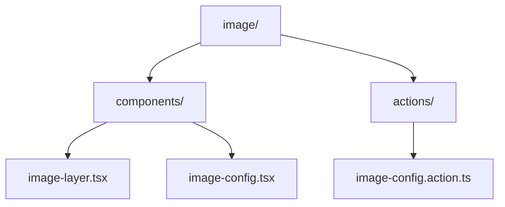
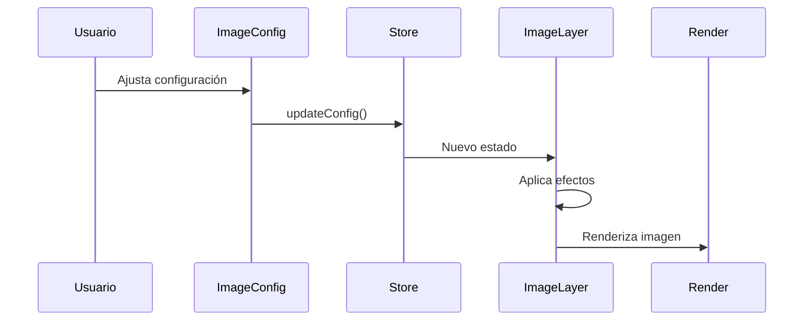

# Módulo de Imagen

Este módulo proporciona una capa de imagen altamente configurable para las tarjetas de entidad, con soporte para efectos visuales, optimizaciones de rendimiento y accesibilidad.

## Estructura del Módulo



## Componentes Principales

### ImageLayer
Componente principal que renderiza la imagen con efectos y optimizaciones.

```tsx
import { ImageLayer } from '@/components/features/entity-cards/layers/image';

<ImageLayer
  width={300}
  height={200}
  imageUrl="/path/to/image.jpg"
  title="Mi imagen"
  isExploded={false}
  isHovered={false}
  activeLayer={0}
/>
```

### ImageConfig
Panel de configuración que permite ajustar todos los parámetros de la imagen.

```tsx
import { ImageConfig } from '@/components/features/entity-cards/layers/image';

<ImageConfig />
```

## Estado Global

El módulo utiliza Zustand para gestionar el estado de la configuración:

```tsx
import { useImageStore } from '@/components/features/entity-cards/layers/image';

const { config, updateConfig, resetConfig } = useImageStore();
```

## Características

### 1. Ajustes Básicos
- Ajuste de imagen (cover, contain, fill, none)
- Relación de aspecto (1:1, 4:3, 3:4, 16:9, auto)
- Bordes redondeados (none, sm, md, lg, full)

### 2. Filtros
- Desenfoque (0-10px)
- Escala de grises (0-100%)
- Brillo (50-150%)
- Contraste (50-150%)
- Saturación (0-200%)

### 3. Rendimiento
- Estrategia de carga (lazy, eager)
- Placeholders (shimmer, blur, empty)
- Optimización automática de calidad

### 4. Accesibilidad
- Texto alternativo
- Descripción larga
- Soporte para lectores de pantalla

## Flujo de Datos



## Ejemplo de Uso Completo

```tsx
import { ImageLayer, ImageConfig, useImageStore } from '@/components/features/entity-cards/layers/image';

export const MyComponent = () => {
  const { config } = useImageStore();

  return (
    <div>
      <ImageLayer
        width={400}
        height={300}
        imageUrl="/my-image.jpg"
        title="Mi imagen"
        isExploded={false}
        isHovered={false}
        activeLayer={0}
      />

      <ImageConfig />
    </div>
  );
};
```

## Mejores Prácticas

1. **Rendimiento**
   - Usar lazy loading para imágenes fuera de la vista
   - Optimizar el tamaño y formato de las imágenes
   - Utilizar placeholders para mejorar la UX

2. **Accesibilidad**
   - Siempre proporcionar texto alternativo descriptivo
   - Usar descripciones largas para imágenes complejas
   - Mantener suficiente contraste en los controles

3. **Mantenimiento**
   - Seguir las convenciones de nombres
   - Documentar cambios significativos
   - Mantener la configuración organizada

## Notas Técnicas

- Utiliza Next.js Image para optimización automática
- Implementa lazy loading nativo
- Soporta formatos modernos (WebP, AVIF)
- Compatible con modo oscuro/claro
- Optimizado para dispositivos móviles