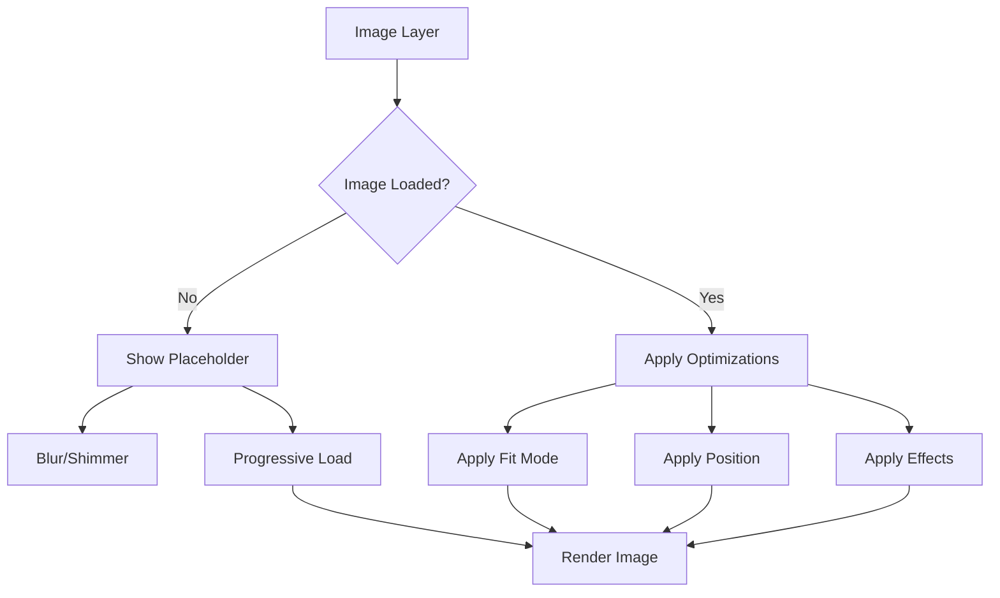

# Image Layer (Capa de Imagen)

## 📝 Descripción
La capa de imagen es una capa fundamental que se encarga de renderizar y gestionar las imágenes en las Entity Cards. Proporciona funcionalidades avanzadas para el manejo de imágenes, incluyendo lazy loading, fallbacks, y optimizaciones de rendimiento.

## 🔧 Configuración

```typescript
interface ImageLayerConfig {
  enabled: boolean;        // Habilitar/deshabilitar la capa
  layerIndex: number;      // Posición en el stack de capas
  fit: 'cover' | 'contain' | 'fill' | 'none';  // Modo de ajuste de imagen
  position: 'center' | 'top' | 'bottom' | 'left' | 'right';  // Posición de la imagen
  quality: number;         // Calidad de la imagen (1-100)
  blur: number;           // Nivel de desenfoque (0-20)
  opacity: number;        // Opacidad de la imagen (0-1)
  rounded: boolean;       // Bordes redondeados
  aspectRatio?: string;   // Relación de aspecto (ej: "16:9")
  loading: 'eager' | 'lazy';  // Estrategia de carga
  placeholder: 'blur' | 'empty' | 'shimmer';  // Tipo de placeholder
}
```

## 🎨 Características Principales

1. **Optimización de Imágenes**
   - Lazy loading automático
   - Carga progresiva
   - Placeholders personalizables
   - Compresión y optimización automática

2. **Modos de Ajuste**
   - Cover: Cubre todo el contenedor
   - Contain: Mantiene proporciones
   - Fill: Estira para llenar
   - None: Sin ajuste

3. **Efectos y Transformaciones**
   - Desenfoque configurable
   - Control de opacidad
   - Bordes redondeados
   - Posicionamiento flexible

## 🚀 Uso

```typescript
import { imageLayerImplementation } from './image';

// Configuración básica
const basicConfig = {
  enabled: true,
  layerIndex: 10,
  fit: 'cover',
  position: 'center',
  quality: 85,
  blur: 0,
  opacity: 1,
  rounded: true,
  loading: 'lazy',
  placeholder: 'blur'
};

// Uso en EntityCard
<EntityCard
  layerConfigs={{
    image: basicConfig
  }}
/>
```

## 🔄 Integración con otras capas

La capa de imagen trabaja en conjunto con:
- Content Layer
- Border Layer
- Filter Layer
- Effects Layer

## ⚠️ Consideraciones y Mejoras Pendientes

1. **Rendimiento**
   - Implementar formato WebP automático
   - Mejorar la estrategia de caching
   - Optimizar la carga progresiva

2. **Accesibilidad**
   - Mejorar el soporte de alt text
   - Añadir descripciones detalladas
   - Soporte para lectores de pantalla

3. **Funcionalidades**
   - Soporte para múltiples imágenes
   - Zoom y pan interactivo
   - Recorte dinámico

## 🎯 Ejemplos

### Imagen de Alta Calidad
```typescript
const highQualityConfig = {
  enabled: true,
  quality: 100,
  fit: 'cover',
  loading: 'eager',
  placeholder: 'blur'
};
```

### Imagen con Efectos
```typescript
const effectsConfig = {
  enabled: true,
  blur: 5,
  opacity: 0.8,
  rounded: true,
  position: 'center'
};
```

### Imagen Optimizada para Rendimiento
```typescript
const performanceConfig = {
  enabled: true,
  quality: 75,
  loading: 'lazy',
  placeholder: 'shimmer'
};
```

## 📊 Diagrama de Flujo



## 🔍 Debugging

Para depurar problemas comunes:

1. **Imagen no carga**
   - Verificar URL de la imagen
   - Comprobar permisos CORS
   - Revisar configuración de lazy loading

2. **Problemas de rendimiento**
   - Ajustar calidad de imagen
   - Verificar tamaño de imagen
   - Optimizar formato de imagen

3. **Problemas visuales**
   - Revisar modo de ajuste
   - Verificar posicionamiento
   - Comprobar relación de aspecto