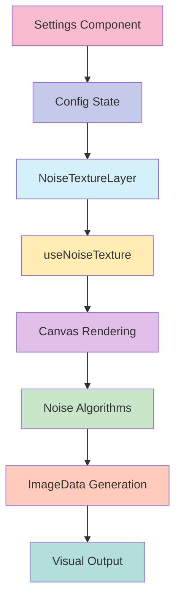

# 🌫️ Noise Texture Layer

## Descripción
La capa de textura de ruido permite añadir efectos de ruido procedural a las tarjetas, creando texturas dinámicas y efectos visuales interesantes.

## Estructura
```typescript
src/components/features/entity-cards/layers/noise-texture/
├── actions/
│   └── noise-texture-config.action.ts    // Acciones del servidor y tipos
├── components/
│   ├── noise-texture-layer.tsx           // Componente principal
│   └── noise-texture-settings.tsx        // Panel de configuración
├── hooks/
│   └── use-noise-texture.ts              // Lógica de renderizado
├── utils/
│   └── noise-algorithms.ts               // Algoritmos de generación de ruido
├── noise-texture-implementation.tsx       // Registro e implementación
└── index.ts                              // Exportaciones
```

## Flujo de Datos


## Configuración
La capa acepta las siguientes opciones de configuración:

```typescript
interface NoiseTextureConfig {
  enabled: boolean;              // Activar/desactivar la capa
  visibleOnHover: boolean;      // Mostrar solo en hover
  layerIndex: number;           // Orden de la capa
  opacity: number;              // Opacidad general
  density: number;              // Densidad del ruido
  pattern: string;              // Tipo de patrón
  scale: number;                // Escala del ruido
  octaves: number;              // Detalle del ruido
  seed: number;                 // Semilla para generación
  animated: boolean;            // Animación activa
  animationSpeed: number;       // Velocidad de animación
  color: string;               // Color del ruido
  intensity: number;           // Intensidad del efecto
  blendMode: string;           // Modo de fusión
}
```

## Presets Disponibles

### 1. Suave
- Textura de ruido suave y sutil
- Ideal para efectos de fondo delicados

### 2. Dinámico
- Textura de ruido animada y dinámica
- Perfecto para efectos interactivos

### 3. Intenso
- Textura de ruido más pronunciada
- Útil para efectos dramáticos

## Ejemplos de Uso

```tsx
// Uso básico
<NoiseTextureLayer
  config={{
    enabled: true,
    opacity: 0.1,
    pattern: 'fractalNoise',
    scale: 1,
  }}
  isHovered={false}
  isExploded={false}
  activeLayer={null}
  getExplodeLayerTransform={(index) => ({ transform: `translateZ(${index * 10}px)` })}
/>

// Uso con animación
<NoiseTextureLayer
  config={{
    enabled: true,
    animated: true,
    animationSpeed: 1.5,
    pattern: 'fractalNoise',
    opacity: 0.15,
  }}
  // ... resto de props
/>

// Uso con hover
<NoiseTextureLayer
  config={{
    enabled: true,
    visibleOnHover: true,
    opacity: 0.2,
    intensity: 0.8,
  }}
  // ... resto de props
/>
```

## Optimizaciones
- Uso de `requestAnimationFrame` para animaciones suaves
- Cache de mapas de ruido para mejor rendimiento
- Memoización de cálculos costosos
- Ajuste automático de resolución según el dispositivo

## Consideraciones
1. El rendimiento puede variar según el tamaño del canvas y la complejidad del ruido
2. La animación consume más recursos, usar con moderación
3. Algunos modos de fusión pueden no funcionar en todos los navegadores

## Integración con Otros Sistemas
- Compatible con el sistema de capas base
- Se integra con el sistema de configuración global
- Soporta el modo de explosión de capas
- Funciona con el sistema de presets

## Desarrollo Futuro
- [ ] Añadir más patrones de ruido
- [ ] Mejorar el rendimiento en dispositivos móviles
- [ ] Implementar más presets
- [ ] Añadir efectos de color avanzados
```