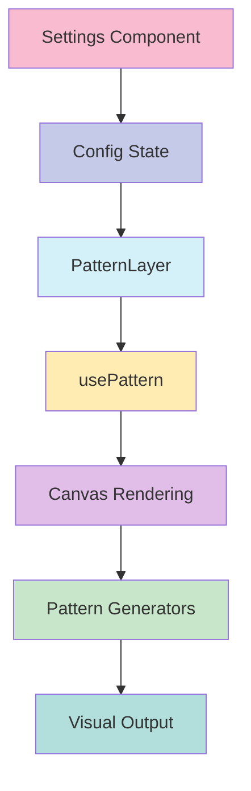

# 🔲 Pattern Layer

## Descripción
La capa de patrones permite añadir diseños geométricos a las tarjetas, creando efectos visuales únicos y personalizables.

## Estructura
```typescript
src/components/features/entity-cards/layers/patterns/
├── actions/
│   └── pattern-config.action.ts      // Acciones del servidor y tipos
├── components/
│   ├── pattern-layer.tsx            // Componente principal
│   └── pattern-settings.tsx         // Panel de configuración
├── hooks/
│   └── use-pattern.ts              // Lógica de renderizado
├── utils/
│   └── pattern-generators.ts       // Generadores de patrones
├── pattern-implementation.tsx      // Registro e implementación
└── index.ts                       // Exportaciones
```

## Flujo de Datos


## Configuración
La capa acepta las siguientes opciones de configuración:

```typescript
interface PatternConfig {
  enabled: boolean;              // Activar/desactivar la capa
  visibleOnHover: boolean;      // Mostrar solo en hover
  layerIndex: number;           // Orden de la capa
  opacity: number;              // Opacidad general
  scale: number;                // Escala del patrón
  color: string;                // Color del patrón
  patternType: string;          // Tipo de patrón
  spacing: number;              // Espaciado entre elementos
  lineWidth: number;            // Grosor de líneas
  rotation: number;             // Rotación del patrón
  blendMode: string;            // Modo de fusión
}
```

## Tipos de Patrones

### 1. Grid
- Patrón de cuadrícula básico
- Ideal para efectos técnicos y minimalistas
- Configurable en espaciado y grosor

### 2. Dots
- Patrón de puntos regulares
- Perfecto para texturas sutiles
- Ajustable en tamaño y densidad

### 3. Hexagon
- Patrón de hexágonos interconectados
- Crea efectos futuristas y tecnológicos
- Personalizable en tamaño y rotación

### 4. Lines
- Patrón de líneas diagonales
- Genera efectos dinámicos y energéticos
- Configurable en ángulo y densidad

## Presets Disponibles

### 1. Grid Clásico
- Cuadrícula simple y elegante
- Opacidad moderada
- Espaciado equilibrado

### 2. Dots Minimalista
- Puntos sutiles y modernos
- Rotación de 45 grados
- Mayor espaciado entre elementos

### 3. Hexágonos Futuristas
- Patrón hexagonal tecnológico
- Mayor opacidad
- Líneas más gruesas

### 4. Líneas Diagonales
- Patrón dinámico
- Rotación diagonal
- Espaciado compacto

## Ejemplos de Uso

```tsx
// Uso básico con grid
<PatternLayer
  config={{
    enabled: true,
    opacity: 0.15,
    patternType: 'grid',
    spacing: 20,
    lineWidth: 1,
  }}
  isHovered={false}
  isExploded={false}
  activeLayer={null}
  getExplodeLayerTransform={(index) => ({ transform: `translateZ(${index * 10}px)` })}
/>

// Patrón de puntos rotado
<PatternLayer
  config={{
    enabled: true,
    patternType: 'dots',
    rotation: 45,
    spacing: 25,
    opacity: 0.2,
  }}
  // ... resto de props
/>

// Hexágonos con efecto hover
<PatternLayer
  config={{
    enabled: true,
    visibleOnHover: true,
    patternType: 'hexagon',
    spacing: 30,
    opacity: 0.25,
  }}
  // ... resto de props
/>
```

## Optimizaciones
- Uso de canvas para renderizado eficiente
- Transformaciones optimizadas
- Ajuste automático a resolución del dispositivo
- Manejo eficiente de eventos de redimensionamiento

## Consideraciones
1. Los patrones complejos pueden afectar el rendimiento en dispositivos de gama baja
2. Algunos modos de fusión pueden no ser compatibles con todos los navegadores
3. La rotación puede afectar el rendimiento en patrones complejos

## Integración con Otros Sistemas
- Compatible con el sistema de capas base
- Se integra con el sistema de configuración global
- Soporta el modo de explosión de capas
- Funciona con el sistema de presets

## Desarrollo Futuro
- [ ] Añadir más tipos de patrones
- [ ] Implementar patrones animados
- [ ] Mejorar el rendimiento en patrones complejos
- [ ] Añadir efectos de degradado
```