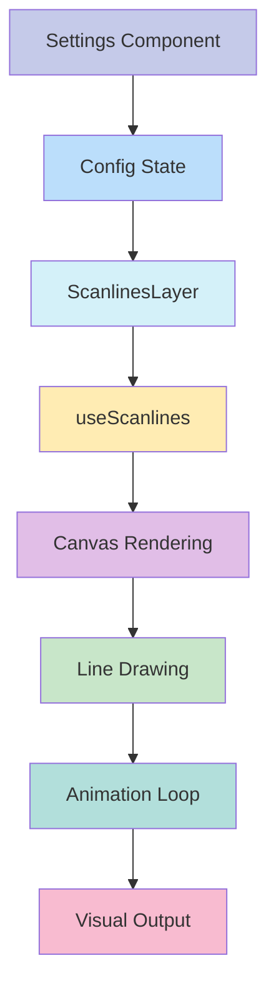

# 📺 Scanlines Layer

## Descripción
La capa de líneas de escaneo añade un efecto retro que simula las líneas de barrido de pantallas CRT y monitores antiguos, con opciones de personalización y animación.

## Estructura
```typescript
src/components/features/entity-cards/layers/scanlines/
├── actions/
│   └── scanlines-config.action.ts      // Acciones del servidor y tipos
├── components/
│   ├── scanlines-layer.tsx            // Componente principal
│   └── scanlines-settings.tsx         // Panel de configuración
├── hooks/
│   └── use-scanlines.ts              // Lógica de renderizado
├── scanlines-implementation.tsx      // Registro e implementación
└── index.ts                         // Exportaciones
```

## Flujo de Datos


## Configuración
La capa acepta las siguientes opciones de configuración:

```typescript
interface ScanlinesConfig {
  enabled: boolean;              // Activar/desactivar la capa
  visibleOnHover: boolean;      // Mostrar solo en hover
  layerIndex: number;           // Orden de la capa
  opacity: number;              // Opacidad general
  lineWidth: number;            // Grosor de las líneas
  lineSpacing: number;          // Espaciado entre líneas
  speed: number;                // Velocidad de animación
  color: string;                // Color de las líneas
  blendMode: string;            // Modo de fusión
  direction: string;            // Dirección de las líneas
  animated: boolean;            // Activar animación
  offset: number;               // Desplazamiento inicial
}
```

## Características Principales

### 1. Dirección de Líneas
- **Horizontal**: Líneas que se extienden de izquierda a derecha
- **Vertical**: Líneas que se extienden de arriba a abajo
- Configurable en tiempo real
- Mantiene la consistencia visual

### 2. Personalización Visual
- Control preciso del grosor de línea
- Espaciado ajustable entre líneas
- Opacidad configurable
- Paleta de colores predefinida
- Modos de fusión diversos

### 3. Sistema de Animación
- Animación suave y optimizada
- Velocidad ajustable
- Dirección configurable
- Desplazamiento personalizable
- Activación/desactivación sencilla

## Presets Disponibles

### 1. TV Retro
- Líneas horizontales sutiles
- Efecto monocromático clásico
- Opacidad moderada
- Sin animación

### 2. Monitor CRT
- Líneas verticales definidas
- Efecto de brillo suave
- Mayor espaciado
- Aspecto profesional

### 3. Cyberpunk
- Líneas gruesas animadas
- Color cian futurista
- Efecto de superposición
- Velocidad moderada

### 4. Matrix
- Líneas verticales finas
- Color verde característico
- Alta velocidad
- Efecto digital

### 5. Glitch
- Líneas gruesas y rápidas
- Color magenta vibrante
- Efecto de exclusión
- Aspecto distorsionado

## Ejemplos de Uso

```tsx
// Efecto TV Retro básico
<ScanlinesLayer
  config={{
    enabled: true,
    opacity: 0.15,
    lineWidth: 1,
    lineSpacing: 3,
    color: 'rgba(0, 0, 0, 0.1)',
    blendMode: 'multiply',
    direction: 'horizontal',
  }}
  isHovered={false}
  isExploded={false}
  activeLayer={null}
  getExplodeLayerTransform={(index) => ({ transform: `translateZ(${index * 10}px)` })}
/>

// Efecto Cyberpunk animado
<ScanlinesLayer
  config={{
    enabled: true,
    opacity: 0.25,
    lineWidth: 2,
    lineSpacing: 6,
    speed: 2,
    color: 'rgba(0, 255, 255, 0.1)',
    blendMode: 'screen',
    direction: 'horizontal',
    animated: true,
  }}
  // ... resto de props
/>

// Efecto Matrix vertical
<ScanlinesLayer
  config={{
    enabled: true,
    opacity: 0.2,
    lineWidth: 1,
    lineSpacing: 2,
    speed: 5,
    color: 'rgba(0, 255, 0, 0.1)',
    blendMode: 'screen',
    direction: 'vertical',
    animated: true,
  }}
  // ... resto de props
/>
```

## Optimizaciones
- Uso de requestAnimationFrame para animaciones suaves
- Renderizado eficiente con canvas
- Limpieza automática de recursos
- Ajuste automático a resolución del dispositivo
- Manejo eficiente de eventos de redimensionamiento
- Cancelación de animaciones cuando no son visibles

## Consideraciones
1. La animación puede afectar el rendimiento en dispositivos de gama baja
2. Algunos modos de fusión pueden no ser compatibles con todos los navegadores
3. Las líneas muy finas pueden verse pixeladas en algunas pantallas
4. La velocidad de animación debe ajustarse según el rendimiento deseado
5. El espaciado debe ser proporcional al tamaño de la tarjeta

## Integración con Otros Sistemas
- Compatible con el sistema de capas base
- Se integra con el sistema de configuración global
- Soporta el modo de explosión de capas
- Funciona con el sistema de presets
- Interactúa correctamente con otras capas

## Desarrollo Futuro
- [ ] Añadir patrones de líneas más complejos
- [ ] Implementar efectos de distorsión
- [ ] Añadir más presets temáticos
- [ ] Mejorar el rendimiento en dispositivos móviles
- [ ] Añadir efectos de parpadeo
- [ ] Implementar modos de animación adicionales
```