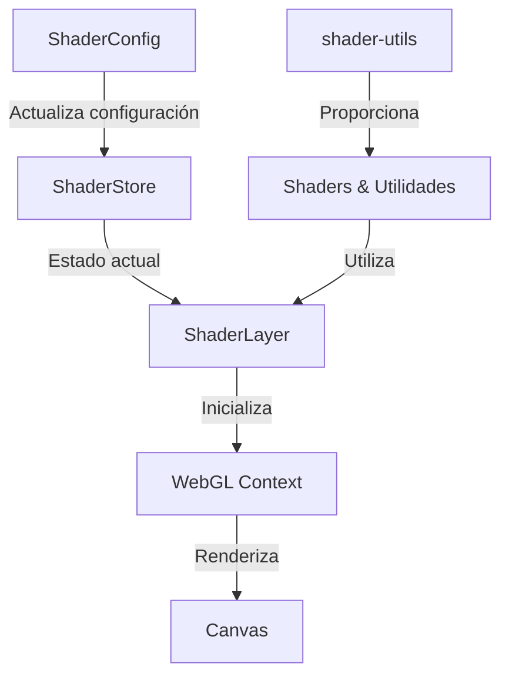

# 🎨 Shader Layer

El Shader Layer es un componente avanzado que permite aplicar efectos visuales dinámicos a las cartas utilizando WebGL. Este layer proporciona una variedad de shaders predefinidos que pueden ser personalizados y combinados para crear efectos únicos.

## 📁 Estructura del Directorio

```
shaders/
├── actions/
│   └── shader-config.action.ts    # Configuración y estado de los shaders
├── components/
│   ├── shader-layer.tsx          # Componente principal del shader
│   └── shader-config.tsx         # Componente de configuración
├── utils/
│   └── shader-utils.ts           # Utilidades para WebGL y shaders
└── README.md                     # Esta documentación
```

## 🔄 Flujo de Datos



## ⚙️ Configuración

Cada shader tiene su propia configuración específica que hereda de una configuración base:

```typescript
interface BaseShaderConfig {
  enabled: boolean;
  type: ShaderType;
  opacity: number;
  blendMode: string;
}
```

### Tipos de Shaders Disponibles

1. **Distortion**
   - Crea efectos de distorsión ondulante
   - Configurable: intensidad

2. **Hologram**
   - Efecto de holograma con líneas de escaneo
   - Configurable: color, intensidad de líneas

3. **Wave**
   - Efecto de onda animada
   - Configurable: amplitud, frecuencia

4. **Particle**
   - Sistema de partículas dinámico
   - Configurable: tamaño, densidad

## 🎯 Características Principales

- Shaders WebGL optimizados para rendimiento
- Animaciones fluidas y personalizables
- Sistema de mezcla (blending) con la capa subyacente
- Controles de opacidad y visibilidad
- Interfaz de usuario intuitiva para configuración
- Soporte para múltiples tipos de efectos
- Gestión de estado con Zustand

## 📝 Ejemplos de Uso

### Uso Básico

```tsx
import { ShaderLayer } from './components/shader-layer';

function Card() {
  return (
    <div className="relative">
      <ShaderLayer width={300} height={400} />
      {/* Contenido de la carta */}
    </div>
  );
}
```

### Configuración de Shader

```tsx
import { useShaderStore } from './actions/shader-config.action';

function ShaderControls() {
  const { updateConfig } = useShaderStore();

  const enableDistortion = () => {
    updateConfig('distortion', {
      enabled: true,
      intensity: 0.5,
      blendMode: 'screen'
    });
  };

  return <button onClick={enableDistortion}>Activar Distorsión</button>;
}
```

## 🚀 Optimizaciones

- Uso de `useRef` para referencias persistentes
- Limpieza adecuada de recursos WebGL
- Memoización de valores y callbacks
- Renderizado condicional basado en estado
- Gestión eficiente de eventos de resize

## 🔗 Integración con Otros Sistemas

- Compatible con el sistema de capas de la carta
- Interactúa con el sistema de eventos de la carta
- Se integra con el sistema de temas
- Soporta el sistema de animaciones global

## 🎯 Planes Futuros

- [ ] Añadir más tipos de shaders
- [ ] Implementar sistema de presets
- [ ] Mejorar el rendimiento en dispositivos móviles
- [ ] Añadir soporte para texturas personalizadas
- [ ] Implementar sistema de post-procesamiento
- [ ] Añadir efectos de transición entre shaders

## 🛠️ Consideraciones Técnicas

- Requiere soporte WebGL en el navegador
- Optimizado para WebGL 1.0 para máxima compatibilidad
- Manejo de fallbacks para navegadores sin soporte
- Gestión de memoria y limpieza de recursos
- Soporte para diferentes densidades de píxeles