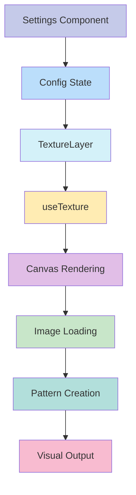

# 🖼️ Texture Layer

## Descripción
La capa de texturas permite añadir imágenes de textura a las tarjetas, con opciones avanzadas de transformación y filtros para crear efectos visuales únicos.

## Estructura
```typescript
src/components/features/entity-cards/layers/textures/
├── actions/
│   └── texture-config.action.ts      // Acciones del servidor y tipos
├── components/
│   ├── texture-layer.tsx            // Componente principal
│   └── texture-settings.tsx         // Panel de configuración
├── hooks/
│   └── use-texture.ts              // Lógica de renderizado
├── texture-implementation.tsx      // Registro e implementación
└── index.ts                       // Exportaciones
```

## Flujo de Datos


## Configuración
La capa acepta las siguientes opciones de configuración:

```typescript
interface TextureConfig {
  enabled: boolean;              // Activar/desactivar la capa
  visibleOnHover: boolean;      // Mostrar solo en hover
  layerIndex: number;           // Orden de la capa
  textureUrl: string;           // URL de la imagen de textura
  opacity: number;              // Opacidad general
  scale: number;                // Escala de la textura
  rotation: number;             // Rotación en grados
  blendMode: string;            // Modo de fusión
  offsetX: number;              // Desplazamiento horizontal
  offsetY: number;              // Desplazamiento vertical
  tileMode: string;             // Modo de mosaico
  filters?: {                   // Filtros opcionales
    brightness?: number;        // Brillo (0-200)
    contrast?: number;         // Contraste (0-200)
    saturation?: number;       // Saturación (0-200)
    blur?: number;            // Desenfoque (0-20)
  };
}
```

## Texturas Predefinidas

### 1. Papel
- Textura de papel con relieve sutil
- Ideal para efectos vintage y artísticos
- Funciona bien con modos de fusión multiply y overlay

### 2. Concreto
- Textura de concreto con detalles
- Perfecta para efectos industriales y modernos
- Mejor con opacidades bajas y escala grande

### 3. Tela
- Textura de tela tejida
- Excelente para efectos suaves y delicados
- Funciona bien con rotación y filtros sutiles

### 4. Metal
- Textura metálica con brillo
- Ideal para efectos futuristas y tecnológicos
- Mejor con modo de fusión overlay y contraste alto

### 5. Madera
- Textura de madera natural
- Perfecta para efectos orgánicos y cálidos
- Funciona bien con modo soft-light y saturación ajustada

## Presets Disponibles

### 1. Papel Vintage
- Textura de papel envejecido
- Opacidad baja y contraste ajustado
- Efecto sutil y elegante

### 2. Metal Pulido
- Acabado metálico brillante
- Rotación de 45 grados
- Mayor contraste y brillo

### 3. Madera Natural
- Textura de madera con vetas
- Escala ajustada para detalle
- Saturación y contraste naturales

### 4. Concreto Industrial
- Textura de concreto ampliada
- Efecto industrial moderno
- Contraste alto y saturación reducida

### 5. Tela Suave
- Textura de tela rotada
- Efecto delicado y sutil
- Filtros suaves y naturales

## Ejemplos de Uso

```tsx
// Textura básica de papel
<TextureLayer
  config={{
    enabled: true,
    textureUrl: '/textures/paper.jpg',
    opacity: 0.15,
    scale: 1,
    rotation: 0,
    blendMode: 'multiply',
  }}
  isHovered={false}
  isExploded={false}
  activeLayer={null}
  getExplodeLayerTransform={(index) => ({ transform: `translateZ(${index * 10}px)` })}
/>

// Textura metálica con efectos
<TextureLayer
  config={{
    enabled: true,
    textureUrl: '/textures/metal.jpg',
    opacity: 0.2,
    scale: 1.5,
    rotation: 45,
    blendMode: 'overlay',
    filters: {
      brightness: 120,
      contrast: 130,
      saturation: 90,
      blur: 0.5,
    },
  }}
  // ... resto de props
/>

// Textura de madera con transformaciones
<TextureLayer
  config={{
    enabled: true,
    textureUrl: '/textures/wood.jpg',
    opacity: 0.25,
    scale: 1.2,
    rotation: 0,
    blendMode: 'soft-light',
    offsetX: 10,
    offsetY: -10,
    tileMode: 'repeat',
  }}
  // ... resto de props
/>
```

## Optimizaciones
- Carga asíncrona de imágenes
- Caché de texturas cargadas
- Renderizado eficiente con canvas
- Transformaciones optimizadas con DOMMatrix
- Ajuste automático a resolución del dispositivo
- Manejo eficiente de eventos de redimensionamiento

## Consideraciones
1. Las imágenes de textura deben ser lo suficientemente grandes para evitar pixelación al escalar
2. Los filtros pueden afectar el rendimiento en dispositivos de gama baja
3. Algunos modos de fusión pueden no ser compatibles con todos los navegadores
4. Las texturas muy grandes pueden afectar el tiempo de carga inicial
5. La rotación y escala pueden afectar el rendimiento en patrones complejos

## Integración con Otros Sistemas
- Compatible con el sistema de capas base
- Se integra con el sistema de configuración global
- Soporta el modo de explosión de capas
- Funciona con el sistema de presets
- Integración con el sistema de gestión de assets

## Desarrollo Futuro
- [ ] Añadir soporte para texturas animadas
- [ ] Implementar sistema de caché de texturas más avanzado
- [ ] Añadir más filtros y efectos
- [ ] Mejorar el rendimiento en dispositivos móviles
- [ ] Añadir soporte para texturas procedurales
- [ ] Implementar sistema de previsualización en tiempo real
```