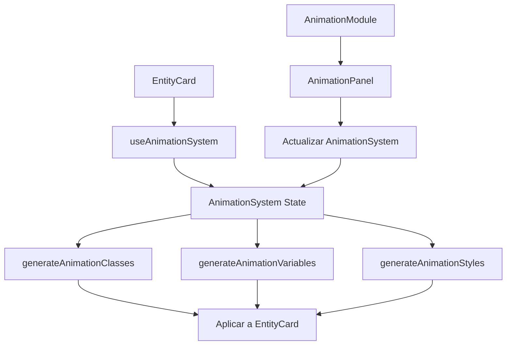

# Módulo de Animación para Entity Cards

## Descripción

El módulo de animación proporciona un sistema completo para gestionar animaciones y efectos interactivos en las tarjetas de entidad. Permite configurar animaciones de entrada/salida, efectos de hover, efectos de clic y otras propiedades relacionadas con el movimiento y las transiciones.

## Componentes Principales

### AnimationModule

Componente principal que gestiona la configuración de animaciones. Acepta un sistema de animación inicial y proporciona una interfaz para modificarlo.

```tsx
import { AnimationModule } from '@/components/features/entity-cards/modules/animation';

<AnimationModule
	initialAnimationSystem={myAnimationSystem}
	onChange={(updatedSystem) => console.log('Sistema actualizado:', updatedSystem)}
	disabled={false}
	className="my-custom-class"
/>;
```

### AnimationPanel

Panel de configuración visual que permite al usuario modificar las propiedades de animación a través de una interfaz gráfica.

```tsx
import { AnimationPanel } from '@/components/features/entity-cards/modules/animation';

<AnimationPanel
	animationSystem={myAnimationSystem}
	onChange={(updatedSystem) => console.log('Sistema actualizado:', updatedSystem)}
	disabled={false}
	className="my-custom-class"
/>;
```

## Hooks

### useAnimationSystem

Hook personalizado para gestionar el estado del sistema de animación. Proporciona funciones para actualizar, restablecer y generar clases/estilos CSS.

```tsx
import { useAnimationSystem } from '@/components/features/entity-cards/modules/animation';

function MyComponent() {
	const {
		animationSystem,
		updateAnimationSystem,
		resetAnimationSystem,
		getAnimationClasses,
		getAnimationVariables,
		getAnimationStyles,
	} = useAnimationSystem({
		enabled: true,
		hoverEffect: true,
		// ... otras propiedades
	});

	return (
		<div className={getAnimationClasses()} style={getAnimationStyles()}>
			Contenido animado
		</div>
	);
}
```

## Utilidades

### Generación de CSS

El módulo incluye funciones para generar clases, variables y estilos CSS basados en la configuración de animación:

```tsx
import {
	generateAnimationClasses,
	generateAnimationVariables,
	generateAnimationStyles,
} from '@/components/features/entity-cards/modules/animation';

// Generar clases CSS
const classes = generateAnimationClasses(myAnimationSystem);

// Generar variables CSS
const variables = generateAnimationVariables(myAnimationSystem);

// Generar estilos en línea
const styles = generateAnimationStyles(myAnimationSystem);
```

#### Funciones de temporización personalizadas

El sistema soporta funciones de temporización estándar (`ease`, `ease-in`, `ease-out`, `ease-in-out`, `linear`) y también funciones `cubic-bezier` personalizadas:

```tsx
// Ejemplo de configuración con cubic-bezier personalizado
const animationSystem = {
	// ... otras propiedades
	timingFunction: 'cubic-bezier(0.34, 1.56, 0.64, 1)', // Función elástica
};

// El generador aplicará automáticamente esta función como estilo en línea
const styles = generateAnimationStyles(animationSystem);
```

También puedes aplicar funciones de temporización personalizadas directamente desde el hook:

```tsx
import { useAnimationSystem } from '@/components/features/entity-cards/modules/animation';

function MyComponent() {
	const { applyCustomTimingFunction } = useAnimationSystem();

	// Aplicar una función elástica
	const handleApplyElasticTiming = () => {
		applyCustomTimingFunction(0.34, 1.56, 0.64, 1);
	};

	// Aplicar una función de rebote
	const handleApplyBounceTiming = () => {
		applyCustomTimingFunction(0.68, -0.6, 0.32, 1.6);
	};

	return (
		<div>
			<button onClick={handleApplyElasticTiming}>Aplicar timing elástico</button>
			<button onClick={handleApplyBounceTiming}>Aplicar timing con rebote</button>
		</div>
	);
}
```

### Adaptadores

Para mantener la compatibilidad con sistemas antiguos, se incluyen adaptadores:

```tsx
import { legacyToAnimationSystem, animationSystemToLegacy } from '@/components/features/entity-cards/modules/animation';

// Convertir opciones antiguas al nuevo sistema
const newSystem = legacyToAnimationSystem(legacyOptions);

// Convertir nuevo sistema a formato antiguo
const legacyOptions = animationSystemToLegacy(newSystem);
```

## Presets

El módulo incluye presets predefinidos para diferentes estilos de animación:

- **Estándar**: Animaciones suaves y sutiles
- **Minimalista**: Animaciones muy sutiles
- **Enérgico**: Animaciones vívidas y dinámicas
- **Sin animaciones**: Deshabilita todas las animaciones

## Integración con Entity Card

El módulo de animación se integra directamente con el componente EntityCard:

```tsx
import { EntityCard } from '@/components/features/entity-cards';

<EntityCard
	// ... otras props
	options={{
		// ... otras opciones
		animationSystem: {
			enabled: true,
			hoverEffect: true,
			clickEffect: true,
			entranceAnimation: 'fade-in',
			// ... otras propiedades
		},
	}}
/>;
```

## Diagrama de Flujo



## Próximas Mejoras

- Implementación de animaciones personalizadas mediante keyframes
- Soporte para animaciones basadas en scroll
- Optimización de rendimiento para dispositivos de gama baja
- Integración con preferencias de sistema para reducción de movimiento
