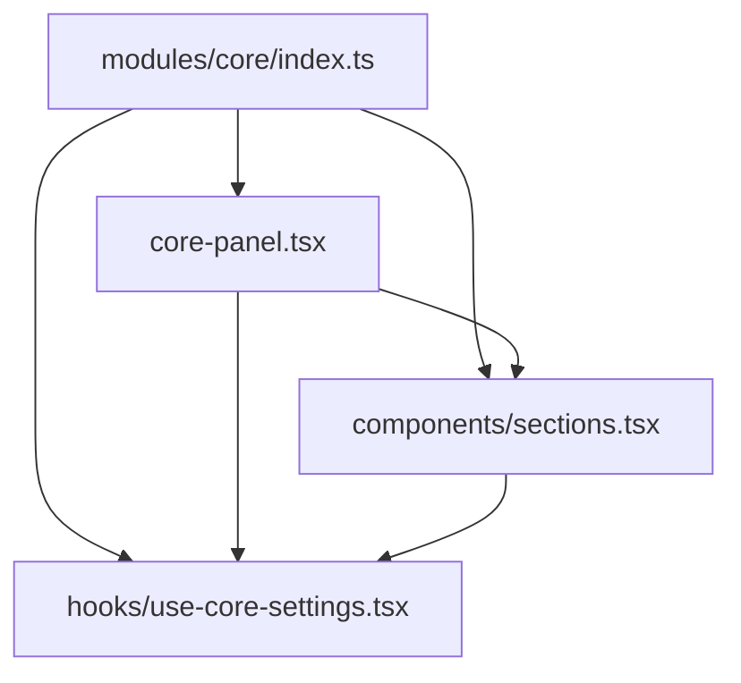
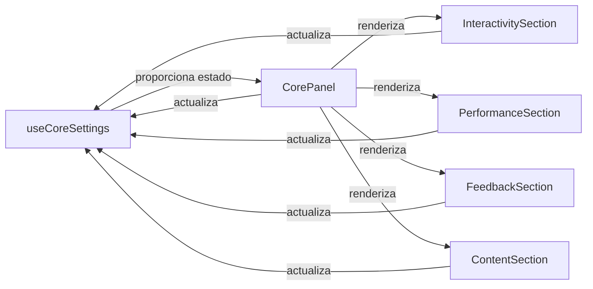
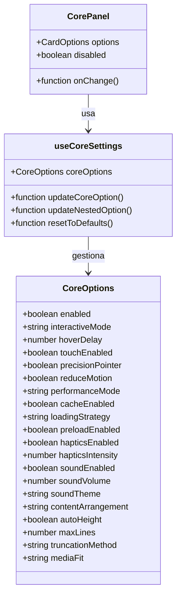

# Arquitectura del Módulo Core

Este documento proporciona una visión general de la estructura y las relaciones entre los componentes del módulo Core.

## Estructura de Archivos

## Flujo de Datos

## Jerarquía de Componentes

```mermaid
graph TD
    A[CorePanel] --> B[FormLayout]
    A --> C[FormToggle]
    A --> D[Tabs]
    D --> E[TabsList]
    D --> F[TabsContent]
    E --> G[TabsTrigger]
    F --> H[InteractivitySection]
    F --> I[PerformanceSection]
    F --> J[FeedbackSection]
    F --> K[ContentSection]
    H --> L[FormSelect/FormSlider/FormToggle]
    I --> L
    J --> L
    K --> L
```

## Estructura de Datos

