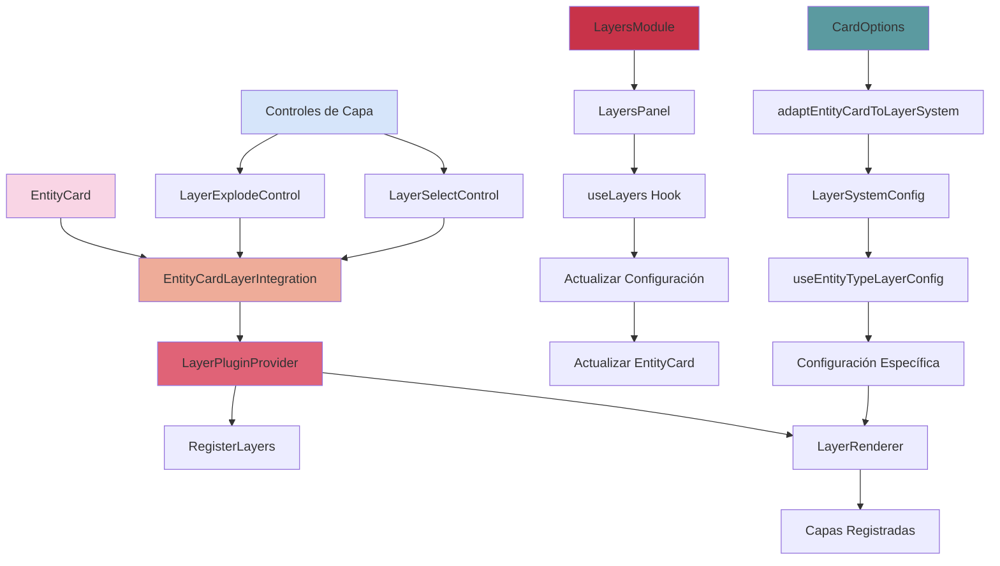
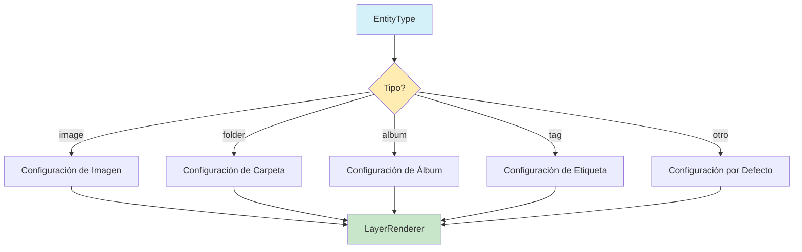

# Módulo de Capas para Entity Cards

## Descripción

El módulo de capas proporciona un sistema completo para gestionar las diferentes capas visuales que componen una tarjeta de entidad. Permite configurar el orden, visibilidad y propiedades específicas de cada capa, así como efectos de explosión para visualizar la estructura de la tarjeta.

## Componentes Principales

### EntityCardLayerIntegration

Componente optimizado para la integración de capas en EntityCard, con soporte para memoización y configuración dinámica por tipo de entidad.

```tsx
import { EntityCardLayerIntegration } from '@/components/features/entity-cards/modules/layers';

<EntityCardLayerIntegration
	title="Mi Tarjeta"
	description="Descripción de la tarjeta"
	cardOptions={cardOptions}
	entityType="image"
	entityId="123"
	enableExplode={true}
	isExploded={isExploded}
	activeLayer={activeLayer}
	onExplodedChange={setIsExploded}
	onActiveLayerChange={setActiveLayer}
	className="w-64 h-96"
>
	{/* Contenido adicional */}
</EntityCardLayerIntegration>;
```

### LayersModule

Componente principal que gestiona la configuración de capas. Acepta una configuración inicial y proporciona una interfaz para modificarla.

```tsx
import { LayersModule } from '@/components/features/entity-cards/modules/layers';

<LayersModule
	initialConfig={myLayersConfig}
	onChange={(updatedConfig) => console.log('Configuración actualizada:', updatedConfig)}
	cardOptions={cardOptions}
	onCardOptionsChange={(updatedOptions) => console.log('Opciones actualizadas:', updatedOptions)}
/>;
```

### LayersPanel

Panel de configuración visual que permite al usuario modificar las propiedades de las capas a través de una interfaz gráfica.

```tsx
import { LayersPanel } from '@/components/features/entity-cards/modules/layers';

<LayersPanel
	config={myLayersConfig}
	onChange={(updatedConfig) => console.log('Configuración actualizada:', updatedConfig)}
	cardOptions={cardOptions}
	onCardOptionsChange={(updatedOptions) => console.log('Opciones actualizadas:', updatedOptions)}
/>;
```

### Controles de Capa

Componentes para controlar la vista explosionada y la selección de capas.

```tsx
import { LayerExplodeControl, LayerSelectControl } from '@/components/features/entity-cards/modules/layers';

// Control para vista explosionada
<LayerExplodeControl
	isExploded={isExploded}
	onToggle={() => setIsExploded(!isExploded)}
	className="absolute top-2 right-2"
/>

// Control para selección de capas
<LayerSelectControl
	layers={[
		{ id: 'border', name: 'Borde' },
		{ id: 'content', name: 'Contenido' },
		{ id: 'effects', name: 'Efectos' }
	]}
	activeLayer={activeLayer}
	onLayerSelect={setActiveLayer}
	className="mt-4"
/>
```

## Hooks y Adaptadores

### useLayers

Hook personalizado para gestionar el estado del sistema de capas. Proporciona funciones para actualizar, restablecer y gestionar las capas.

```tsx
import { useLayers, LayersProvider } from '@/components/features/entity-cards/modules/layers';

function MyComponent() {
	const { config, updateConfig, toggleLayerEnabled, updateLayerConfig, updateLayerOrder, resetToDefaults } =
		useLayers();

	return (
		<div>
			<button onClick={() => toggleLayerEnabled('border', true)}>Activar borde</button>
			<button onClick={() => updateLayerOrder(['background', 'border', 'content'])}>Reordenar capas</button>
		</div>
	);
}

// Usar con el proveedor
function App() {
	return (
		<LayersProvider initialConfig={myInitialConfig}>
			<MyComponent />
		</LayersProvider>
	);
}
```

### useEntityTypeLayerConfig

Hook para gestionar configuraciones de capa específicas por tipo de entidad.

```tsx
import { useEntityTypeLayerConfig } from '@/components/features/entity-cards/modules/layers';

function MyComponent({ entityType, entityId }) {
	const layerConfig = useEntityTypeLayerConfig(entityType, entityId, initialConfig);

	return <div>{/* Usar la configuración específica para el tipo de entidad */}</div>;
}
```

### Adaptadores

Para mantener la compatibilidad con el sistema de tarjetas, se incluyen adaptadores bidireccionales:

```tsx
import {
	adaptEntityCardToLayerSystem,
	adaptLayerSystemToEntityCard,
	detectAndConvertLayerConfig,
} from '@/components/features/entity-cards/modules/layers';

// Convertir opciones de tarjeta a configuración de capas
const layersConfig = adaptEntityCardToLayerSystem(cardOptions);

// Convertir configuración de capas a opciones de tarjeta
const cardOptions = adaptLayerSystemToEntityCard(layersConfig);

// Detectar automáticamente el formato y convertir
const convertedConfig = detectAndConvertLayerConfig(anyConfig, 'entityCard');
```

## Sistema de Registro de Capas

El módulo utiliza un sistema de registro de capas que permite añadir nuevas capas de forma dinámica:

```tsx
import { LayerPluginProvider, useLayerPlugin, RegisterLayers } from '@/components/features/entity-cards/layers';

// Registrar una nueva capa
function RegisterMyLayer() {
	const { registerLayer } = useLayerPlugin();

	useEffect(() => {
		registerLayer({
			type: 'myCustomLayer',
			name: 'Mi Capa Personalizada',
			description: 'Una capa personalizada para efectos especiales',
			Component: MyCustomLayerComponent,
			defaultConfig: {
				enabled: true,
				layerIndex: 10,
				// Otras propiedades específicas
			},
		});

		return () => {
			// Limpiar al desmontar
			unregisterLayer('myCustomLayer');
		};
	}, []);

	return null;
}

// Usar en la aplicación
function App() {
	return (
		<LayerPluginProvider>
			<RegisterLayers />
			{/* Resto de la aplicación */}
		</LayerPluginProvider>
	);
}
```

## Diagrama de Arquitectura



## Integración con Tipos de Entidad

El sistema de capas se adapta automáticamente a diferentes tipos de entidad:



## Optimización de Rendimiento

El módulo incluye varias optimizaciones de rendimiento:

1. **Memoización de componentes**: Uso de `React.memo` para evitar renderizados innecesarios
2. **Cálculo diferido**: Uso de `useMemo` y `useCallback` para optimizar cálculos
3. **Renderizado condicional**: Las capas desactivadas no se renderizan
4. **Configuración específica por tipo**: Carga solo las capas necesarias para cada tipo de entidad
5. **Adaptadores eficientes**: Conversión optimizada entre formatos de configuración

## Próximas Mejoras

- Implementación de efectos de transición entre capas
- Soporte para capas con contenido dinámico
- Mejora de la interfaz de usuario para la configuración de capas
- Optimización del rendimiento para tarjetas con muchas capas
- Integración con el sistema de temas para aplicar estilos consistentes
