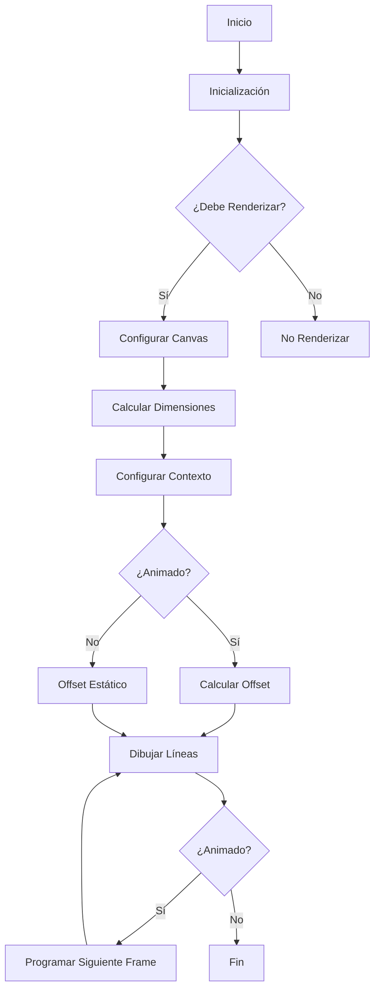

# 📺 Scanlines Layer

Este componente implementa un efecto de líneas de escaneo que puede ser aplicado a las tarjetas de entidad. El efecto simula las líneas de escaneo típicas de pantallas CRT y puede ser personalizado para crear diferentes estilos visuales.

## 🔄 Flujo de Funcionamiento



## 📁 Estructura del Componente

```
scanlines/
├── actions/
│   └── scanlines-config.action.ts    # Configuración y tipos
├── components/
│   ├── scanlines-layer.tsx           # Componente principal
│   └── scanlines-settings.tsx        # Panel de configuración
├── hooks/
│   └── use-scanlines.ts              # Lógica de renderizado
└── scanlines-implementation.tsx       # Implementación de la capa
```

## 🛠️ Configuración

El componente acepta las siguientes propiedades de configuración:

| Propiedad | Tipo | Descripción | Valor por defecto |
|-----------|------|-------------|-------------------|
| enabled | boolean | Activa/desactiva el efecto | true |
| visibleOnHover | boolean | Muestra el efecto solo al pasar el mouse | false |
| opacity | number | Opacidad de las líneas | 0.15 |
| lineWidth | number | Grosor de las líneas | 1 |
| lineSpacing | number | Espacio entre líneas | 3 |
| speed | number | Velocidad de animación | 0 |
| color | string | Color de las líneas | '#000000' |
| blendMode | string | Modo de mezcla | 'multiply' |
| direction | 'horizontal' \| 'vertical' | Dirección de las líneas | 'horizontal' |
| animated | boolean | Activa la animación | false |
| offset | number | Desplazamiento inicial | 0 |

## 🎨 Presets Disponibles

1. **TV Retro**
   - Líneas horizontales sutiles
   - Color negro con baja opacidad
   - Sin animación

2. **Monitor CRT**
   - Líneas verticales blancas
   - Modo de mezcla suave
   - Mayor espaciado entre líneas

3. **Cyberpunk**
   - Líneas horizontales cyan
   - Animación lenta
   - Efecto de brillo

4. **Matrix**
   - Líneas verticales verdes
   - Animación rápida
   - Efecto de pantalla

5. **Glitch**
   - Líneas horizontales magenta
   - Animación muy rápida
   - Efecto de exclusión

## 📝 Ejemplos de Uso

```tsx
// Ejemplo básico
<ScanlinesLayer
  config={{
    enabled: true,
    opacity: 0.15,
    lineWidth: 1,
    lineSpacing: 3,
    direction: 'horizontal'
  }}
/>

// Efecto animado
<ScanlinesLayer
  config={{
    enabled: true,
    animated: true,
    speed: 2,
    color: '#00ffff',
    blendMode: 'screen'
  }}
/>

// Efecto al hover
<ScanlinesLayer
  config={{
    enabled: true,
    visibleOnHover: true,
    opacity: 0.3,
    lineWidth: 2,
    direction: 'vertical'
  }}
/>
```

## 🔧 Optimizaciones

- Uso de `ResizeObserver` para manejar cambios de tamaño
- Memoización de configuraciones con `useMemo`
- Referencia persistente al contexto del canvas
- Manejo de errores robusto
- Limpieza de recursos en desmontaje
- Soporte para DPR (Device Pixel Ratio)

## 🎯 Mejores Prácticas

1. Usar presets para configuraciones comunes
2. Ajustar la opacidad según el fondo
3. Considerar el rendimiento con animaciones
4. Limpiar recursos al desmontar
5. Manejar errores apropiadamente

## 🔍 Depuración

Si encuentras problemas:

1. Verifica que el canvas esté inicializado
2. Comprueba las dimensiones del contenedor
3. Revisa la configuración de blendMode
4. Monitorea el uso de CPU con animaciones
5. Verifica errores en consola