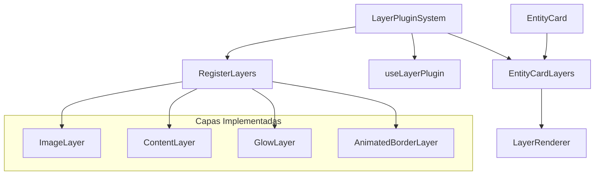

# 🎨 Sistema de Capas para Entity Cards

## Descripción
El sistema de capas proporciona una arquitectura modular y extensible para agregar efectos visuales y funcionalidades a las tarjetas de entidades. Cada capa puede ser activada, configurada y animada de forma independiente.

## Estructura del Sistema



## Uso con EntityCard

```tsx
import { EntityCard } from '@/components/features/entity-cards/entity-card';

// Uso básico con capas habilitadas
<EntityCard
  id="card-1"
  title="Mi Tarjeta"
  description="Descripción de la tarjeta"
  image="/images/card.jpg"
  options={{
    enableLayers: true,
    explodeLayers: false,
    activeLayer: null
  }}
/>
```

## Componentes Principales

### 🔌 LayerPluginSystem
- Gestiona el registro y renderizado de capas
- Proporciona contexto global para las capas
- Maneja la activación y desactivación de capas

### 🎭 EntityCardLayers
- Integra el sistema de capas con EntityCard
- Gestiona eventos de ratón y estados de hover
- Maneja la vista explotada de capas

### 🎨 LayerRenderer
- Renderiza las capas en el orden correcto
- Aplica transformaciones y efectos
- Gestiona la interacción con capas individuales

## Crear una Nueva Capa

1. **Definir la configuración de la capa**

```typescript
import type { BaseLayerConfig } from '@/components/features/entity-cards/modules/layers';

interface MyLayerConfig extends BaseLayerConfig {
  // Propiedades específicas de la capa
  customProperty: string;
}
```

2. **Implementar el componente de capa**

```typescript
import { useLayerPlugin } from '@/components/features/entity-cards/modules/layers';
import type { CommonLayerProps } from '@/components/features/entity-cards/modules/layers';

const MyLayerComponent = (props: CommonLayerProps & { config: MyLayerConfig }) => {
  const { isHovered, mousePosition, style, config } = props;

  // Lógica específica de la capa

  return (
    <div style={style}>
      {/* Contenido de la capa */}
    </div>
  );
};
```

3. **Registrar la capa en el sistema**

```typescript
// En un componente de registro
import { useLayerPlugin } from '@/components/features/entity-cards/modules/layers';

export function RegisterMyLayer() {
  const { registerLayer } = useLayerPlugin();

  React.useEffect(() => {
    registerLayer({
      type: 'my-layer',
      name: 'Mi Capa',
      description: 'Descripción de mi capa',
      component: MyLayerComponent,
      defaultConfig: {
        enabled: true,
        layerIndex: 10, // Orden de renderizado
        // Propiedades específicas
        customProperty: 'valor predeterminado'
      }
    });
  }, [registerLayer]);

  return null;
}
```

## Integración con EntityCard

El componente EntityCard ahora incluye soporte integrado para el sistema de capas. Para habilitarlo, use las siguientes opciones:

```tsx
<EntityCard
  // Propiedades básicas
  id="card-1"
  title="Tarjeta con Capas"

  // Opciones de capas
  options={{
    enableLayers: true,     // Habilitar el sistema de capas
    explodeLayers: false,   // Mostrar capas en vista explotada
    activeLayer: "glow"     // Capa activa seleccionada (opcional)
  }}
/>
```

## Mejores Prácticas

1. **Rendimiento**
   - Use la propiedad `visibleOnHover` para capas que solo deben mostrarse al pasar el ratón
   - Implemente memoización para cálculos costosos
   - Evite cambios de estado innecesarios

2. **Organización**
   - Agrupe las capas relacionadas en carpetas según su funcionalidad
   - Mantenga consistencia en la estructura de archivos

3. **Extensibilidad**
   - Diseñe capas para ser independientes y reutilizables
   - Documente la configuración y uso de cada capa
