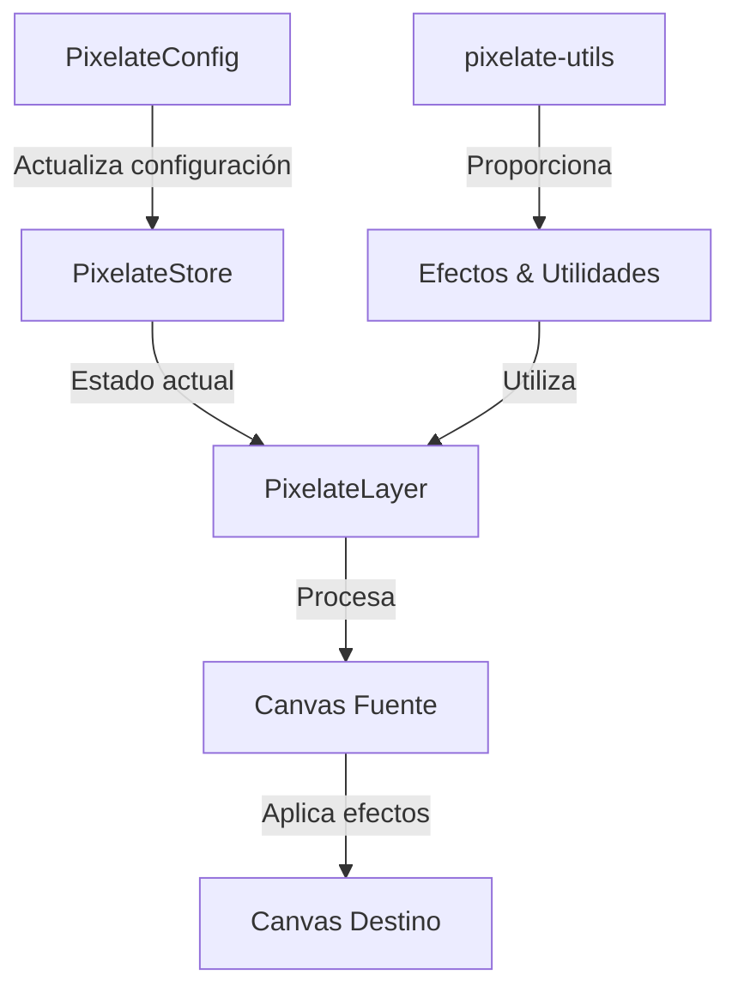

# 🎮 Pixelate Layer

El Pixelate Layer es un componente avanzado que permite aplicar efectos de pixelado y retro a las imágenes de las cartas. Este layer ofrece una amplia gama de opciones de personalización y efectos adicionales para crear estilos únicos y nostálgicos.

## 📁 Estructura del Directorio

```
pixelate/
├── actions/
│   └── pixelate-config.action.ts    # Configuración y estado del pixelado
├── components/
│   ├── pixelate-layer.tsx          # Componente principal del pixelado
│   └── pixelate-config.tsx         # Componente de configuración
├── utils/
│   └── pixelate-utils.ts           # Utilidades para efectos de pixelado
└── README.md                       # Esta documentación
```

## 🔄 Flujo de Datos



## ⚙️ Configuración

La configuración del pixelado incluye múltiples opciones para personalizar el efecto:

```typescript
interface PixelateConfig {
  enabled: boolean;
  pixelSize: number;
  opacity: number;
  blendMode: string;
  animated: boolean;
  animationSpeed: number;
  animationPattern: 'random' | 'wave' | 'spiral' | 'none';
  colorQuantization: boolean;
  colorLevels: number;
  preserveAlpha: boolean;
  threshold: number;
  edgeDetection: boolean;
  edgeColor: [number, number, number];
  edgeThickness: number;
  noiseAmount: number;
  glitchIntensity: number;
  glitchFrequency: number;
}
```

## 🎯 Características Principales

1. **Pixelado Básico**
   - Control preciso del tamaño de píxel
   - Ajuste de opacidad
   - Modos de mezcla personalizables

2. **Animaciones**
   - Patrones predefinidos (onda, espiral, aleatorio)
   - Velocidad ajustable
   - Transiciones suaves

3. **Efectos de Color**
   - Cuantización de color
   - Preservación de transparencia
   - Ajuste de niveles de color

4. **Efectos Especiales**
   - Detección de bordes
   - Efectos de ruido
   - Efectos glitch

## 📝 Ejemplos de Uso

### Uso Básico

```tsx
import { PixelateLayer } from './components/pixelate-layer';

function Card() {
  return (
    <div className="relative">
      <PixelateLayer
        width={300}
        height={400}
        sourceImage="/path/to/image.jpg"
      />
      {/* Contenido de la carta */}
    </div>
  );
}
```

### Configuración de Efectos

```tsx
import { usePixelateStore } from './actions/pixelate-config.action';

function PixelateControls() {
  const { updateConfig } = usePixelateStore();

  const enableRetroEffect = () => {
    updateConfig({
      enabled: true,
      pixelSize: 4,
      colorQuantization: true,
      colorLevels: 8,
      noiseAmount: 0.1
    });
  };

  return <button type="button" onClick={enableRetroEffect}>Activar Efecto Retro</button>;
}
```