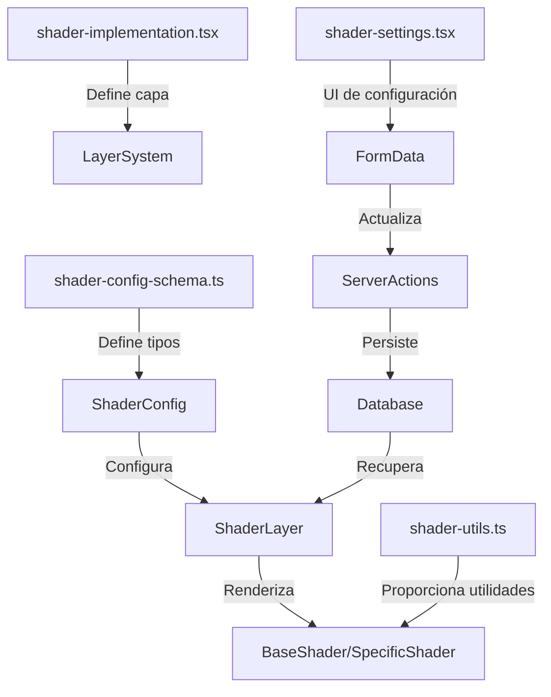

# 🌟 Shader Layer

El módulo Shader Layer es un componente avanzado que permite aplicar efectos visuales dinámicos a las entidades utilizando WebGL. Este layer proporciona una variedad de shaders predefinidos que pueden ser personalizados y combinados para crear efectos visuales únicos.

## 📁 Estructura del Directorio

```
shaders/
├── actions/
│   └── shader-config.action.ts    # Acciones del servidor y store
├── components/
│   ├── shader-layer.tsx           # Componente principal del shader
│   └── shader-settings.tsx        # Panel de configuración
├── hooks/
│   └── use-shader.ts              # Hooks personalizados
├── utils/
│   └── shader-utils.ts            # Utilidades para WebGL y shaders
├── __tests__/                     # Tests unitarios
├── base-shader.tsx                # Shader base
├── particle-shader.tsx            # Shader de partículas
├── wave-shader.tsx                # Shader de ondas
├── hologram-shader.tsx            # Shader de holograma
├── distortion-shader.tsx          # Shader de distorsión
├── shader-config-schema.ts        # Esquema de configuración
├── shader-implementation.tsx      # Implementación principal
├── index.ts                       # Exportaciones
└── README.md                      # Esta documentación
```

## 🔄 Flujo de Datos



## ⚙️ Configuración

La configuración de los shaders se define en el esquema de configuración y hereda de la configuración base de capas:

```typescript
export interface ShaderConfig extends BaseLayerConfig {
  type: 'base' | 'distortion' | 'hologram' | 'wave' | 'particle';
  intensity: number;
  speed: number;
  color: string;
  blendMode: 'normal' | 'multiply' | 'screen' | 'overlay' | 'darken' | 'lighten';
  visibleOnHover: boolean;
  animated: boolean;
  advanced?: {
    fragmentShader?: string;
    vertexShader?: string;
    uniforms?: Record<string, number | number[]>;
  };
}
```

## 🎯 Tipos de Shaders Disponibles

1. **Base**
   - Shader base con gradiente de colores animado
   - Configurable: intensidad, velocidad, color

2. **Distortion**
   - Efecto de distorsión ondulante de imagen
   - Configurable: intensidad de distorsión, velocidad

3. **Hologram**
   - Efecto de holograma con líneas de escaneo
   - Configurable: color, intensidad de líneas, velocidad

4. **Wave**
   - Efecto de ondas animadas superpuestas
   - Configurable: amplitud, frecuencia, color

5. **Particle**
   - Sistema de partículas dinámico
   - Configurable: cantidad, tamaño, velocidad

## 💼 Características Principales

- Integración con el sistema de capas mediante `withBaseLayer`
- Shaders WebGL optimizados para rendimiento
- Integración con Server Actions para persistencia
- Validación con Zod para configuración segura
- Animaciones fluidas con RequestAnimationFrame
- Sistema de presets predefinidos
- Configuración avanzada para usuarios expertos
- Panel de ajustes completo con múltiples opciones

## 📝 Ejemplos de Uso

### Uso Básico

```tsx
import { shaderImplementation } from '@/components/features/entity-cards/modules/layers/shaders';
import { registerLayer } from '@/components/features/entity-cards/modules/layers';

// Registrar la capa en el sistema
registerLayer(shaderImplementation);
```

### Renderizado directo

```tsx
import { ShaderLayer } from '@/components/features/entity-cards/modules/layers/shaders';

function MyComponent() {
  return (
    <div className="relative w-[300px] h-[400px]">
      <ShaderLayer
        config={...}
        defaultConfig={...}
        layerId="my-shader"
        isHovered={true}
        activeLayer="shader"
      />
      {/* Contenido adicional */}
    </div>
  );
}
```

## 🚀 Optimizaciones

- Uso de `useCallback` y `useMemo` para prevenir renderizados innecesarios
- Animaciones optimizadas con RequestAnimationFrame
- Cleanup adecuado de recursos WebGL al desmontar componentes
- Renderizado condicional basado en visibilidad
- Soporte para múltiples densidades de píxeles (DPR)

## 🛠️ Consideraciones Técnicas

- Requiere soporte WebGL en el navegador
- Manejo de contextos WebGL con referencias estables
- Utiliza el HOC `withBaseLayer` para funcionalidad común de capas
- Implementa el patrón LayerImplementation estandarizado
- Integrado con Server Actions para persistencia
- Validación de esquemas con Zod
- Maneja uniformes dinámicos para personalización

## 📊 Planes Futuros

- [ ] Añadir más tipos de shaders avanzados
- [ ] Implementar sistema de efectos postprocesado
- [ ] Mejorar soporte para dispositivos móviles
- [ ] Añadir editor visual de shaders
- [ ] Implementar sistema de nodos para crear shaders personalizados
- [ ] Optimizar el rendimiento para mejor FPS