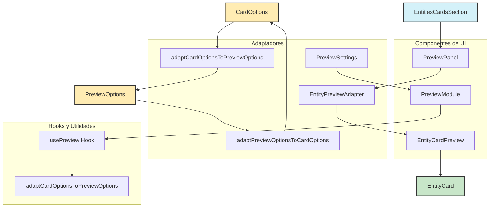

# Módulo de Vista Previa para Entity Cards

Este módulo proporciona componentes y utilidades para la visualización y configuración de vistas previas de tarjetas de entidades.

## Componentes Principales

### EntityCardPreview

Componente base que renderiza una tarjeta de entidad con datos de ejemplo para vista previa.

```tsx
<EntityCardPreview
	cardOptions={options}
	entityType="card-album"
	rarity={selectedRarity}
	texture={selectedTexture}
	className="w-full max-w-[350px]"
/>
```

### EntityPreviewAdapter

Adaptador que garantiza la compatibilidad entre diferentes formatos de opciones y proporciona valores predeterminados seguros.

```tsx
<EntityPreviewAdapter cardOptions={options} entityType="card-album" showInfo={true} previewMode="full" />
```

### PreviewPanel

Panel que envuelve la vista previa con controles adicionales y efectos visuales.

```tsx
<PreviewPanel cardOptions={options} entityType="card-album" showControls={true} showBorder={true} />
```

### PreviewModule

Módulo completo de configuración de vista previa con controles para ajustar todas las opciones.

```tsx
<PreviewModule initialOptions={previewOptions} onChange={handlePreviewChange} disabled={false} />
```

## Utilidades

- `adaptCardOptionsToPreviewOptions`: Convierte opciones de tarjeta a opciones de vista previa
- `adaptPreviewOptionsToCardOptions`: Convierte opciones de vista previa a opciones de tarjeta
- `applyPreviewOptionToCardOptions`: Aplica una opción específica de vista previa a las opciones de tarjeta
- `getPreviewDimensions`: Obtiene las dimensiones en píxeles según el tamaño seleccionado

## Diagrama de Flujo



## Estructura de Archivos

```
preview/
├─ entity-card-preview.tsx     # Componente base para renderizar tarjetas
├─ entity-preview-adapter.tsx  # Adaptador para diferentes formatos de opciones
├─ preview-adapter.ts          # Utilidades para convertir entre formatos
├─ preview-module.tsx          # Módulo de configuración completo
├─ preview-panel.tsx           # Panel de vista previa con controles
├─ preview-settings-adapter.tsx # Adaptador para el panel de configuración
├─ types.ts                    # Definiciones de tipos
├─ use-preview.ts              # Hook para gestionar opciones
└─ README.md                   # Documentación
```

## Integración con Entity Cards

Este módulo se integra con el sistema de tarjetas de entidad para proporcionar una vista previa interactiva de las tarjetas con diferentes configuraciones. Permite a los usuarios ver cómo se verán las tarjetas con diferentes opciones antes de aplicarlas.

## Ejemplo de Uso Completo

```tsx
import { PreviewPanel, PreviewSettings } from '@/components/features/entity-cards/modules/preview';

export function CardConfigurationPanel() {
	const [cardOptions, setCardOptions] = useState<CardOptions>(DEFAULT_OPTIONS);

	return (
		<div className="grid grid-cols-2 gap-4">
			<div>
				<PreviewPanel cardOptions={cardOptions} entityType="card-album" showControls={true} />
			</div>
			<div>
				<PreviewSettings options={cardOptions} onChange={setCardOptions} />
			</div>
		</div>
	);
}
```
