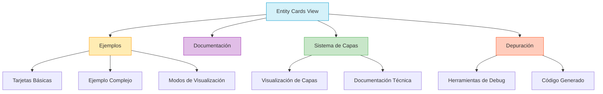

# 🎴 Entity Cards

> Sistema de visualización y exploración de tarjetas para diferentes tipos de entidades

## 📋 Descripción

Esta vista proporciona una interfaz completa para experimentar, depurar y aprender sobre el sistema de Entity Cards de la aplicación. Incluye ejemplos prácticos, documentación, y herramientas de depuración que permiten a los desarrolladores y usuarios avanzados explorar todas las capacidades del sistema.

## 🧩 Características

- **Visualización de ejemplos** de tarjetas para diferentes tipos de entidades
- **Documentación interactiva** sobre el uso del sistema
- **Exploración del sistema de capas** visual
- **Herramientas de depuración** para probar configuraciones en tiempo real
- **Código generado** basado en la configuración actual

## 🔄 Flujo de Trabajo

## 🏗️ Estructura

La vista se organiza en varias pestañas:

1. **Ejemplos**: Muestra diferentes tipos de tarjetas y formas de configuración
2. **Documentación**: Proporciona información sobre el uso del sistema
3. **Sistema de Capas**: Explica y demuestra el funcionamiento de las capas visuales
4. **Depuración**: Ofrece herramientas para probar diferentes configuraciones

## 🧪 Uso para Desarrollo

Esta vista es especialmente útil para:

- Desarrolladores que necesitan implementar nuevos tipos de tarjetas
- Diseñadores que quieren experimentar con diferentes estilos visuales
- Usuarios avanzados que desean personalizar la apariencia de sus entidades

## 🔌 Integración con el Sistema

La vista de Entity Cards está integrada con:

- La barra de depuración global (`CardDebugToolbar`)
- El sistema de presets visuales
- El sistema de navegación principal a través del panel lateral

## 📚 Referencia de Componentes

| Componente | Descripción |
|------------|-------------|
| `EntityCard` | Componente básico para tarjetas simples |
| `EntityCardAdapter` | Adaptador para diferentes tipos de entidades |
| `EntityCardWrapper` | Envoltorio completo con todas las capacidades |
| `CardLayer` | Componente base para el sistema de capas |
| `CardDebugToolbar` | Barra de herramientas para depuración |

## 🎨 Presets Disponibles

El sistema incluye presets visuales predefinidos para diferentes tipos de entidades:

- `folder-default`: Preset para carpetas
- `album-default`: Preset para álbumes
- `collection-default`: Preset para colecciones
- `tag-default`: Preset para etiquetas
- `character-default`: Preset para personajes
- Y muchos más...

## 🧠 Conceptos Clave

- **Sistema de Capas**: Arquitectura que permite componer efectos visuales complejos
- **Adaptadores de Entidad**: Transforman datos de entidad en representaciones visuales
- **Presets Visuales**: Configuraciones predefinidas para diferentes tipos y estilos
- **Efectos Visuales**: Holográfico, brillo, bordes animados, etc.