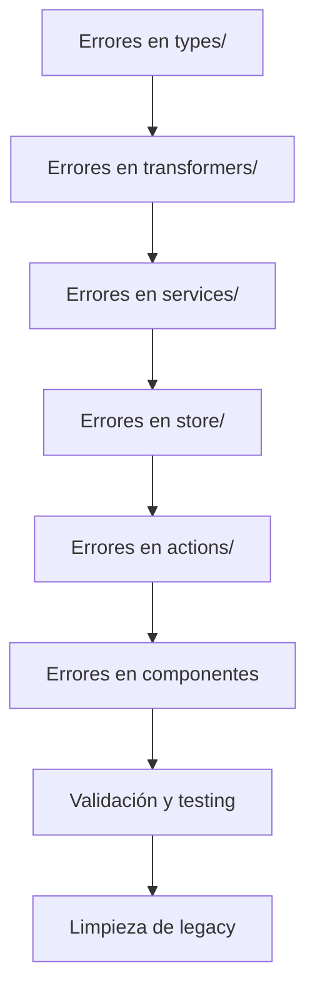

# 🧹 Limpieza del Componente File Browser

## Progreso actual

### ✅ Completado

- Eliminado `virtualizer-wrapper.original.tsx` (versión obsoleta)
- Eliminado `test-grid-view.tsx` (componente de prueba)
- Actualizado `index.ts` para exportar `SimpleGridView` en lugar de `GridView`
- Creados componentes reales para la barra de herramientas:
  - `ViewTypeSelector`: Selector de tipo de vista
  - `SortTypeSelector`: Selector de tipo de ordenamiento
  - `StatusBar`: Barra de estado
  - `SelectionActions`: Acciones de selección
  - `FileBrowserActions`: Acciones generales
- Organizado los componentes de la barra de herramientas en un directorio separado
- **Eliminado `GridView.tsx` (obsoleto)**: Solo se mantiene `SimpleGridView` como la implementación oficial
- **Eliminado `use-grid-view.ts`**: Hook obsoleto que ya no se utiliza
- **Extraído `GridItem` a archivo separado**: Reducido el tamaño del archivo principal
- **Agregadas transiciones**: Implementadas con `framer-motion` y `AnimatePresence`
- **Mejorada accesibilidad**: Agregado `role="application"` y `aria-label`
- **Integración con ViewToolbar**: Reemplazada toolbar básica con ViewToolbar completo del sistema
- **Nuevo componente FileBrowserWithToolbar**: Integración completa con stores de Zustand

### 🔄 En progreso

- Refactorización del componente principal `FileBrowser.tsx` (reducido de 865 a ~750 líneas)
- Verificación de funcionalidades del ViewToolbar integrado

### ⏱️ Pendiente

- Extraer más componentes internos para reducir el tamaño del archivo principal
- Consolidar estilos en archivos CSS específicos
- Mejorar la documentación de cada componente
- Crear tests unitarios para los nuevos componentes extraídos

## Decisiones tomadas

### SimpleGridView vs GridView

Se ha decidido utilizar `SimpleGridView` como el componente principal de vista de cuadrícula porque:

- No depende del complejo `VirtualizerWrapper`
- Tiene mejor manejo de scroll y carga progresiva
- Es más eficiente para conjuntos de datos pequeños y medianos
- Tiene una implementación más simple y mantenible

### Componentes de toolbar

Los componentes de la barra de herramientas han sido implementados como componentes reales y organizados en un directorio separado. Cada componente tiene su propia responsabilidad y puede ser reutilizado en otros contextos.

## Próximos pasos

1. Actualizar el componente principal `FileBrowser.tsx` para usar los nuevos componentes de la barra de herramientas
2. Evaluar si `GridView.tsx` debe ser eliminado o mantenido como alternativa
3. Revisar `VirtualizerWrapper` para posible simplificación
4. Crear subdirectorios para organizar mejor los componentes
5. Mejorar la documentación de cada componente

## Notas adicionales

- El componente `FileBrowser.tsx` es bastante grande (862 líneas) y podría beneficiarse de una refactorización
- Hay componentes placeholder internos que deberían ser extraídos a archivos separados
- La gestión de estado podría ser mejorada utilizando hooks personalizados

# 🧹 Limpieza del Sistema de Tipos

## Progreso actual

### ✅ Completado

- **Migración a tipos canónicos basados en Prisma**
  - ✅ `Place`: Completado
  - ✅ `Property`: Completado
  - ✅ `WorldItem`: Completado
  - ✅ `Album`: Completado
  - ✅ `Tag`: Completado
- Creada guía de migración MIGRATION-GUIDE.md para documentar el proceso
- Resueltos errores de TypeScript relacionados con estas entidades
- Simplificación de la jerarquía de tipos

### 🔄 En progreso

- Migración de tipos canónicos para el resto de entidades
- Actualización de componentes para usar los nuevos tipos

### ⏱️ Pendiente

- Migrar el resto de las entidades siguiendo el patrón establecido
- Actualizar la documentación por módulo
- Crear tests para validar los tipos

## Decisiones tomadas

### Tipos canónicos basados en Prisma

Se ha decidido utilizar los tipos de Prisma como base canónica para todas las entidades porque:

- Proporciona una fuente única de verdad para la estructura de datos
- Elimina la duplicación de tipos
- Simplifica la jerarquía de tipos y reduce la complejidad
- Mejora la inferencia de tipos en TypeScript

### Estructura de tipos

Cada entidad tiene ahora:
- Tipo base que extiende directamente de Prisma
- Interfaces para relaciones con otras entidades
- Interfaces para contadores de relaciones
- Interfaces para inputs de creación y actualización
- Alias de tipos para mantener compatibilidad con código existente

## Próximos pasos

1. Continuar con la migración del resto de entidades
2. Actualizar server actions para usar los nuevos tipos
3. Actualizar transformadores para trabajar con los tipos canónicos
4. Aplicar limpieza de código similar a otros módulos del sistema

## Notas adicionales

- El enfoque de tipos canónicos simplificará el mantenimiento futuro
- Los tipos ahora están mejor alineados con la estructura real de la base de datos
- La guía de migración facilitará que otros desarrolladores continúen con el proceso

# 🚨 Corrección masiva de errores TypeScript tras migraciones y refactorizaciones

## Objetivo
Corregir los 2360 errores de TypeScript reportados tras las migraciones recientes, priorizando tipos canónicos, transformers y acciones, asegurando consistencia, validación y documentación inmediata.

## Estrategia

## Pasos inmediatos
1. Analizar patrones de error y priorizar archivos críticos.
2. Corregir tipos canónicos y transformers base.
3. Validar y testear tras cada bloque de correcciones.
4. Documentar cambios y actualizar diagramas.
5. Limpiar legacy y duplicados.

## Reglas activas
- Tipos canónicos, sin duplicados ni legacy.
- Validación con Zod antes de persistir datos.
- Prohibido importar tipos de Prisma en cliente.
- Documentar cada corrección y actualizar diagramas.
- Usar Server Actions para mutaciones.
- Mantener consistencia en naming y estructura.
