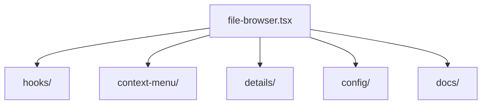

# FileBrowser

Componente principal para explorar archivos y carpetas con soporte de virtualización y precarga de entidades.

## Estructura general



- **entity-preloader.tsx**: Coordinación de precarga de entidades.
- **hooks/**: Lógica de manejo de scroll, grid y transiciones.
- **context-menu/** y **details/**: Componentes auxiliares.
- **docs/**: Documentos técnicos sobre el layout y precarga.

Para un análisis detallado del flujo de precarga consulta `docs/entity-preloader-integration.md`.

# FileBrowser: Fallback visual y robustez de layout

## Fallback visual y logs controlados

Cuando el ancho del contenedor (`containerWidth`) es inválido (0, NaN o indefinido), FileBrowser:

- Muestra un Skeleton animado y FlickeringGrid como feedback visual amigable.
- Loguea el error solo una vez por ciclo usando un flag con `useRef`.
- Permite al usuario reintentar el cálculo manualmente.
- El flag de log se resetea automáticamente cuando el ancho es válido.

```mermaid
decision
    A[Render FileBrowser] --> B{containerWidth válido?}
    B -- Sí --> C[Renderiza grid normalmente]
    B -- No --> D[Renderiza Skeleton + FlickeringGrid]
    D --> E[Usuario puede reintentar cálculo]
    E --> B
    C --> F[UX normal]
    D --> G[UX amigable, sin logs infinitos]
```

## Protección extra para virtualizer

Si el virtualizer no está correctamente inicializado, se muestra un EmptyState con mensaje de error y se loguea el problema.

## Ejemplo visual del fallback

```tsx
{!containerWidth || containerWidth <= 0 ? (
  <div className="flex flex-col items-center justify-center h-full w-full gap-4">
    <div className="w-full max-w-5xl h-72 flex items-center justify-center relative">
      <Skeleton className="w-full h-full rounded-xl" />
      <div className="absolute inset-0 pointer-events-none opacity-80">
        <FlickeringGrid squareSize={16} gridGap={12} maxOpacity={0.18} />
      </div>
    </div>
    <div className="text-xs text-muted-foreground text-center">
      Calculando layout...<br />
      <code>containerWidth: {containerWidth}</code><br />
      <code>ancho real del div padre: {realWidth}</code>
    </div>
    <button
      type="button"
      className="mt-2 px-3 py-1 rounded bg-muted text-xs hover:bg-accent border"
      onClick={() => {
        hasLoggedWidthErrorRef.current = false;
        forceRecalcWidth();
      }}
    >
      Reintentar cálculo
    </button>
  </div>
) : (
  // ...render normal del grid
)}
```

---

- El fallback visual utiliza los componentes `Skeleton` y `FlickeringGrid` para una experiencia de usuario fluida.
- El log de error solo se emite una vez por ciclo usando un flag con `useRef`, evitando spam.
- El usuario puede reintentar el cálculo manualmente.
- El flag de log se resetea automáticamente cuando el ancho es válido.
- Si el virtualizer falla, se muestra un EmptyState y se loguea el error.

---

> Última actualización: 2025-06-11
