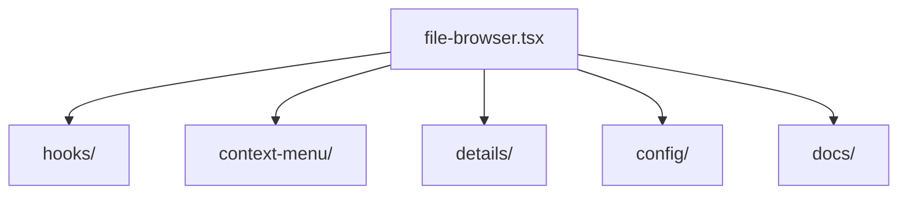

# FileBrowser

Componente principal para explorar archivos y carpetas con soporte de virtualización y precarga de entidades.

## Estructura general

- **entity-preloader.tsx**: Coordinación de precarga de entidades.
- **hooks/**: Lógica de manejo de scroll, grid y transiciones.
- **context-menu/** y **details/**: Componentes auxiliares.
- **docs/**: Documentos técnicos sobre el layout y precarga.

Para un análisis detallado del flujo de precarga consulta `docs/entity-preloader-integration.md`.
