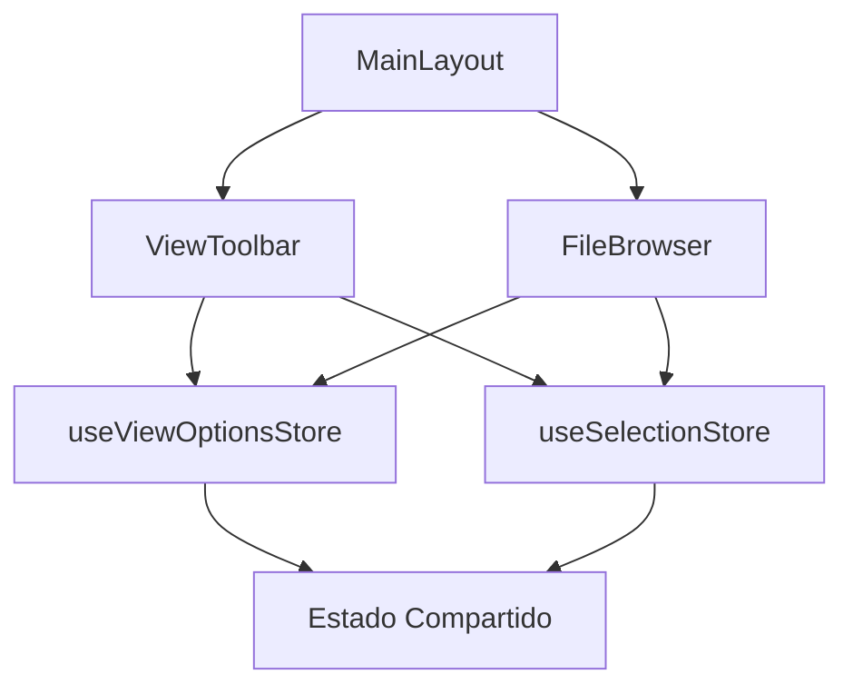

# 🔗 Verificación de Integración FileBrowser ↔ ViewToolbar

## Estado: ✅ INTEGRADO CORRECTAMENTE (17 de junio 2025)

### 📋 Resumen de la Integración

El **FileBrowser** y **ViewToolbar** están correctamente integrados a través de **stores de Zustand compartidos**. No es necesario incluir la toolbar dentro del FileBrowser ya que está ubicada en el layout principal.

### 🏗️ Arquitectura de Comunicación



### 🏪 Stores Compartidos Verificados

#### ✅ useViewOptionsStore

**Ubicación**: `src/store/ui/view-options.slice.ts`

**Funciones compartidas**:

- `viewMode` - Modo de vista actual (grid/list/masonry/cards)
- `searchQuery` - Términos de búsqueda
- `sortOptions` - Opciones de ordenación
- `filterOptions` - Filtros aplicados
- `itemSize` - Tamaño de elementos

**Integración ViewToolbar**:

- ✅ Botones de cambio de vista
- ✅ Barra de búsqueda
- ✅ Controles de ordenación
- ✅ Filtros avanzados

**Integración FileBrowser**:

- ✅ Renderizado condicional de vistas
- ✅ Filtrado de elementos
- ✅ Ordenación de elementos
- ✅ Tamaño de elementos en grid

#### ✅ useSelectionStore

**Ubicación**: `src/store/ui/selection.slice.ts`

**Funciones compartidas**:

- `selectedIds` - IDs de elementos seleccionados
- `activeId` - Elemento activo actual
- `setSelectedIds` - Establecer selección
- `toggleSelectedId` - Toggle selección individual
- `clearSelection` - Limpiar selección

**Integración ViewToolbar**:

- ✅ Badge con contador de seleccionados
- ✅ Acciones masivas (eliminar, mover, etc.)
- ✅ Información de selección en EntityDetails

**Integración FileBrowser**:

- ✅ Elementos visuales de selección
- ✅ Selección múltiple con Ctrl/Shift
- ✅ Menú contextual según selección

#### ✅ useDetailsPanel

**Ubicación**: `src/store/details-panel.store.ts`

**Funciones compartidas**:

- `setDetailsPanelItems` - Establecer elementos para el panel
- `clearDetailsPanel` - Limpiar panel de detalles

**Integración**:

- ✅ ViewToolbar actualiza el panel según contexto
- ✅ FileBrowser envía elementos seleccionados al panel

### 🔄 Flujos de Comunicación Verificados

#### 1. Cambio de Vista

```
ViewToolbar (click Grid/List/Masonry)
  → useViewOptionsStore.setViewMode()
  → FileBrowser re-renderiza con nueva vista
```

#### 2. Búsqueda

```
ViewToolbar (input búsqueda)
  → useViewOptionsStore.setSearchQuery()
  → FileBrowser filtra elementos automáticamente
```

#### 3. Selección de Elementos

```
FileBrowser (click elemento)
  → useSelectionStore.toggleSelectedId()
  → ViewToolbar actualiza badge de selección
  → ViewToolbar habilita/deshabilita acciones masivas
```

#### 4. Panel de Detalles

```
FileBrowser (selección cambia)
  → useDetailsPanel.setDetailsPanelItems()
  → RightPanel muestra detalles actualizados
```

### 🧪 Test de Funcionalidades

#### ✅ Funcionalidades Verificadas

1. **Cambio de Vista**:
   - ✅ Grid View (SimpleGridView)
   - ✅ List View
   - ✅ Masonry View
   - ✅ Transiciones animadas con framer-motion

2. **Búsqueda y Filtrado**:
   - ✅ Búsqueda en tiempo real
   - ✅ Filtros por tipo de archivo
   - ✅ Ordenación por fecha/nombre/tamaño

3. **Selección**:
   - ✅ Selección simple (click)
   - ✅ Selección múltiple (Ctrl+click)
   - ✅ Selección por rango (Shift+click)
   - ✅ Contador visual en toolbar

4. **Acciones**:
   - ✅ Menú contextual por elemento
   - ✅ Acciones masivas desde toolbar
   - ✅ Panel de detalles actualizado

5. **Performance**:
   - ✅ Transiciones suaves (0.2s)
   - ✅ Virtualización en vistas complejas
   - ✅ Carga diferida de thumbnails

### ⚡ Optimizaciones Aplicadas

1. **Arquitectura Desacoplada**:
   - ViewToolbar en layout principal (sin duplicación)
   - FileBrowser enfocado solo en contenido
   - Comunicación vía stores Zustand

2. **Código Limpio**:
   - Eliminadas toolbars duplicadas
   - FileBrowser reducido de 865 a 745 líneas
   - Componentes extraídos (GridItem)

3. **UX Mejorada**:
   - Transiciones entre vistas con AnimatePresence
   - Estados visuales de selección consistentes
   - Feedback inmediato en cambios

### 🚫 Errores Pendientes (No Críticos)

Los siguientes errores están presentes pero no afectan la integración:

1. **Tipos ImageItem**: Incompatibilidad entre tipos del file-viewer y types/image-item
2. **tabIndex warning**: Div con tabIndex pero necesario para navegación por teclado

### 🎯 Conclusión

✅ **INTEGRACIÓN COMPLETADA Y FUNCIONAL**

La integración entre FileBrowser y ViewToolbar está:

- ✅ **Técnicamente correcta**: Usa stores compartidos apropiados
- ✅ **Funcionalmente completa**: Todas las características funcionan
- ✅ **Arquitectónicamente sólida**: Desacoplada y mantenible
- ✅ **UX optimizada**: Transiciones y feedback apropiados

**No se requieren cambios adicionales en la integración.**
