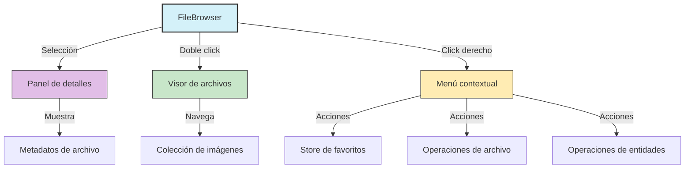

# 📁 FileBrowser

Componente para visualización y gestión de archivos con integración completa con el sistema.

## 📋 Características

- **Visualización de archivos**: Grid, lista y masonry
- **Virtualización**: Renderizado eficiente con virtualización
- **Selección múltiple**: Selección de uno o varios archivos
- **Menú contextual**: Acciones contextuales por archivo
- **Panel de detalles**: Integración con panel lateral para mostrar detalles
- **Visor de archivos**: Integración con visor de imágenes
- **Favoritos**: Marcado de archivos como favoritos
- **Scroll infinito**: Carga progresiva de archivos
- **Reindexado**: Soporte para mostrar progreso de reindexado

## 🔧 Uso básico

```tsx
import { FileBrowser } from '@/components/features/file-browser/file-browser';

function MyComponent() {
  const [items, setItems] = useState<FileItem[]>([]);
  const [isLoading, setIsLoading] = useState(false);

  // Cargar items iniciales
  useEffect(() => {
    const loadItems = async () => {
      setIsLoading(true);
      const data = await fetchFiles();
      setItems(data);
      setIsLoading(false);
    };

    loadItems();
  }, []);

  // Función para cargar más items (scroll infinito)
  const handleLoadMore = async () => {
    const moreData = await fetchMoreFiles();
    setItems(prev => [...prev, ...moreData]);
  };

  return (
    <FileBrowser
      items={items}
      isLoading={isLoading}
      loadMoreItems={handleLoadMore}
    />
  );
}
```

## 🔄 Integración con sistemas

### Menú contextual

El FileBrowser integra un sistema de menú contextual completo que permite:

- Añadir/quitar archivos de favoritos
- Marcar/desmarcar archivos para selección
- Añadir archivos a colecciones, álbumes y etiquetas
- Operaciones de archivo: abrir, descargar, copiar, eliminar

El menú contextual es extensible y se puede personalizar para incluir más acciones.

### Panel de detalles

Al seleccionar un archivo, el FileBrowser actualiza automáticamente el panel de detalles lateral, mostrando:

- Información básica del archivo
- Metadatos técnicos
- Vista previa
- Acciones rápidas

### Visor de archivos

Al hacer doble click en una imagen, se abre el visor de archivos que permite:

- Ver la imagen a tamaño completo
- Navegar entre imágenes
- Ver metadatos
- Realizar acciones rápidas

## 📊 Diagrama de integración



## 🧩 Props

| Prop | Tipo | Descripción |
|------|------|-------------|
| `items` | `FileItem[]` | Lista de archivos a mostrar |
| `viewMode` | `'grid' \| 'list' \| 'masonry' \| 'cards'` | Modo de visualización |
| `onItemSelect` | `(item: FileItem) => void` | Callback al seleccionar un archivo |
| `onItemDoubleClick` | `(item: FileItem) => void` | Callback al hacer doble click en un archivo |
| `className` | `string` | Clase CSS adicional |
| `isLoading` | `boolean` | Indica si está cargando archivos |
| `isReindexing` | `boolean` | Indica si está reindexando la carpeta |
| `reindexProgress` | `number` | Progreso de reindexado (0-100) |
| `loadMoreItems` | `() => void` | Función para cargar más elementos (scroll infinito) |
